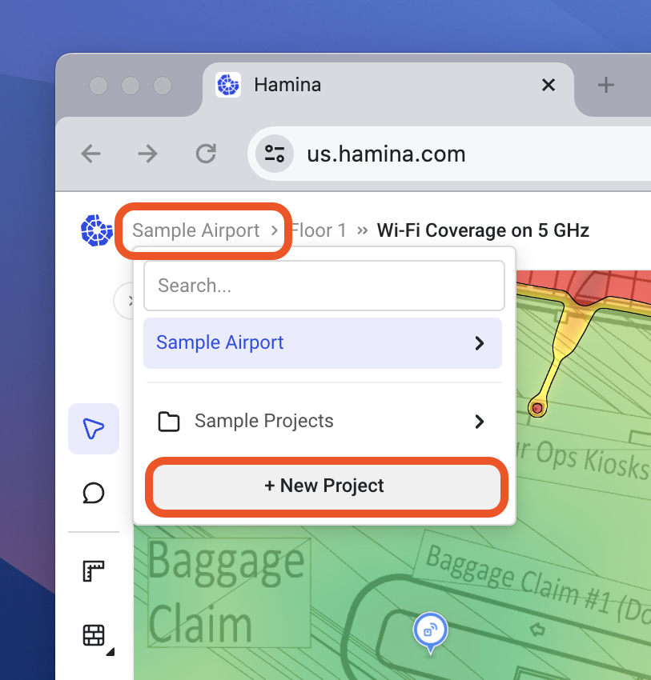

# 📂 Creating and Managing Projects

To create a new project, click on the **Project drop-down menu**, and then the **+ New project** button at the bottom of the menu.

<figure><figcaption></figcaption></figure>

The **Create First Project** window will appear, which contains several settings.

<figure><figcaption></figcaption></figure>

#### Project name

Defines the name for the project. If you are working on a named building, this is a good place to put it.

#### Country

Defines the regulatory domain of the network, and will determine which Wi-Fi channels are available for use.

#### Environment

Determines how much "blanket attenuation" to apply to the map if the user hasn't placed any walls or attenuating objects.

As soon as any walls or attenuating objects have been drawn on the map, then the predictive model reverts to `Free Space Path Loss` + `Attenuation from Walls` + `Attenuation from Objects`. &#x20;


While the environment type and "blanket attenuation" is good for rough AP count estimations, for true network designs, we recommend drawing walls and attenuating objects.



If you need to model free space (such as a network in an open field), choose the **Free Space** environment type, which not apply any blanket attenuation to the project.


#### Project folder

Projects can be grouped together with folders. You can use folders to group together projects on a campus, by larger project, or by customer.

Sub-folders can be created by adding forward slashes. For example:

`Area A / Campus A / Building 1`

`Area A / Campus A / Building 2`

`Area A / Campus B / Building 1`


If the project is shared with another user (either individually or as a team), they receive the same folder structure. You will also receive any edits made to the folder structure.

