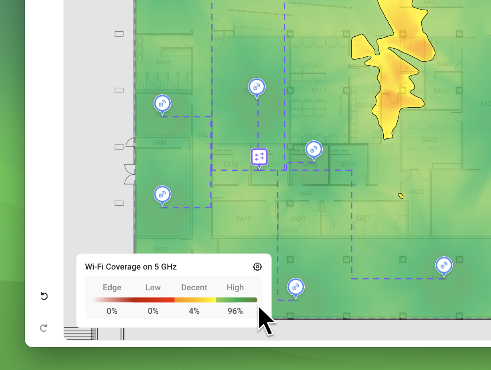

# 🔎 Heatmap Legend

The **Heatmap Legend** in Hamina Network Planner shows the current heatmap settings, as well as a variety of other pieces of information depending on the context in the map view.

## Mouseover Inspector

The Heatmap Legend features a Mouseover Inspector. It shows details about whatever the mouse is hovering over in the map view. For example, with the Coverage, Secondary Coverage, or Tertiary Coverage heatmaps enabled, the Mouseover Inspector shows the precise signal strength underneath the mouse pointer.

<figure><figcaption></figcaption></figure>

## Accessing Heatmap Settings

To quickly access the heatmap settings (which are located in the **Adjust requirements** pane, click anywhere on the Heatmap Legend.

## Viewing Heatmap Statistics

To quickly view statistics about the current heatmap, hover the mouse over the Heatmap Legend. The statistics respect the Scope Zones for the current map or floor.

In the example below, 96% of the floor plan is meeting or exceeding the "High" (green) threshold.

<figure><figcaption></figcaption></figure>

