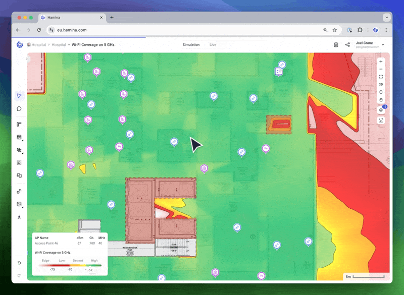
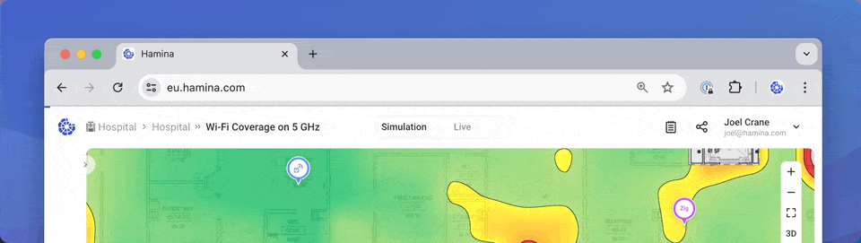

# 🔥 Heatmaps

## Selecting Heatmaps

Access heatmap options by clicking on the **Heatmaps** drop-down menu at the top of Hamina. You can choose the **Technology**, **Heatmap**, and **Band** (for Wi-Fi). The **Adjust requirements** link at the bottom opens the **Adjust Requirements pane**.

<figure><figcaption></figcaption></figure>

### Heatmaps

#### Wi-Fi

* **Coverage**: Shows signal strength from the loudest access point.
* **Secondary coverage**: Shows signal strength from the second loudest access point, which helps ensure that there are always at least two access points above a certain signal strength threshold. Important for redundancy and smooth roaming performance.
* **Tertiary coverage**: Shows signal strength from the third loudest access point, which helps ensure that there are always at least three access points above a certain signal strength threshold. Primary used for Wi-Fi-based real-time location services.
* **SNR**: The Signal-to-noise Ratio shows how much signal strength there is above the noise floor.
* **Interference**: Shows how many access points are audible on the same channel from a given location.
* **Data rate**: Shows the theoretical maximum data rate available, based on on the SNR.

#### 4G/5G

* **Max RSRP**: Shows the signal strength from the loudest cellular base station, in RSRP (Reference Signal Received Power).
* **Secondary RSRP**: Shows the signal strength from the second loudest base station.
* **Tertiary RSRP**: Shows the signal strength from the third loudest base station.
* **SINR**: Shows the signal quality in SINR (Signal to Interference & Noise Ratio).
* **Downlink throughput**: Shows the expected throughput on the downlink, that is from the base station to the client device.

#### BLE

* **Coverage**: Shows signal strength from the loudest BLE-enabled access point or BLE beacon.
* **Secondary Coverage**: Shows signal strength from the second loudest BLE-enabled access point or BLE beacon.
* **Tertiary Coverage**: Shows signal strength from the third loudest BLE-enabled access point or BLE beacon.

## Adjusting Requirements

With any Technology and Heatmap selected, click the **Adjust requirements** link, or click on the **Heatmap Legend** in the lower left, which will open the **Adjust requirements pane** on the right.

<figure><figcaption></figcaption></figure>

### Heatmap Thresholds

To divide the heatmaps into multiple colors, Hamina Network Planner uses configurable thresholds. By default, there are three thresholds which divide the heatmap into colors, which have labels.

<figure><figcaption></figcaption></figure>

The labels can be renamed in the column on the left, and the thresholds can be changed and deleted using the column on the right. Click the **Add a threshold** button on the bottom to add thresholds back in. The maximum amount of thresholds is three, and the minimum is one.


It is best practice to design wireless networks to meet a set of requirements, such as -65 dBm of coverage, or better. Using the Hamina default labels as an example: **High** (-65 dBm or better) is usually considered a Pass, while everything below -65 dBm (**Decent**, **Low**, and **Edge**) is considered a Fail.


### Global Heatmap Settings

<figure><figcaption></figcaption></figure>

* **Opacity** - Adjusts the opacity of the heatmap, which can be adjusted lower to make the map underneath the heatmap easier to see, or adjusted higher to make the heatmap easier to see.
* **Client height** - Adjusts the height of the client devices in the network simulation. By default, Hamina Network Planner simulates a client that is 1 meter off the ground (which is the average height of a client in a user's hand, or on a desk).
* **Display heatmap at client height** (3D only) - In 3D mode, by default, Hamina Network Planner places the heatmap on the floor. Enabling this option causes the heatmap to hover off the floor at the height of the client, which may be useful for visualization purposes. This option is only available in 3D.
* **Full Building Propagation (Beta)** - Without this option enabled, Hamina Network Planner only calculates propagation for the current floor, and the floors above and below the current floor. This usually provides a good balance of speed and accuracy, as most buildings don't see significant signal propagation beyond one floor in either vertical direction. With this option enabled, signal propagation is calculated across all floors in the building, which can be useful for multi-floor atriums, theaters, and stadiums.&#x20;


In some environments, enabling Full building propagation may cause significant performance problems. Enable it with care, and disable if needed.


## **Heatmap Calculations**

Hamina Network Planner keeps planning fast, smooth and responsive by calculating heatmaps in stages. The first stage is a relatively low-resolution heatmap, so you get instant (or near-instant) results. Then, Hamina Network Planner opportunistically calculates successively higher-resolution heatmaps until it was reached the maximum resolution for the browser window.

<figure><figcaption>
In this example, you can see the stages of heatmap calculation. When all APs are selected, notice that the second stage (when the progress bar is about 1/8th complete) is already high-enough resolution for analysis.
</figcaption></figure>

### Heatmap Progress Bar

The progress of this calculation is represented with a blue **Heatmap Progress Bar** along the top of Hamina Network Planner. The progress bar will disappear when the maximum resolution heatmap is completed. It will also reset whenever the calculations start over, for example by changing the viewport or the predictive model.

<figure><figcaption></figcaption></figure>


In almost all cases, _you don't need to wait for the Heatmap Progress Bar to finish_. In most projects, the first couple of stages will give you plenty of resolution to make decisions, and potentially move on to the next design task.


The calculation is optimized for the **current viewport**, which is the part of the map that is currently visible in Hamina Network Planner. The viewport changes as you pan and zoom around the project.

Hamina Network Planner will reset heatmap calculations whenever the viewport changes (e.g., by panning and zooming), or whenever the predictive model changes (e.g. by moving an access point or placing a wall). Heatmap calculation is automatically reset and started, so you don't have to think about it - just plan, and we'll take care of the heatmaps for you.


If you'd like to quickly get a high-resolution heatmap for a specific area, zoom in on it.


