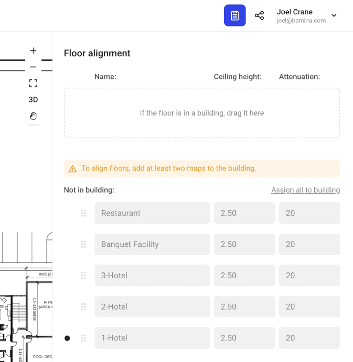

# 🏭 Managing Maps and Floors

## Adding Additional Maps

Additional maps can be added to Hamina in the **Floor** drop-down menu at the top. Click the **Floor** drop-down menu, and click the **Add a floor** button to add additional maps.


Until floors are added to a building, maps don't have any relationship with each other. Instead, they simply exist in the same project. This is useful if you have several single-floor buildings in a campus environment, and want to contain them all in the same project..


## Renaming Maps

To rename a map, click on the **Floor** drop-down, point to the floor, and click **Rename**.

<figure><figcaption></figcaption></figure>

### Map Sorting

In the Floor dropdown, maps are sorted numerically/alphabetically in _descending_ (largest to smallest) order, which causes the floors to be sorted logically in how they would stack up in a building, for example:

* Floor 4
* Floor 3
* Floor 2
* Floor 1

It is possible to further organize maps with additional names, such as the names of buildings.


Note: Only one multi-floor building is supported per project. If you need to design for more than one multi-floor building, then we recommend creating a unique project for each building.


#### Map Sorting for Buildings

When floors are added to a building, they are sorted in the map dropdown based on their order in the building, which can override the default map sorting.

<figure><figcaption>
Floor 1 is erroneously placed above Floor 2, to illustrate how buildings override default map sorting.
</figcaption></figure>

## Creating a Building

When a map is added to a building, the maps can be stacked up and aligned to form multiple floors.


We recommend renaming all of the maps in your project before creating a building and aligning floors, which makes for more organized projects with cleaner deliverables.


To add floors to the building for alignment:

1. Ensure that at least one map has the correct scale, and select it with the **Floor** menu at the top.
2. Click on the **Floor alignment** tool in the toolbar on the left.
3. In the **Floor alignment** pane on the left, drag any desired floors into the build area at the top.
4. Drag the floors into the correct order within the building, with the lower floors on the bottom of the list.

<figure><figcaption></figcaption></figure>

## Aligning Floors

Floor alignment is accomplished by dragging the yellow map until it aligns with the black map.&#x20;

* The **black map** is the the current floor, e.g. the map that is selected with the **Floor** menu on the top.
* The <mark style="color:yellow;">**yellow map**</mark> is the floor that is currently being moved and resized. The position and scale of the yellow map is changed in relation to the position and scale of the black map. You can change which map you want to move and resize by clicking on other maps in the **Floor alignment** pane.

<figure><figcaption></figcaption></figure>

Align the floors by identifying common features between floors, such as elevators and stairwells.

<figure><figcaption></figcaption></figure>

### Resizing Floors

In addition to clicking and dragging the yellow map around, you can also use the corner handles to resize the map. The <mark style="color:yellow;">**yellow map**</mark> scale will change, respecting the scale of the **black map**.


It's a good idea to set the known scale on an "anchor" floor, select it in the **Floor** dropdown, and use that as the source of truth for scaling in the project.


### Floor Height and Attenuation

The height of each floor and the attenuation of each floor is editable. The attenuation value is for the the space between the current floor and the ceiling of the floor below.

Hamina Network Planner models a static floor thickness of 0.5 meters, and calculates loss on a per-meter basis as the RF travels through the floor.

The input value is the total loss for a vertical RF path through the floor, in other words, the shortest possible path through the floor.

The more oblique (slanted) the RF path through the floor is, the longer a distance the RF must travel to get through the floor, and the more loss the signal will experience.


**Why doesn't Hamina Network Planner offer floor thickness and loss per meter controls?**

While some tools do offer the ability to configure the exact floor thickness, and to input how many dB of loss per meter the floor has, getting those measurements from a real building is very challenging. The network designer must be able to measure the floor thickness, calculate how much dB of loss there is from floor to floor, and understand how far the RF had to travel to get through the floor (if at an angle) to be able to calculate how many dB of loss per meter there is in the floor.

Hamina decided to take a more practical approach, and accept a simple vertical RF loss value.


&#x20;
