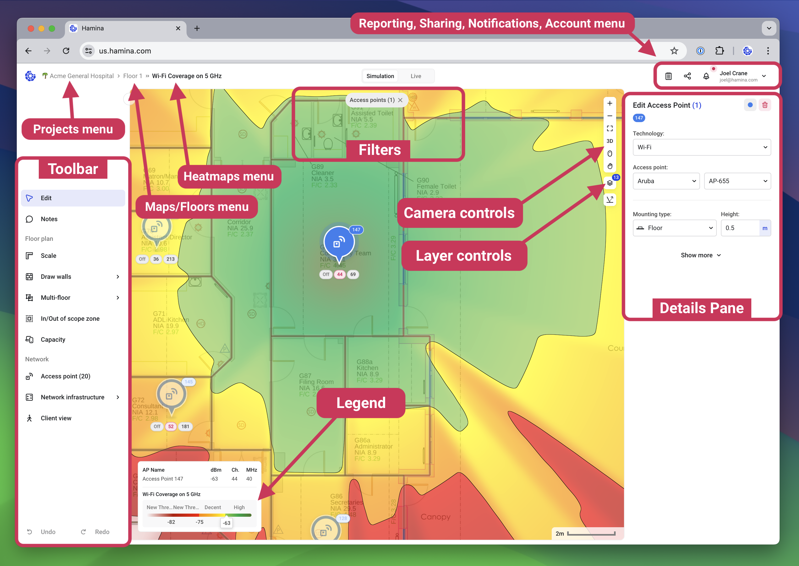
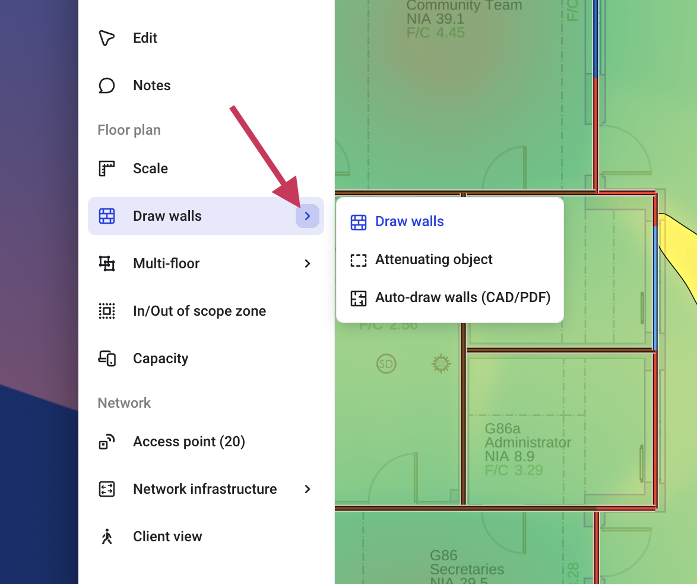

# 🌍 Overview

## Overview

<figure><figcaption></figcaption></figure>

### Menus

There are three dropdown menus, arranged in a "breadcrumbs" format.

### Projects menu

Lists all of the projects in your Hamina account, and all projects shared with your account. You can also create new projects here. For more information about creating projects, see[creating-and-managing-projects.md](../creating-and-managing-projects.md "mention").

### Maps/Floors menu

Lists all of the maps or floors in the current project. Floor plans and images are known as **maps** until they are assigned to a building with the multi-floor tool, at which point they become **floors**. You can learn more about managing maps, creating buildings, and ordering floors in [maps-floors.md](../maps-floors.md "mention").

### Heatmaps menu

Lists all of the heatmaps in Hamina Network Planner. Learn more in the [heatmaps.md](../heatmaps.md "mention")article.

## Toolbar

Lists all of the various tools, depending on which mode the project is in, **Simulation**, **Survey**, and **Live** (which is currently in <mark style="color:red;">**Feature Preview**</mark>).

#### Tool Groups

Some tools are grouped together. Press the **>** button to see the group, and select a tool from the group.

<figure><figcaption></figcaption></figure>

#### Keyboard Shortcuts and Hotkeys

Individual tools can be selected with a single keyboard hotkey (shortcut) press.&#x20;


[keyboard-shortcuts-hotkeys.md](keyboard-shortcuts-hotkeys.md)



For tools in groups, toggle through all of them by repeatedly pressing the hotkey.


<table><thead><tr><th width="447">Tool</th><th>Hotkey</th></tr></thead><tbody><tr><td>Edit</td><td><code>1</code></td></tr><tr><td>Notes</td><td><code>2</code></td></tr><tr><td>Scale</td><td><code>3</code></td></tr><tr><td>Draw Walls / Attenuating object / Auto-draw walls</td><td><code>4</code></td></tr><tr><td>Multi-floor / Floor holes/ Raised floors/ Sloped floors</td><td><code>5</code></td></tr><tr><td>In/Out of scope zone</td><td><code>6</code></td></tr><tr><td>Capacity</td><td><code>7</code></td></tr><tr><td>Access point</td><td><code>8</code></td></tr><tr><td>Network infrastructure / Client device</td><td><code>9</code></td></tr><tr><td>Client view</td><td><code>0</code></td></tr></tbody></table>

## Camera controls

* **Plus** and **Minus** - Zooms in and out. This is a pretty inefficient way to zoom in and out though, so be sure to check out [panning-zooming.md](../panning-zooming.md "mention") to learn better ways.
* **Zoom to fit** - Changed the zoom to fit the entire canvas on screen.
* **3D** / **2D** - Alternates between 2D and 3D modes. Note that some tools are disabled in 3D mode.
* **Switch to mouse mode** / **Switch to trackpad mode** - Changes the behavior of the scroll wheel. See [panning-zooming.md](../panning-zooming.md "mention") for more information.
* **Panning** - It looks like a control, but it's not! This is just a reminder of how to use the spacebar to pan the map.

## Layer controls

The **Layer controls** allow you to show and hide different types of objects on the map. When they're unchecked, they're still there - just hidden! 🤫

## Details Pane

This pane serves several different functions, depending on which tools and objects are selected. For example, with the **Access point** tool selected, the title of the details pane will be **Add access point**. Any clicks on the map will place an access point with the settings defined in the **Add access point** pane.

With the **Edit** tool selected, clicking on an access point will show the **Edit access point** pane, where you can make changes to the selected access point. You can learn more in the [access-points.md](../../design/access-points.md "mention")article.

## Legend

Shows a legend for the current heatmap.

