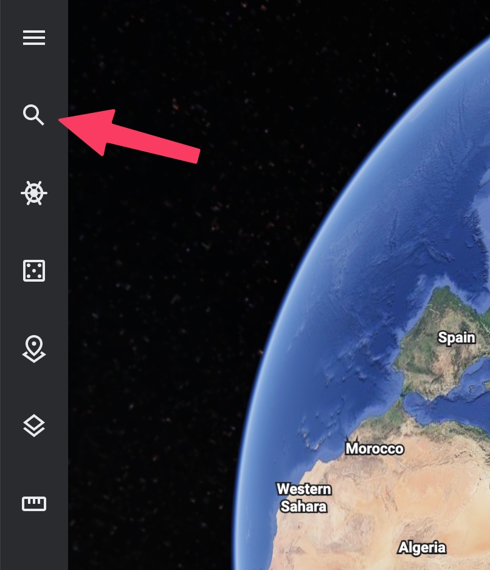

# 📏 Scaling Maps

One of the most important parts of wireless network design is setting an accurate scale. Hamina Network Planner uses distance to predict how far signal will travel from each access point, eNodeB, and gNodeB. How signal travels through open space (and through Attenuating Objects) is tied directly to distance, so an accurate scale is very important for the accuracy of the design.

## Getting The Scale of a Map

There are several ways to get the scale of a map.

1. Using the built-in scale on the map
2. Taking a measurement (long wall, large room, or long hallway)
3. Measuring the length of the building in Google Earth


The key to a good scale is to use as long of an object as possible. Using short objects is dangerous, as being a few pixels off can cause exponential scale problems on large maps.



Avoid using short distances like doorways! Using a short distance to set the scale can cause the scale to drift over larger distances. Hamina strongly recommends using longer objects like the length of the building, a long hallway, or a gymnasium-sized room to set the scale.


### Using the Built-in Scale

In some cases, image-based maps (such as JPEG's, PNG's, and PDF's) may have a scale marker built-in. If this is true on your map, then congratulations! You have won the network design lottery, and can easily [scale your map](https://app.gitbook.com/o/rTVfxjULR4EKN01QWb8X/s/zUQ3TfKTYBeb6nf9W8Hv/\~/changes/AFLrpuKEHkIHIvtepKsV/scaling-maps#setting-the-scale).

When using a CAD file (such as a DXF or DWG), there is usually a built-in scale that will be applied as soon as you upload the CAD file.


It's always a good idea to double-check a CAD file scale with the Scale tool to make sure it is accurate. You don't need to measure a real wall to find out - just use the **Scale tool** to [measure part of the map](https://app.gitbook.com/o/rTVfxjULR4EKN01QWb8X/s/zUQ3TfKTYBeb6nf9W8Hv/\~/changes/AFLrpuKEHkIHIvtepKsV/scaling-maps#measuring-distances), and see if it seems reasonably accurate. CAD files do not always include accurate scales, so be careful!


### Taking a Measurement

If the map doesn't include a built-in scale (which is very common), then take a measurement of a long wall, long hallway, or length of a large room to find the scale. Most wireless network engineers carry a laser range finder for this task. Hold it up against the wall, point it to the other side of the long room or hallway, and activate the range finger to measure the distance. Once you have the distance, you can proceed to [setting the scale](https://app.gitbook.com/o/rTVfxjULR4EKN01QWb8X/s/zUQ3TfKTYBeb6nf9W8Hv/\~/changes/AFLrpuKEHkIHIvtepKsV/scaling-maps#setting-the-scale).

### Google Earth

If you can't easily get on site to take a measurement, then Google Earth is a great alternative. Just like Hamina, it's even in a web browser!

1. Navigate to [https://earth.google.com/web/](https://earth.google.com/web/).
2. Use the **Search** tool to locate the building.\
   
3. Use Google Earth's camera controls to center the building. Selecting **2D** in the lower right can be helpful.
4. Select the **Measure distance and area** tool.\
   
5. On the building, choose two points that are opposite of each other to measure. It is always a good idea to use the longest part of the building to get the most accurate scale.
6. Click on the first point, then the second point. The **Distance** measurement window will appear, showing the distance in meters.\
   
7. Click Done to capture the distance, It will remain on-screen in Google Earth until you take further action.
8. You can now proceed to Setting the Scale in Hamina.

## Setting the Scale

1. Click the **Scale** tool in the toolbar on the left\
   
2. Alternatively, click the blue **Add scale** button in the lower right.\
   
3. Left-click on the map, where the first point of the measurement was taken. A blue line will appear that follows the mouse pointer.
4. Left-click on the map again, where the second point of the measurement was taken. The blue line will snap between the two points, and the length setting popup will appear.\
   
5. Press the **Enter** key, or click the **Set** button to set the scale.

## Measuring Distances in Hamina

Once the scale is set, the Scale tool in Hamina can be used to take various measurements in the design. For example, you can use it to see how wide a room is, or see how far apart access points are from each other.
