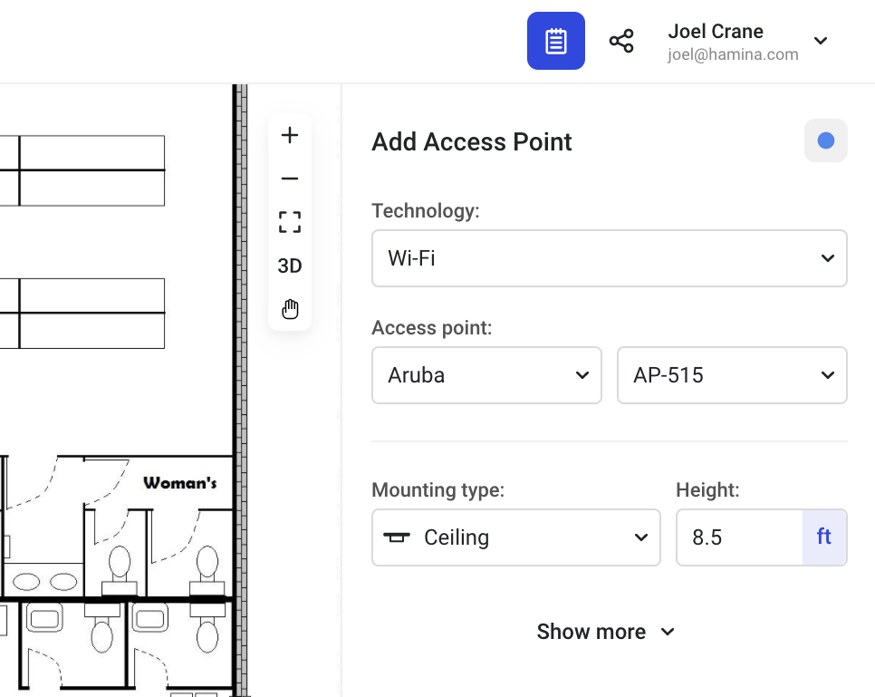

# 📶 Access Points

## Placing Access Points

To place an access point, click on the **Access point** tool in the toolbar on the left. This will cause the **Add Access Point** pane to appear on the right.

In the Add Access Point pane, you can choose the technology, vendor, and model of the access point, as well as the mounting type and height. Then click on the map to place the access point.

<figure><figcaption></figcaption></figure>

Click the **Show more** expander to view additional options, such as the **Access Point Name**, **Transmit Power** settings, **Connected via Ethernet** selector, and **Power allocation (from switch)** settings.

### Transmit Power

The transmit power of the access point radio is configured as _Conducted Power_, in other words, the amount of power transmitted by the radio without factoring in antenna gain. The final amount of gain, or EIRP (Equivalent Isotropic Radiated Power) is calculated by adding the Conducted Power and the antenna gain together.

## Duplicating Access Points

When placing additional access points, Hamina Network Planner will reuse all of the settings from the last selected access point.

1. Select the **Access point** tool
2. Click on the access point that you would like to duplicate
3. Click in an empty place on the map to de-select the access point
4. The **Add Access Point** pane will appear on the left, along with the add access point cursor
5. Click on the map to place additional access points
