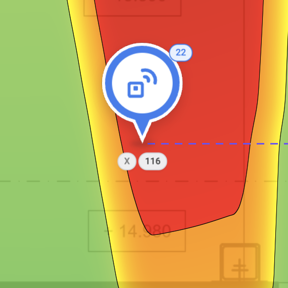
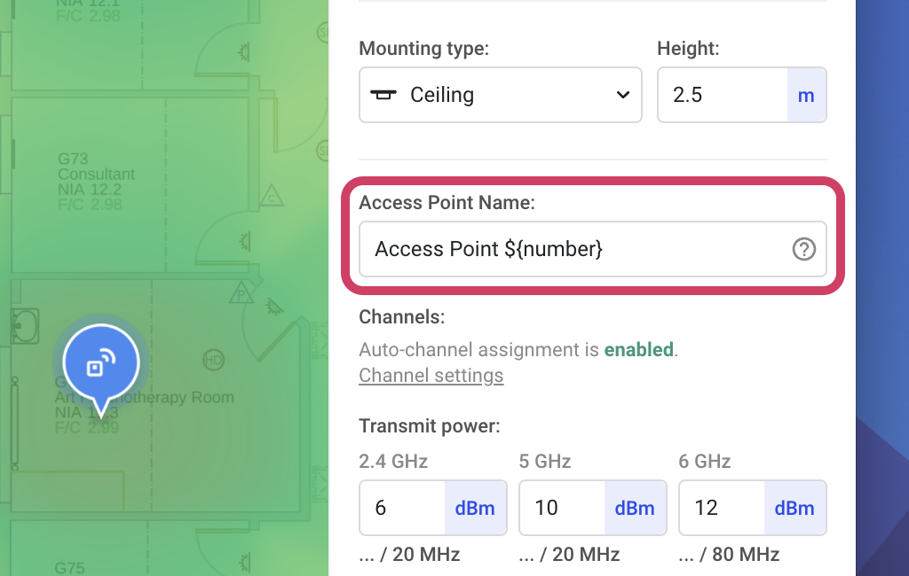
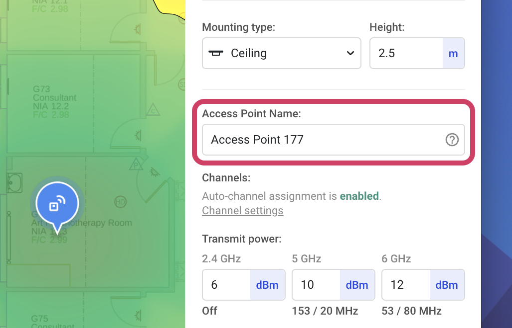
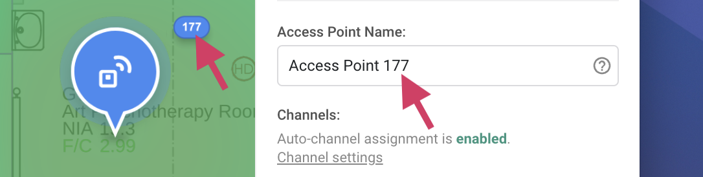
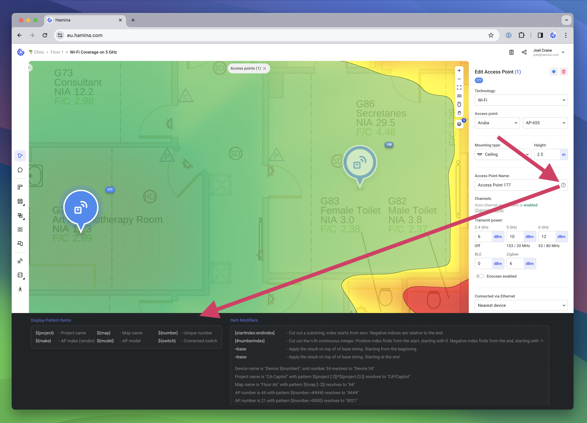

# 📶 Access Points

## Adding Access Points

To add a new access point, click on the **Access point** tool in the toolbar on the left. This will cause the **Add Access Point** pane to appear on the right.

<figure><figcaption></figcaption></figure>

In the Add Access Point pane, you can choose the technology, vendor, and model of the access point, as well as the mounting type and height. Then click on the map to place the access point.

Click the **Show more** expander to view additional options, such as the **Access Point Name**, **Transmit Power** settings, **Connected via Ethernet** selector, and **Power allocation (from switch)** settings.

### Transmit Power

The transmit power of the access point radio is configured as _Conducted Power_, in other words, the amount of power transmitted by the radio without factoring in antenna gain. The final amount of gain, or EIRP (Equivalent Isotropic Radiated Power) is calculated by adding the Conducted Power and the antenna gain together.

### Disabling Radios

#### Automatically Disabled Radios

The automatic channel planner in Hamina Network Planner runs whenever any changes are made to the predictive model. By default, it will automatically disable radios in the 2.4 GHz band to avoid creating excessive co-channel contention (sometimes called Co-Channel Interference) in the network. This behavior can be changed in the [Channel Settings](channel-planning.md) for the project.

When a 2.4 GHz radio has been disabled automatically, the 2.4 GHz channel label will be changed to `Off`.

#### Manually Disabling Radios

To manually disable a radio, right-click the channel label beneath the access point on the map, and select **Disable**.

<figure><figcaption></figcaption></figure>

When a radio has been manually disabled, the channel label will display an `X`.

<figure><figcaption></figcaption></figure>

## Duplicating Access Points

When placing additional access points, Hamina Network Planner will reuse all of the settings from the last selected access point.

1. Select the **Access point** tool.
2. Click on the access point that you would like to duplicate.
3. Click in an empty place on the map to de-select the access point.
4. The **Add Access Point** pane will appear on the left, along with the add access point cursor.
5. Click on the map to place additional access points.

## Antenna Viewer

Hamina Network Planner includes a built-in antenna viewer for both access points with internal antennas, and external antennas. The viewer shows:

* **Horizontal** - The 2D, top-down or "Azimuth" pattern.
* **Vertical** - The 2D, side view or "Elevation" pattern.
* **3D Pattern** - A 3D composite of the horizontal and vertical patterns.
* **Datasheet gain** - The gain of the antenna, according to the datasheet provided by the vendor.

<figure><figcaption></figcaption></figure>

#### Enabling AP Pattern Viewing

By default, the antenna pattern viewer does not show internal antennas in access points. To enable viewing internal antennas:

1. Open the Account menu in the upper right.
2.  Toggle on **Internal antenna pattern viewer**, and click **Save.**\

    

    <figure><figcaption></figcaption></figure>

    

3.  Now, you can mouse over access points to see their internal antenna patterns.\

    

    <figure><figcaption></figcaption></figure>

    

### Downloading Antenna Patterns

For AccelTex, Ventev, and Extreme Networks, antenna patterns are downloadable as an .OBJ file for 3D printing.

For more information about downloading and printing antenna patterns from Hamina Network Planner, [check out our blog](https://blog.hamina.com/printing-wi-fi-antenna-patterns).


If you are an antenna or access point vendor, and would like your antenna patterns to be downloadable for 3D printing, contact our support team and we'll enable it with your permission.


## Renumbering Access Points

The access point number is incremented every time a new access point is added to the design. If the user removes some access points, there might be gaps in the numbers.

<figure><figcaption></figcaption></figure>

The **Reorganize numbers** option will reset the numbering of all access points, switches, and wired clients in a left to right, top to bottom pattern. This will also remove any gaps in the numbers.

To renumber the access points, switches, and wired clients:

1.  Click on the **Project Menu**, then the current project (which will be at the top), and then **Settings**.\

    

    <figure><figcaption></figcaption></figure>

    

2.  Click the **Reorganize numbers** button.\

    

    <figure><figcaption></figcaption></figure>

    

3.  Hamina Network Planner will confirm that the access points, wired clients, and switches have been renumbered.\

    

    <figure><figcaption></figcaption></figure>

    

4. The access point, wired client, and switch renumbering is from left to right, and top to bottom.

<figure><figcaption></figcaption></figure>

## Renaming Access Points

Hamina Network Planner uses a name and variable system to programmatically generate names for access points, switches, and PoE clients on the fly. To accommodate this variable system, access point names have two states: **Unresolved** and **Resolved**.

An **Unresolved Name** is the what you see when you are changing the name of an access point, or when you have multiple access point selected. Both the text and the variables will be visible and editable in the name.

<figure><figcaption></figcaption></figure>

A **Resolved Name** is the final name of the access point, after the text and variables have been applied. By default, Hamina Network Planner access point names resolve to `Access Point ${number}`.

<figure><figcaption></figcaption></figure>

### Display Patterns

Display Patterns are variables that you can use to automatically populate the names of access points, switches, and PoE clients. Hamina Network Planner will automatically replace Display Patterns with text and numbers when the name resolves. For example, the `${number}` field is populated with the access point number.

<figure><figcaption></figcaption></figure>

Display patterns:

* `${project}` - The name of the project.
* `${make}` - The make/vendor of the access point.
* `${map}` - The current map or floor that the AP is located on.
* `${model}` - The model of access point.
* `${number}` - The unique number, as assigned by Hamina Network Planner.
* `${switch}` - The switch that the AP is connected too.

You can view all of the display patterns and modifiers directly in Hamina Network Planner by clicking the **?** button inside the **Access Point Name** field.

<figure><figcaption></figcaption></figure>

### Editing Access Point Names

Access points can be renamed one at a time, in a manual selection, or all at once (for all access points on the current map).


While editing single access point names is possible, we recommend selecting all access points on the map, and editing them at the same time using display patterns.


1. Use the Edit tool to select all of the access points on the current map (usually with `command` + `A` or `Ctrl` + `A`, and then clicking the Access points filter at the top).
2. Locate the **Access Point Name** field in the **Edit Access Point** pane on the right.
3. Enter a new name, including display patterns/variables.
4. All of the access points will now be renamed, according to the new naming convention that you have applied.
