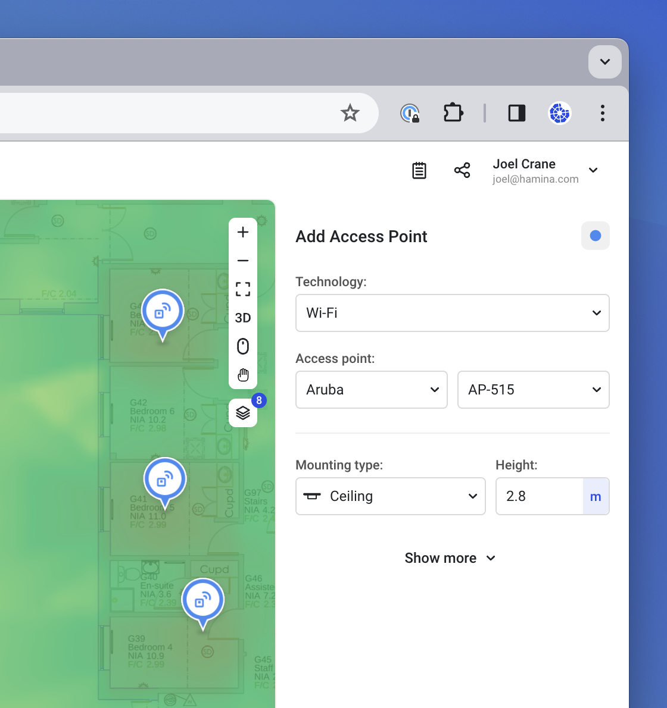
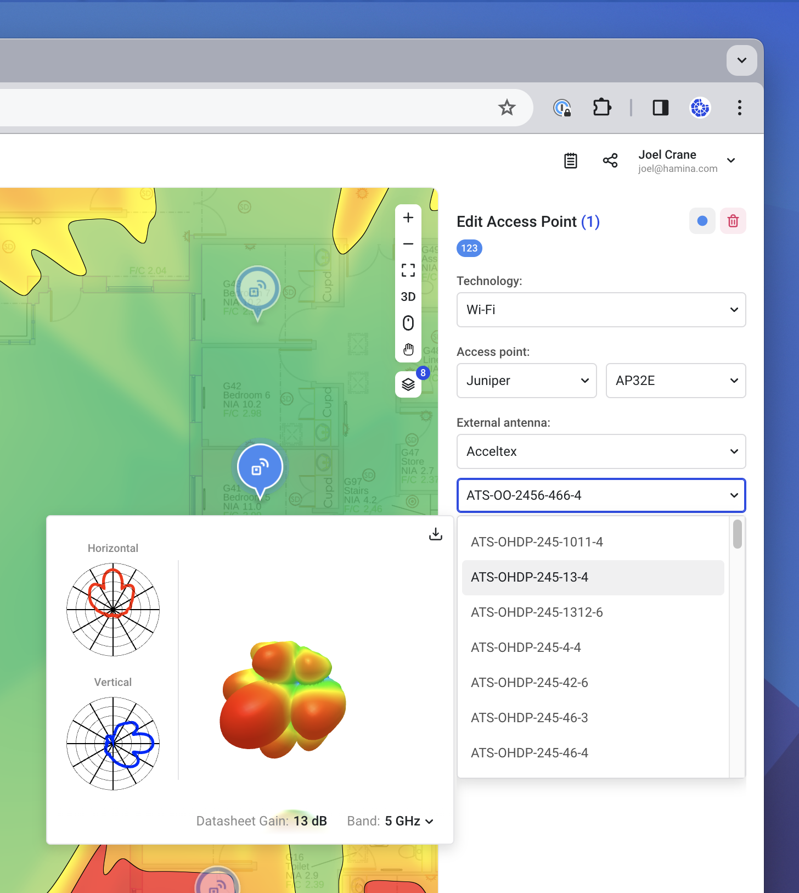
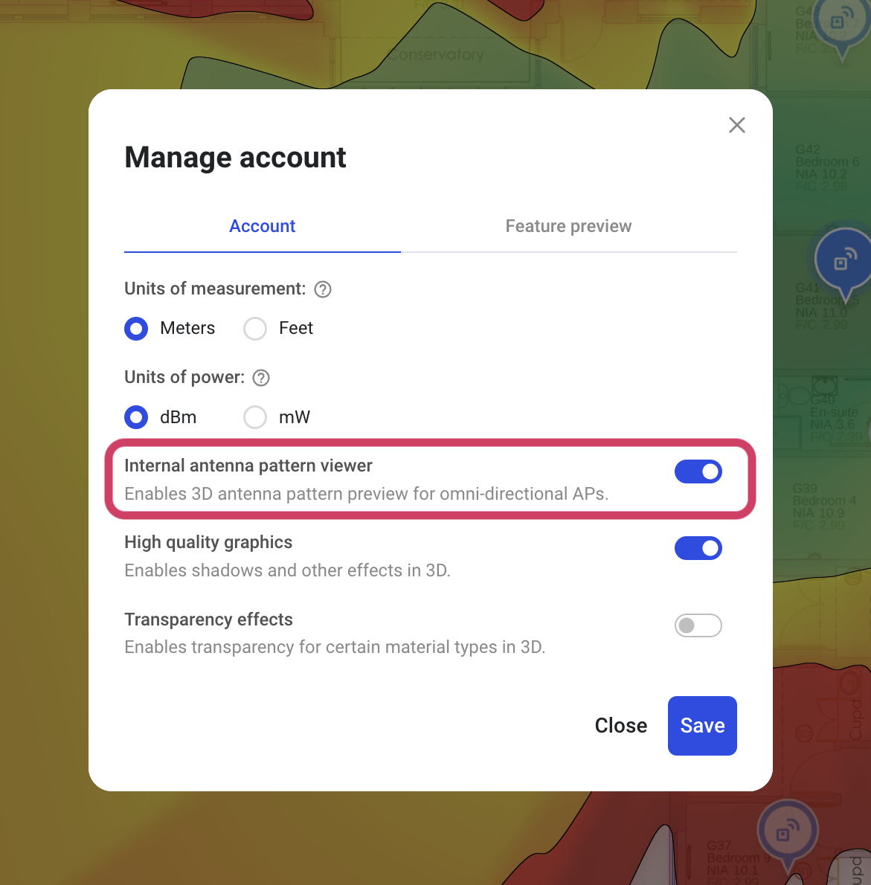
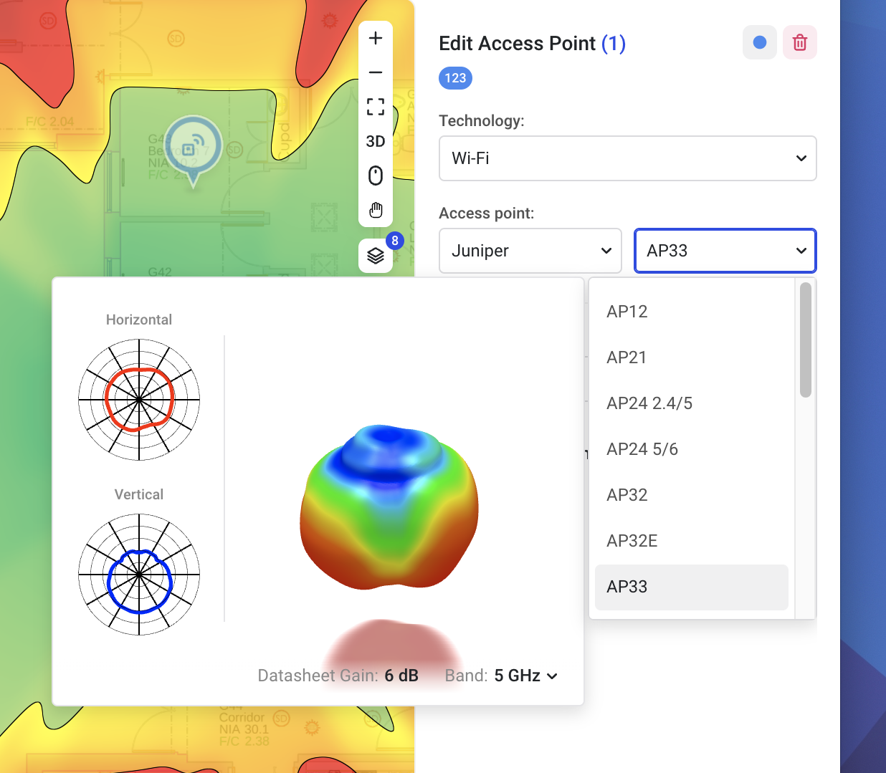
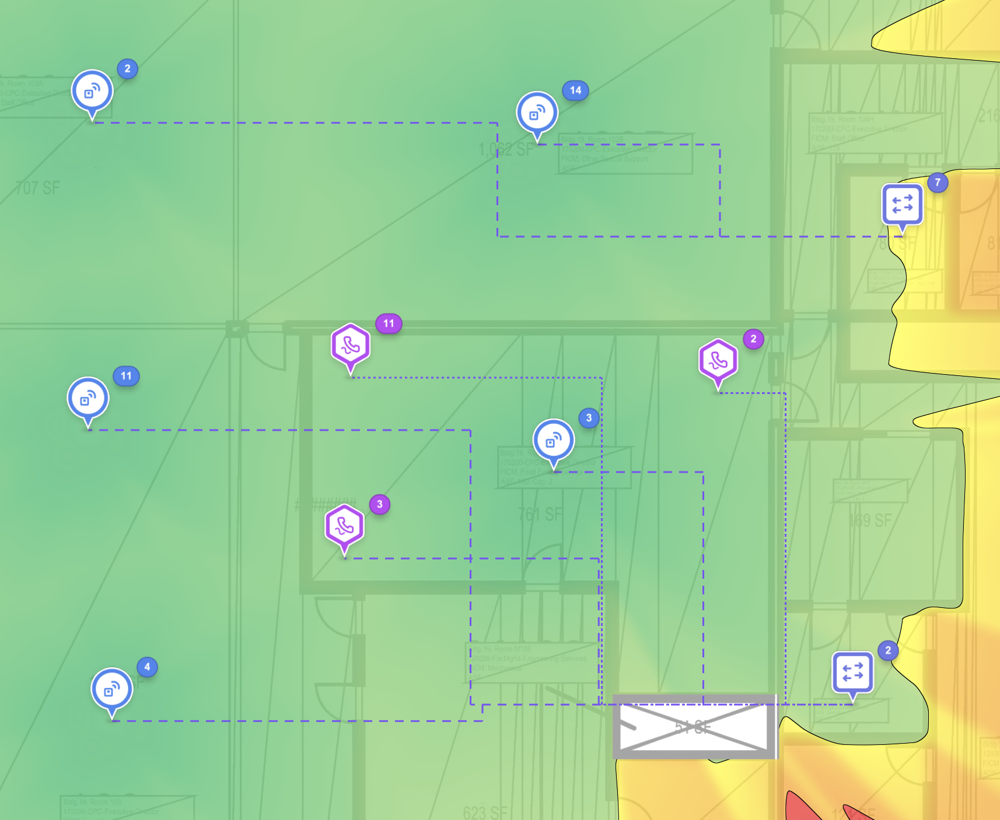
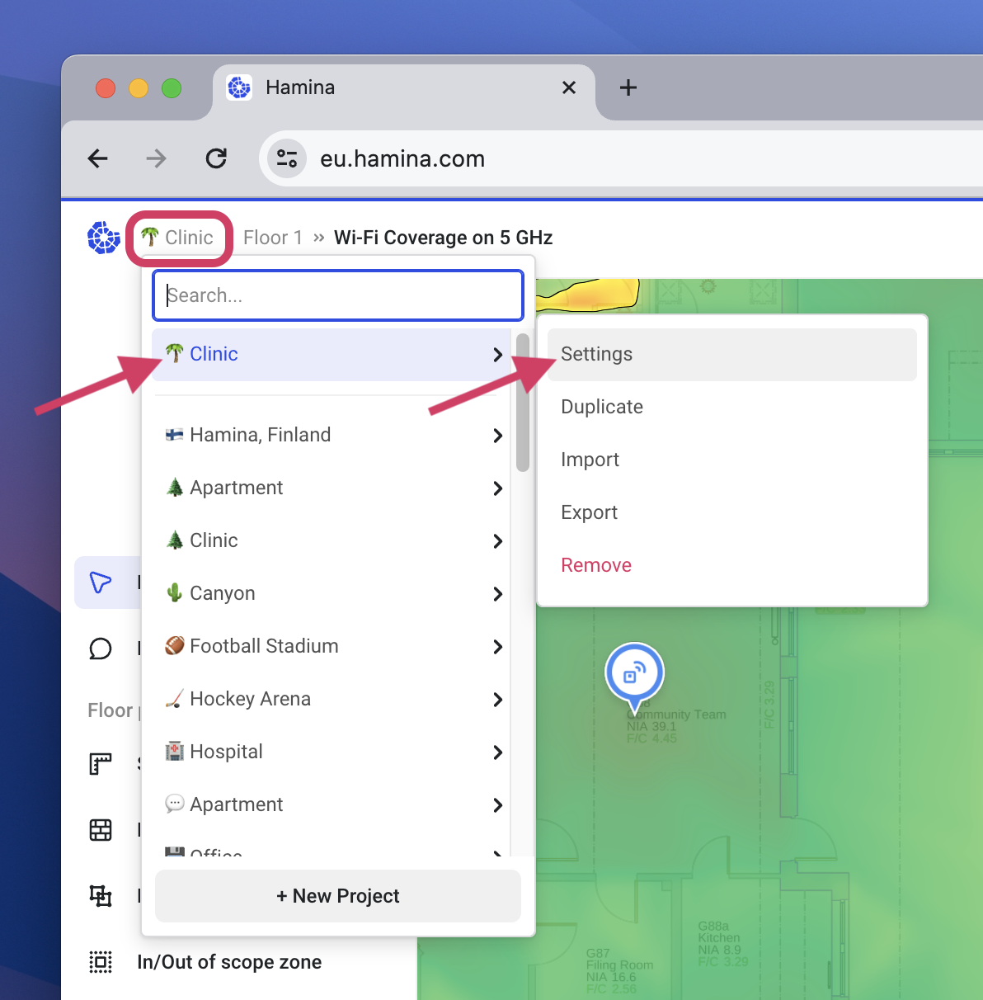
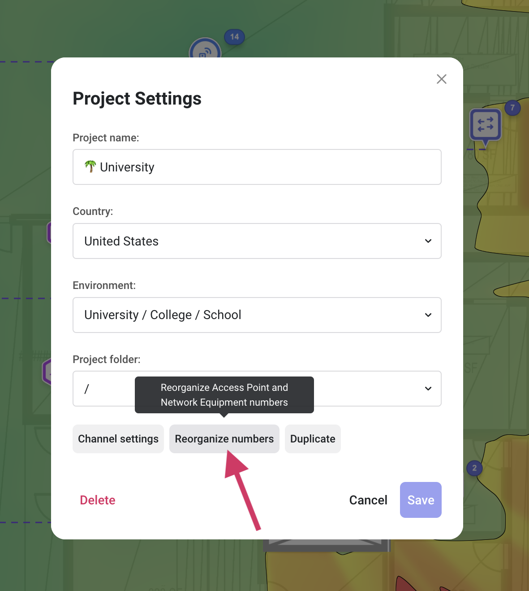
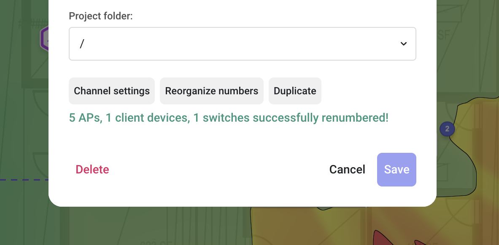
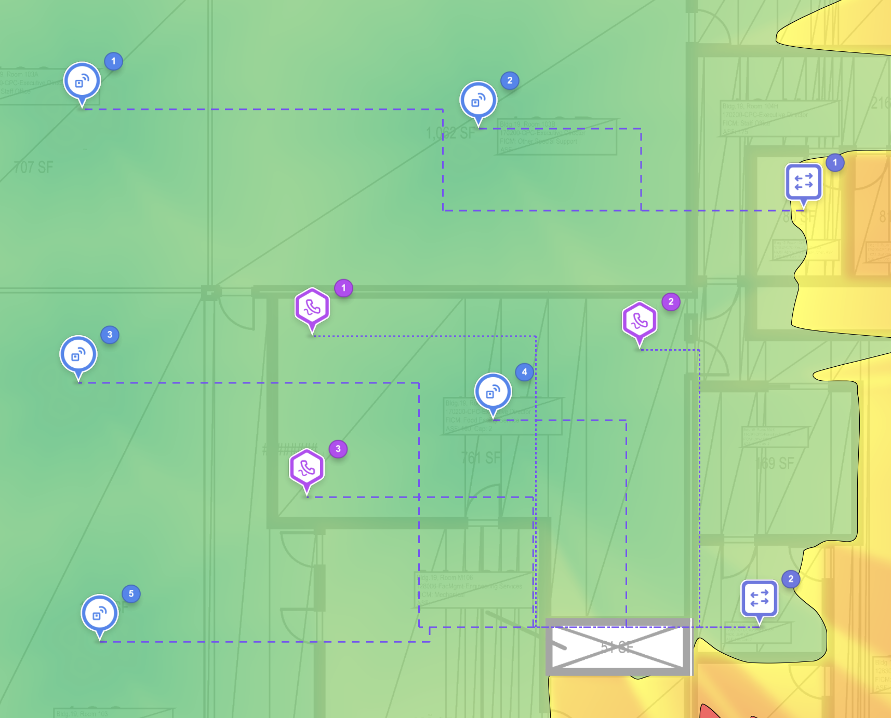

# 📶 Access Points

## Adding Access Points

To add a new access point, click on the **Access point** tool in the toolbar on the left. This will cause the **Add Access Point** pane to appear on the right.

<figure><figcaption></figcaption></figure>

In the Add Access Point pane, you can choose the technology, vendor, and model of the access point, as well as the mounting type and height. Then click on the map to place the access point.

Click the **Show more** expander to view additional options, such as the **Access Point Name**, **Transmit Power** settings, **Connected via Ethernet** selector, and **Power allocation (from switch)** settings.

### Transmit Power

The transmit power of the access point radio is configured as _Conducted Power_, in other words, the amount of power transmitted by the radio without factoring in antenna gain. The final amount of gain, or EIRP (Equivalent Isotropic Radiated Power) is calculated by adding the Conducted Power and the antenna gain together.

## Duplicating Access Points

When placing additional access points, Hamina Network Planner will reuse all of the settings from the last selected access point.

1. Select the **Access point** tool.
2. Click on the access point that you would like to duplicate.
3. Click in an empty place on the map to de-select the access point.
4. The **Add Access Point** pane will appear on the left, along with the add access point cursor.
5. Click on the map to place additional access points.

## Antenna Viewer

Hamina Network Planner includes a built-in antenna viewer for both access points with internal antennas, and external antennas. The viewer shows:

* **Horizontal** - The 2D, top-down or "Azimuth" pattern.
* **Vertical** - The 2D, side view or "Elevation pattern.
* **3D Pattern** - A 3D composite of the horizontal and vertical patterns.
* **Datasheet gain** - The gain of the antenna, according to the vendor's antenna datasheet.

<figure><figcaption></figcaption></figure>

#### Enabling AP Pattern Viewing

By default, the antenna pattern viewer does not show internal antennas in access points. To enable viewing internal antennas:

1. Open the Account menu in the upper right.
2.  Toggle on **Internal antenna pattern viewer**, and click **Save.**\

    

    <figure><figcaption></figcaption></figure>

    

3.  Now, you can mouse over access points to see their internal antenna patterns.\

    

    <figure><figcaption></figcaption></figure>

    

### Downloading Antenna Patterns

For AccelTex, Ventev, and Extreme Networks, antenna patterns are downloadable as an .OBJ file for 3D printing.

For more information about downloading and printing antenna patterns from Hamina Network Planner, [check out our blog](https://blog.hamina.com/printing-wi-fi-antenna-patterns).


If you are an antenna or access point vendor, and would like your antenna patterns to be downloadable for 3D printing, contact our support team and we'll enable it with your permission.


## Renumbering Access Points

The access point number is incremented every time a new access point is added to the design. If the user removes some access points, there might be gaps in the numbers.

<figure><figcaption></figcaption></figure>

The **Reorganize numbers** option will reset the numbering of all access points, switches, and wired clients in a left to right, top to bottom pattern. This will also remove any gaps in the numbers.

To renumber the access points, switches, and wired clients:

1.  Click on the **Project Menu**, then the current project (which will be at the top), and then **Settings**.\

    

    <figure><figcaption></figcaption></figure>

    

2.  Click the **Reorganize numbers** button.\

    

    <figure><figcaption></figcaption></figure>

    

3.  Hamina Network Planner will confirm that the access points, wired clients, and switches have been renumbered.\

    

    <figure><figcaption></figcaption></figure>

    

4. The access point, wired client, and switch renumbering is from left to right, and top to bottom.

<figure><figcaption></figcaption></figure>

