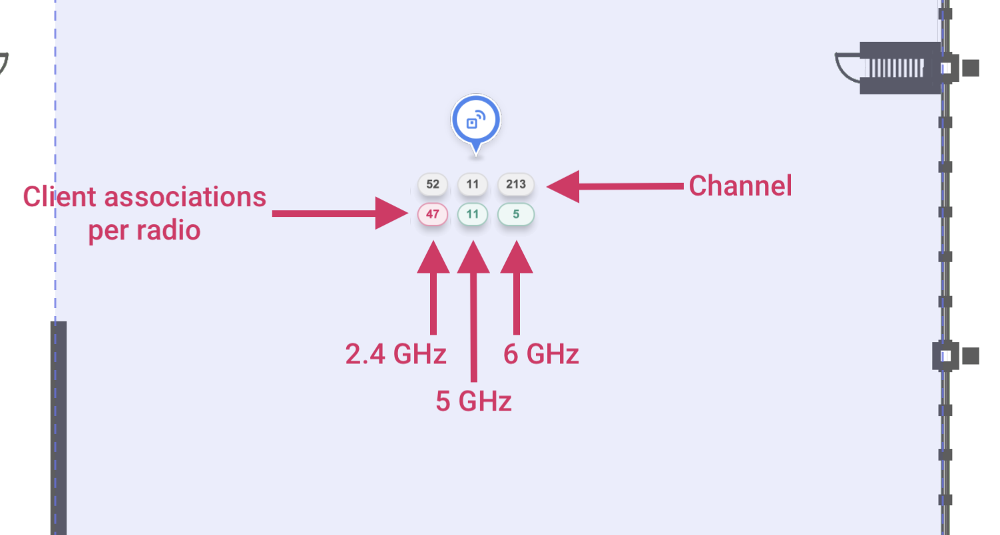
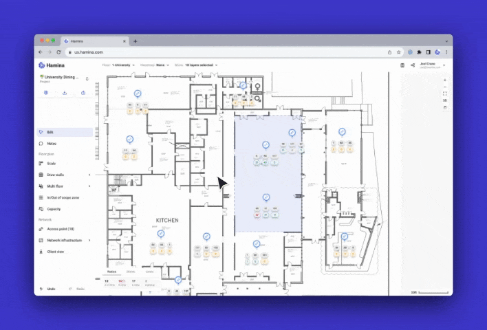

# 🚚 Capacity Planning

In Hamina Network Planner, Capacity Zones are used to add groups of clients to the map, so you can predict how many clients will associate to nearby access point radios, and ensure that no AP radio becomes overloaded.



## How Capacity Zones Work

Capacity Zones use the same client roaming algorithm as the Client View to determine which AP radios clients will associate to. When a Capacity Area is drawn on the map, the client types and amount of each client type is evenly distributed throughout the area, and then Hamina Network Planner simulates each client to determine which AP radio it will be the most likely to associate to. The client roaming algorithm also uses initial distribution to spread clients to separate frequency bands (such as 2.4 and 5 GHz).


To inform the initial distribution, samples of client band distribution were provided by Hamina Wireless customers with large networks. The sample data showed, on a dual-band SSID, how many dual-band clients associated in 2.4 GHz, and how many associated in 5 GHz.


## Creating and Drawing Capacity Areas

1. To draw an area, click on **Capacity** in the toolbar. The **Add Capacity Zone** pane will appear on the left.
2. In the **Add Capacity Zone** pane, you can optionally give the zone a custom name, and define the type and amount of clients.
3. To draw a square Capacity Zone:
   1. With the left mouse button, click and drag diagonally across the map to create a rectangle.
   2. Release the mouse button.
   3. A rectangular Capacity Zone will appear.
4. To draw a free-form Capacity Zone:
   1. Left-click on the map to place the first point.
   2. Left-click elsewhere on the map to place subsequent points.
   3. After placing the final point, right-click to stop drawing and finalize the amount of points in the free-form Capacity Zone.

<figure><figcaption></figcaption></figure>

## Editing Capacity Zones

You can change the Capacity Zone name, types of clients, and amounts of clients in a given zone at any time using the **Edit** tool.

To edit a Capacity Zone:

1. Select the **Edit** tool from the toolbar.
2. Right-click one of the edges of the Capacity Zone (not necessarily a corner).
3. The **Edit Capacity Zone** pane will appear. Any edits that you make are saved automatically.

## Viewing Capacity Results

When a Capacity Zone is placed on the current map, two additional indicators appear:

* **Capacity Indicators** underneath each access point.
* **Capacity Statistics Pane** in the lower left, either in place of, or next to the **Legend.**

<figure><figcaption></figcaption></figure>

### Per-Radio Capacity Indicators

When a Capacity Zone has been placed near an access point, Hamina Network Planner will use the client roaming algorithm to determine how many clients are expected to associate to each radio.

A number will appear underneath each radio channel number, indicating how many clients are predicted to be associated to each radio. If too many clients are associated to the radio, then the indicator will turn red.

<figure><figcaption></figcaption></figure>


Access points running in dual 5 GHz mode will show two 5 GHz radios. Access points sure can be complicated these days!


#### Configuring Capacity Thresholds

To configure the per-radio client capacity threshold, click on the **Capacity Statistics Pane** in the lower right. The **Requirements for Capacity Pane** will appear on the left, where you can set thresholds for radios in each frequency band.

<figure><figcaption></figcaption></figure>

## Capacity Statistics

When a Capacity Zone is placed on the current map, the **Capacity Statistics Pane** will appear. It has three tabs:

* **Radios** - Shows how many radios are present on the map for the given frequency band. If the radio is red, that indicates that there are radios that are over capacity. For example, <mark style="color:red;">**17/2**</mark> indicates that there are 17 radios, but two of them are over capacity.
* **Clients** - Shows the distribution of all clients on the map, across all of the Wi-Fi frequency bands and all cellular clients.
* **Limits** - Shows the configured Per-Radio Capacity Thresholds, per Wi-Fi band and all cellular.

<figure><figcaption></figcaption></figure>
