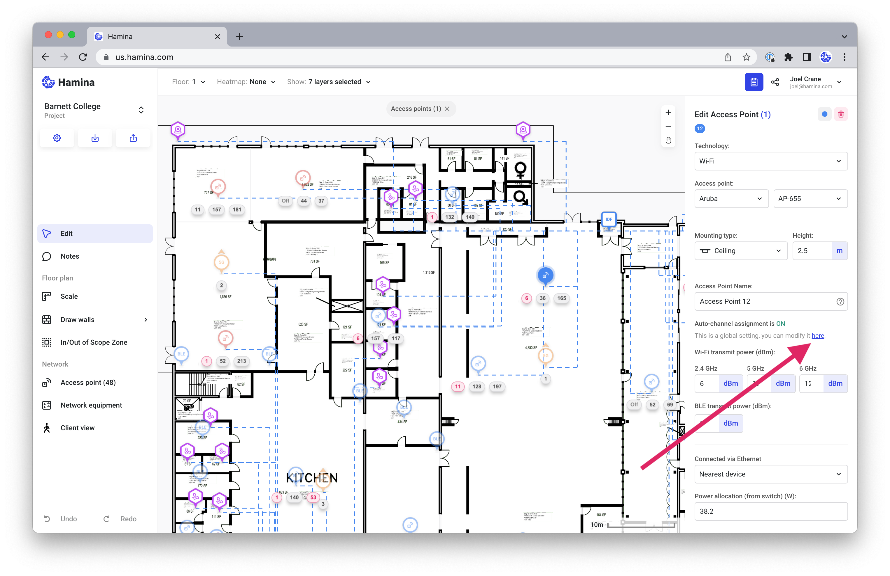
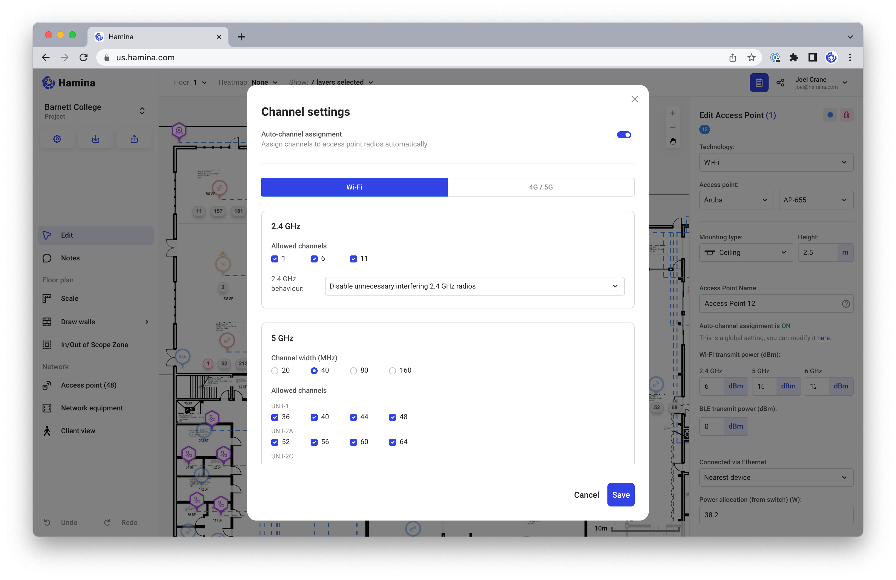

# 📺 Channel Planning

Hamina includes an automatic channel planner, which runs whenever any adjustments are made to the predictive model, such as adding walls or moving access points.

The channel planner attempts to minimize or remove co-channel interference, uses any available channels allowed in the Channel Settings window.

## Opening the Channel Settings

1. Click on any access point on the map.
2.  In the Edit Access Point pane, click **show more**.\

    <figure><figcaption></figcaption></figure>
3.  Click the link to open the **Channel Settings** window.\

    <figure><figcaption></figcaption></figure>

### Removing Channels

In 2.4, 5, and 6 GHz, it is possible to remove channels from the channel plan. It is very common to remove channels from the 5 GHz channel plan, due to factors such as:

* Neighboring networks already using channels
* Lack of client device support on certain channels (for example, some clients do not support channel 144)
* Lack of access point support on certain channels
* Non-Wi-Fi technologies operating in the same frequency space as some Wi-Fi channels

You can use the Chanel Settings window to remove channels from the channel plan but unchecking them, and clicking **Save**.

