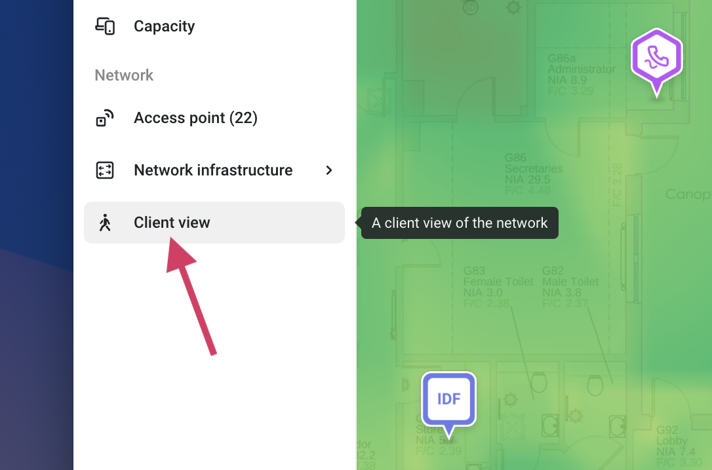
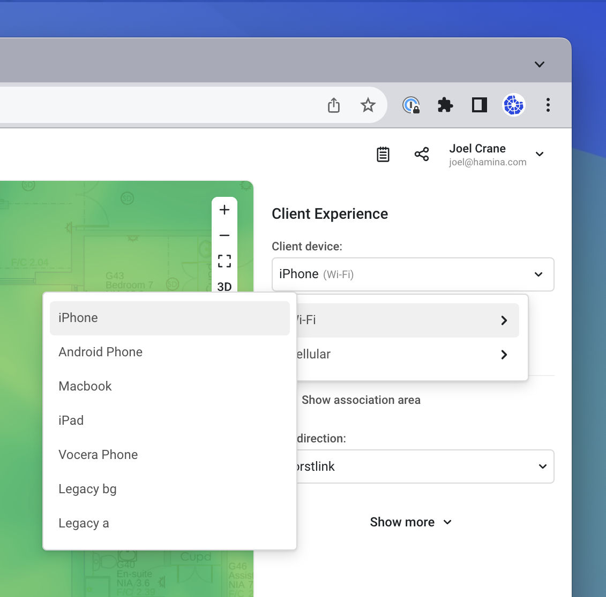
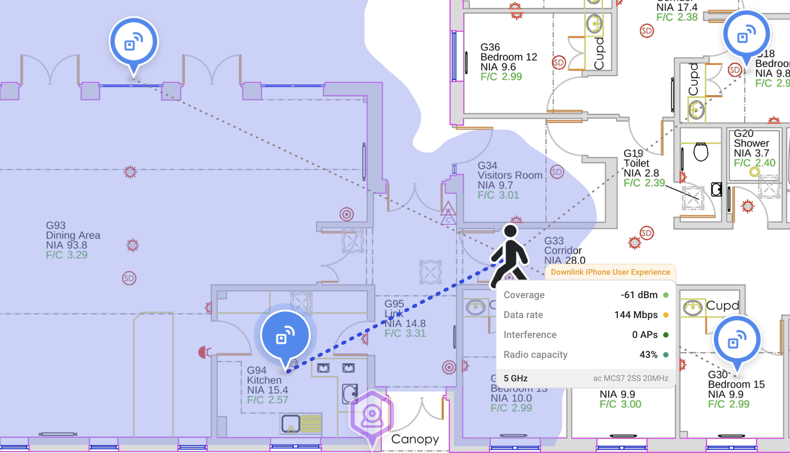
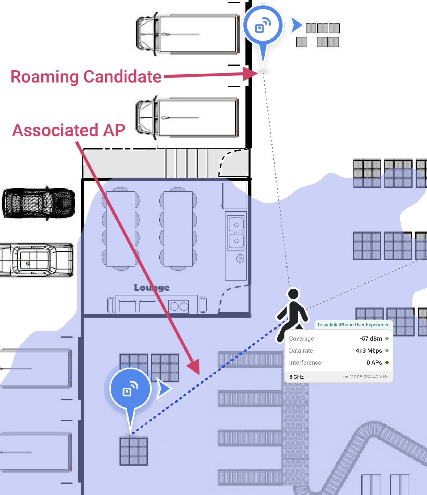
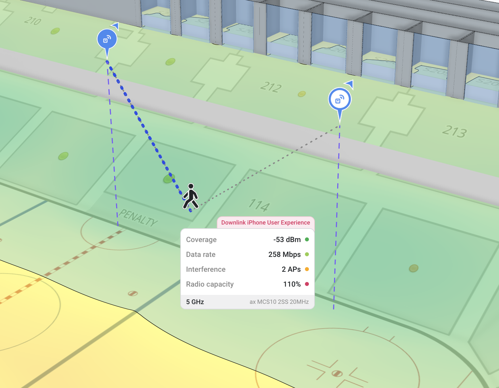
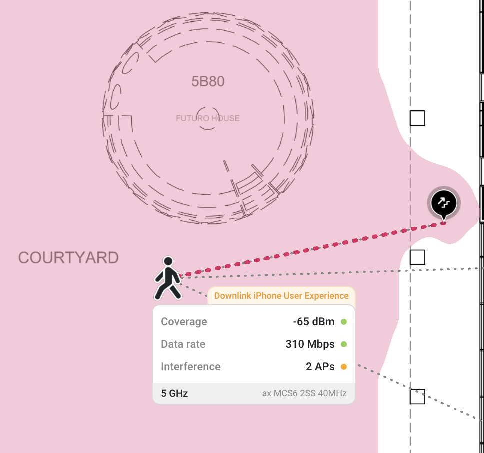

# 📱 Client View

The Client View simulates the roaming behaviors and band preferences of specific client devices, so you can see when the client will most likely decide to roam, and which access point the client will decide to roam to. In most cases, the available clients are simulated using the documented roaming behaviors, as provided by the client vendors.

By knowing which access point a client is most likely to associate to, the Client View also shows useful statistics about coverage, data rate, access point radio capacity.&#x20;


If you are a client vendor, and would like to see your client in Hamina Network Planner, please reach out to us at support@hamina.com with your roaming specifications.



A client's decision to roam varies greatly between vendors, operating systems, chipsets, and drivers, and is also influenced by a wide range of conditions that are outside of what Hamina Network Planner can simulate (such as how much data the client is transmitting at a given time).

As a result, Hamina Network Planner's client roaming simulation will never perfectly match the real world, but it can be extremely useful for demonstrating expected network performance to managers and customers, and helping them understand why you designed your network in a specific way.


The Client View tool is available with a Planner subscription, without a subscription when viewing a project, and in web-based reports.

## Using the Client View

To activate the **Client view** tool, click on **Client view** in the **Network** section in the toolbar.

<figure><figcaption></figcaption></figure>

In the **Client Experience** pane on the right, select the desired Wi-Fi or Cellular client from the **Client device** drop down.

<figure><figcaption></figcaption></figure>

Click on the map to place the client, and view the network from the client's perspective. Click and drag the client across the map to simulate client movement. The client will roam from access point to access point, based on the client's known roaming algorithm.

<figure><figcaption></figcaption></figure>


Drag the client around the map to see how the client is expected to roam between APs and bands.


### Client View Details

With the client placed on the map, or being moved around the map, the **Client View Details** pane will appear.

* The blue dashed line shows which AP the client is currently associated to.
* The thin grey dashed lines show roaming candidates.

<figure><figcaption></figcaption></figure>

Listed in the Client View Details pane:

* **Coverage**: The current received signal strength by the client. The client is assumed to have a 0 dBi, isotropic (perfectly omni-directional) antenna.
* **Data rate**: The current expected data rate of the client, which is based on:
  * AP and client spatial streams
  * AP and client Phy types
  * AP and client signal-to-noise ratio
  * Channel width
* **Interference**: How much co-channel interference the client is experiencing from APs.
* **Radio Capacity**: Appears whenever the client is near a Capacity Zone, and is a percentage of the AP radio's amount of associated clients and the capacity threshold for the AP radio.

Along the bottom of the Client View Details pane:

* **Current band**: The frequency band that the client is associated in. Hamina Planner will simulate a client performing an inter-band roam, or roaming to an AP in 2.4 GHz, when no 5 GHz option is available, per the known roaming algorithm of the selected client type.
* The MCS, client spatial streams, and channel width, which is all used to calculate the **Data rate**.

<figure><figcaption></figcaption></figure>

### Client View Settings

The Client Experience pane on the right has additional settings:

* **6 GHz capable**: Enables 6 GHz capabilities for the selected client.
* **Wi-Fi 7 capable** (coming soon): Enables Wi-Fi 7 for the selected client.
*   **Show association area**: Disables the current heatmap, and shows a blue area in which the client will stay associated to the AP. If the area is red, then the client is associated to an AP on a different floor.\

    

    <figure><figcaption></figcaption></figure>

    

* **Link direction** (only with **Hamina Network Planner Plus**)
  * **Downlink**: Displays simulated values as received and measured by the client.
  * **Uplink**: Displays simulated values as received and measured by the AP.
  * **Worstlink**: Displays either downlink or uplink, whichever has the worst signal (RSSI for Wi-Fi, or RSRP for Cellular). Worstlink is the default setting.

Below the **Show more** expander, there are further settings:

* **Client height**: The height of the client. This setting is linked to the **Client height** setting in the **Adjust requirements** pane.
* **Noise floor**: Sets the noise floor, per band. This setting is linked to the **Noise floor** setting in the **Adjust requirements** pane for SNR and Data Rate heatmaps.
* **Client transmit power**: Sets the transmit power of the client in milliwatts.
* **Min. interfering RSSI**: Defines the minimum signal strength threshold for an access point to be considered "interfering".
