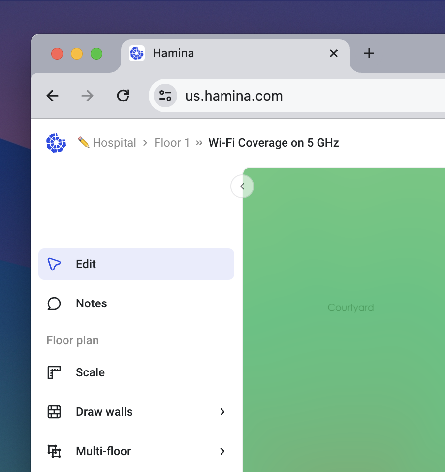
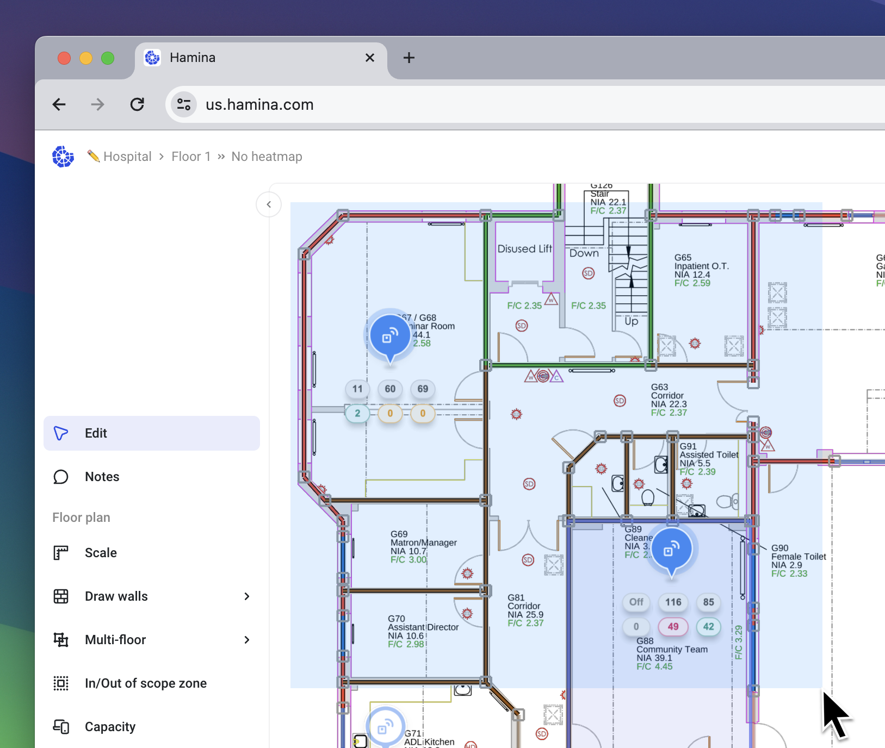
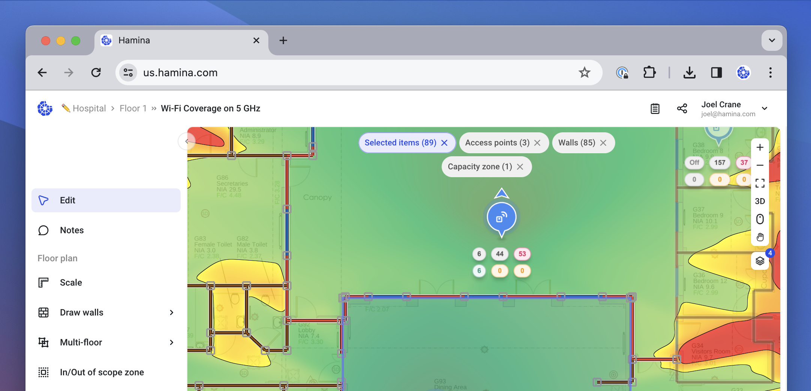
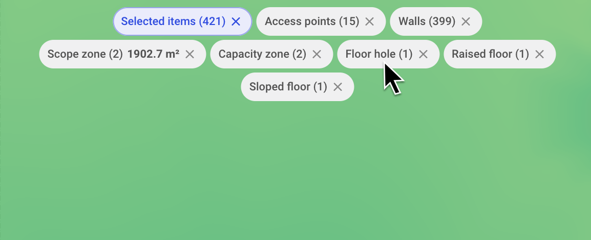
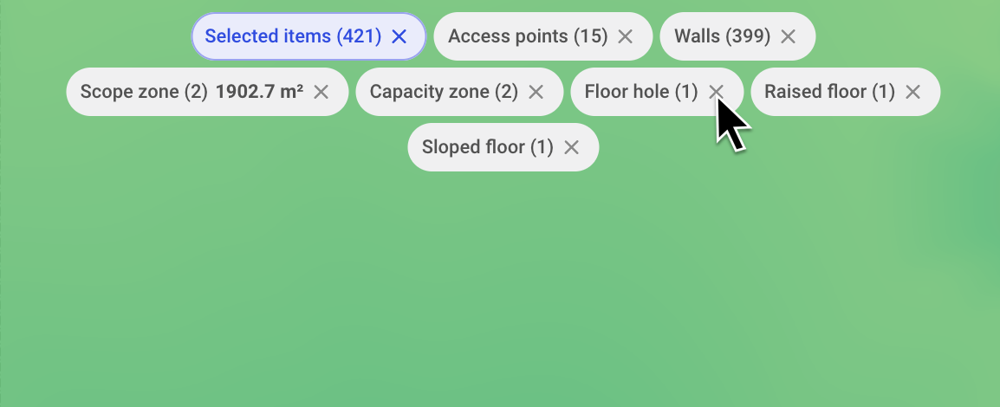

# 🖊 Edit Tool

The Edit tool us used for selecting, editing, or moving objects on the map.

<figure><figcaption></figcaption></figure>

## Selecting a Single Object

To select an object, left-click it. Selectable objects include:

* Walls and attenuating objects
* Floor holes, raised floors, and sloped floors
* Scope zones
* Capacity zones
* Access points
* Switches, routers, IDFs, and MDFs
* PoE clients

For most object types, selecting the object will cause an Edit pane to appear on the right.

## Selecting Multiple Objects

To select multiple objects, click and drag to make a selection rectangle. Alternatively, hold down Shift while clicking multiple objects, or press **`⌘`** + `A` or `Ctrl` + `A` to select all objects on the map.

<figure><figcaption></figcaption></figure>


If a heatmap is enabled, only the selected access points will be included in the visualization. You can use this to view coverage from specific access points. For Secondary and Tertiary Coverage, be sure to select at least either two or three access points, respectively.


## Filtering Objects

When objects are selected, clickable Filters will appear at the top center of the map.

<figure><figcaption></figcaption></figure>

To filter to a specific type of object, click on the associated **Filter**. This will remove all of the other filters, focusing on the specific object type that you selected.

<figure><figcaption></figcaption></figure>

To remove a specific type of object from the selection, click the **X** inside the **Filter**. You can repeat this action to remove any object types from the selection.

<figure><figcaption></figcaption></figure>


While not specifically part of the edit, selection, and filtering tools, you can also use the Show Layers menu to aid in filtering. Hide any layers that you don't wish to select, before using the Edit tool to make selections. Objects on hidden layers won't be included in selections.


