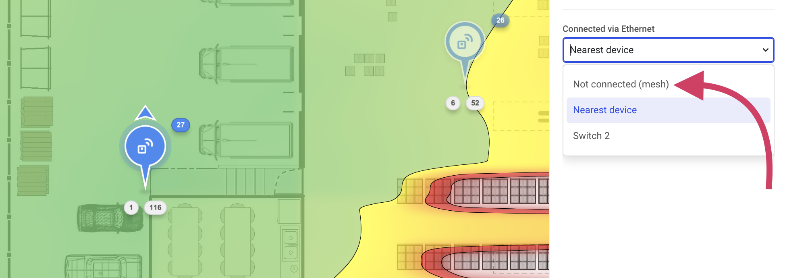
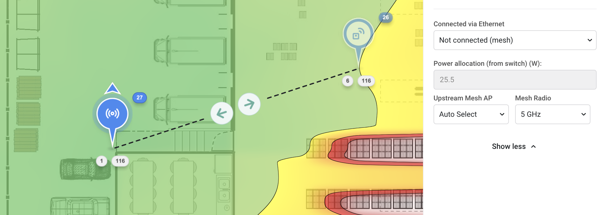
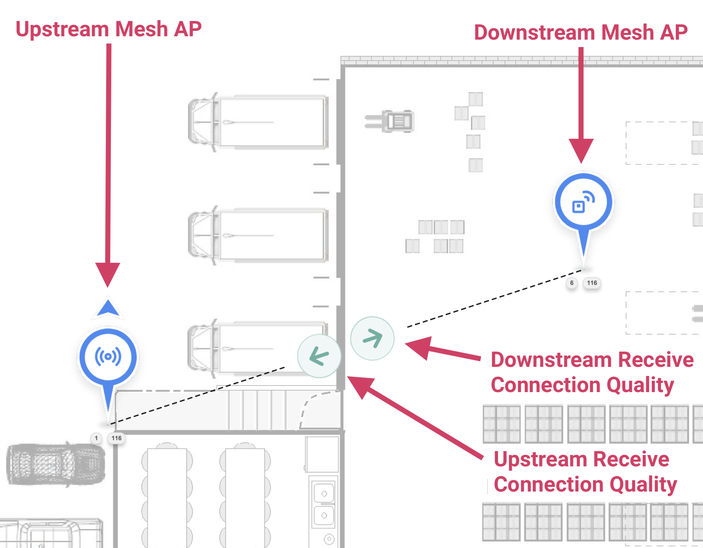
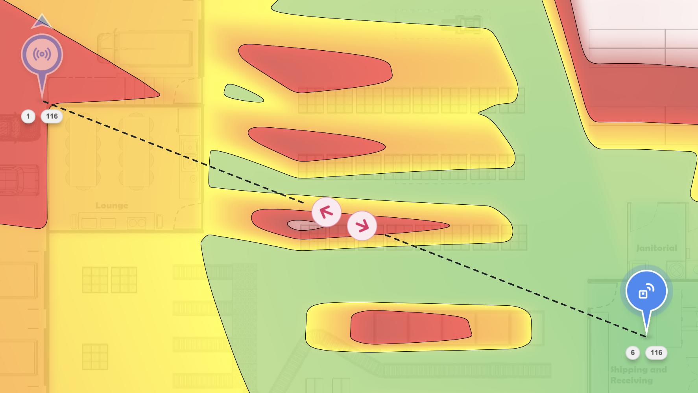
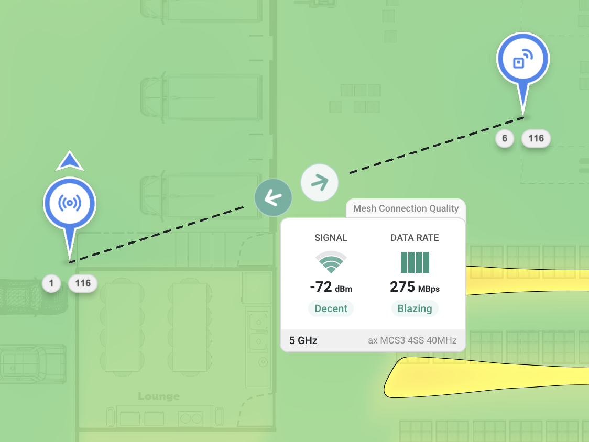

# 🔗 Mesh Planning

By default, the **Connect via Ethernet** setting in Hamina is set to `Nearest Device`, which will cause the access point to be cabled to the nearest network switch. By changing **Connected via Ethernet** setting to `Not connected (mesh)`, Hamina will enable mesh mode for the selected AP, at which point the mesh link can be visualized.

Mesh terminology in Hamina Network Planner:

* **Upstream Mesh AP** - The root node/mesh gateway.
* **Downstream Mesh AP** - The non-root node of the mesh.

## Enabling Mesh Mode

To enable single-hop mesh mode in Hamina:

1. Using the **Edit** tool, select the access point that you would like to enable mesh mode on.
2. In the **Edit Access Point** pane on the left, click **Show more** at the bottom.
3.  In the **Connected via Ethernet** dropdown, select `Not connected (mesh)`.\

    <figure><figcaption></figcaption></figure>
4.  The access point will now establish a mesh backhaul to the nearest access point, defaulting to the 5 GHz radio. You can choose a specific **Upstream Mesh AP** and **Mesh Radio** as desired.\

    <figure><figcaption></figcaption></figure>


The Upstream Mesh AP's mesh radio receives a channel assignment from the automatic channel planner. The Downstream Mesh AP mesh radio will use the same channel.


## Viewing the Mesh Link

When single-hop mesh mode is enabled, a dashed line appears showing the mesh link and Link Quality Arrows. The Downstream Mesh AP (non-root node) uses a different icon to differentiate it from Upstream Mesh APs (root nodes).

<figure><figcaption></figcaption></figure>

### Connection Quality Arrows

Depending on the signal strength of the link, the Connection Quality Arrows will change colors depending on the Primary Signal Strength heatmap settings. In other words, they use the same thresholds and colors as the Signal Strength heatmap.

<figure><figcaption>
Example of a link with poor quality. The signal strength is so low that it is below the red threshold, which is -82 dBm by default.
</figcaption></figure>

### Connection Quality Details

To view the details about the quality of the mesh link, click on one of the arrows.

The arrow pointing towards the Upstream Mesh AP (non-root node) shows how well it is receiving on the link. In other words, it is showing the receive signal strength and data rate from the Downstream Mesh AP (root node/gateway).

<figure><figcaption>
The arrow pointing towards the Upstream Mesh AP is selected, so it is showing the Upstream Mesh APs perspective on the link. The Upstream Mesh AP is hearing the other AP at -72 dBm.
</figcaption></figure>

Conversely, the arrow pointing towards the Downstream Mesh AP (root node/gateway) shows how well it is receiving on the link. It is showing the receive signal strength and data rate from the Upstream Mesh AP (non-root node).
