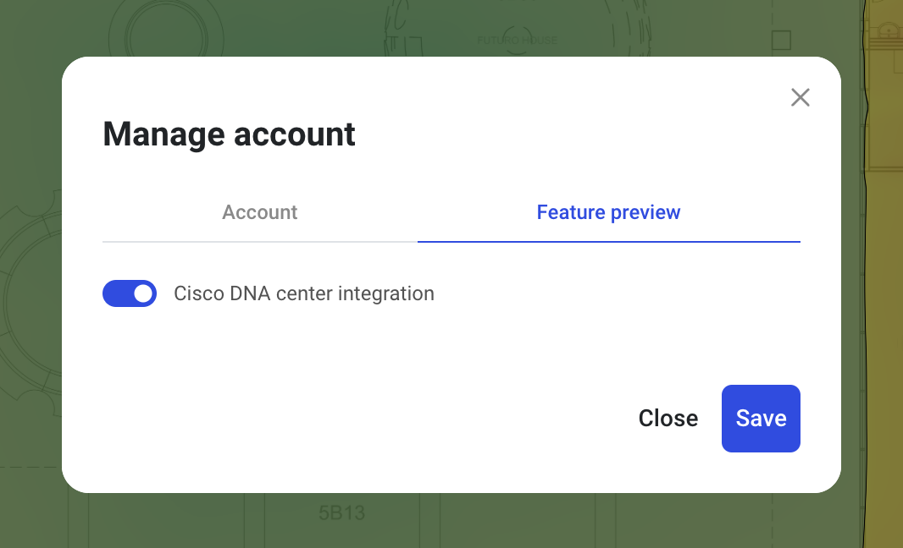
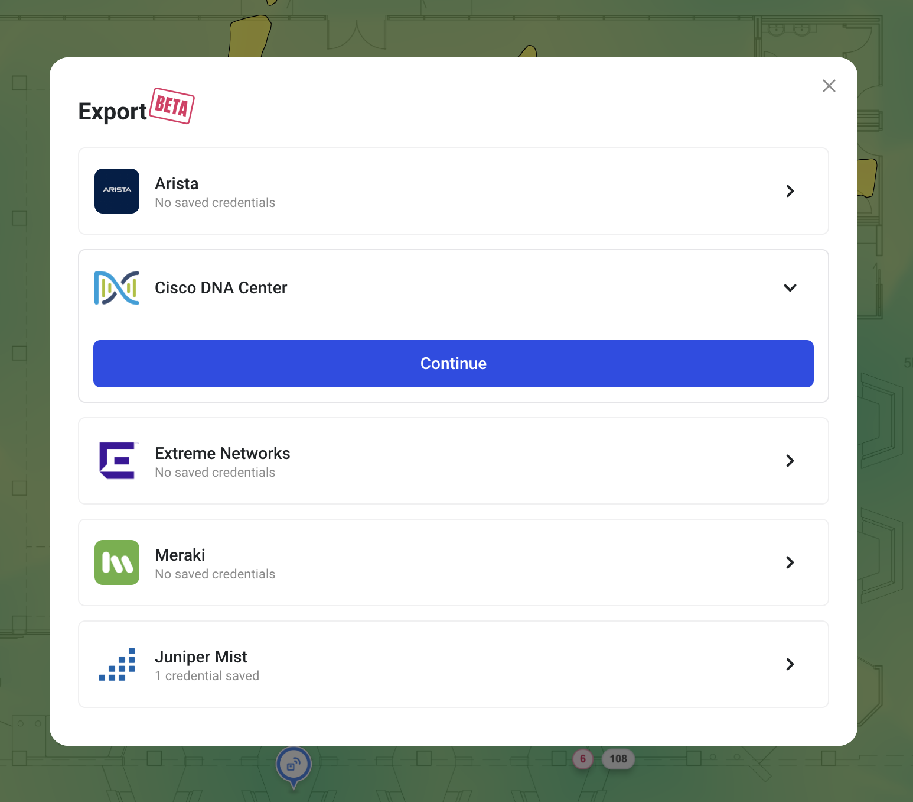
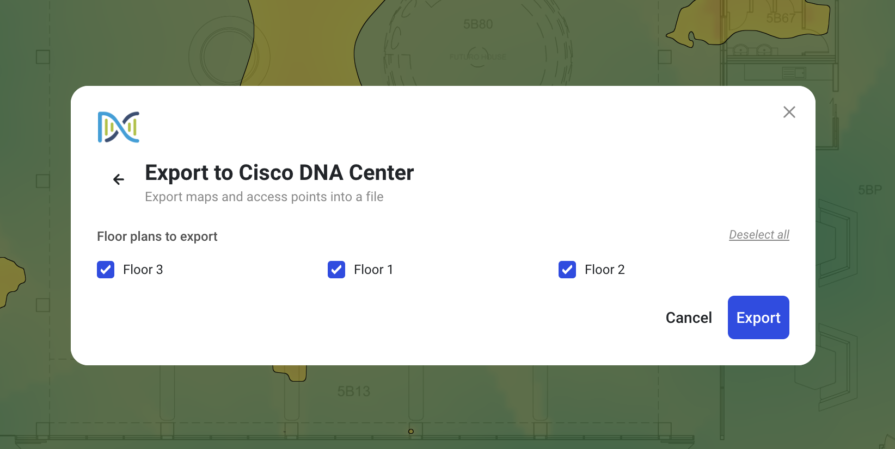
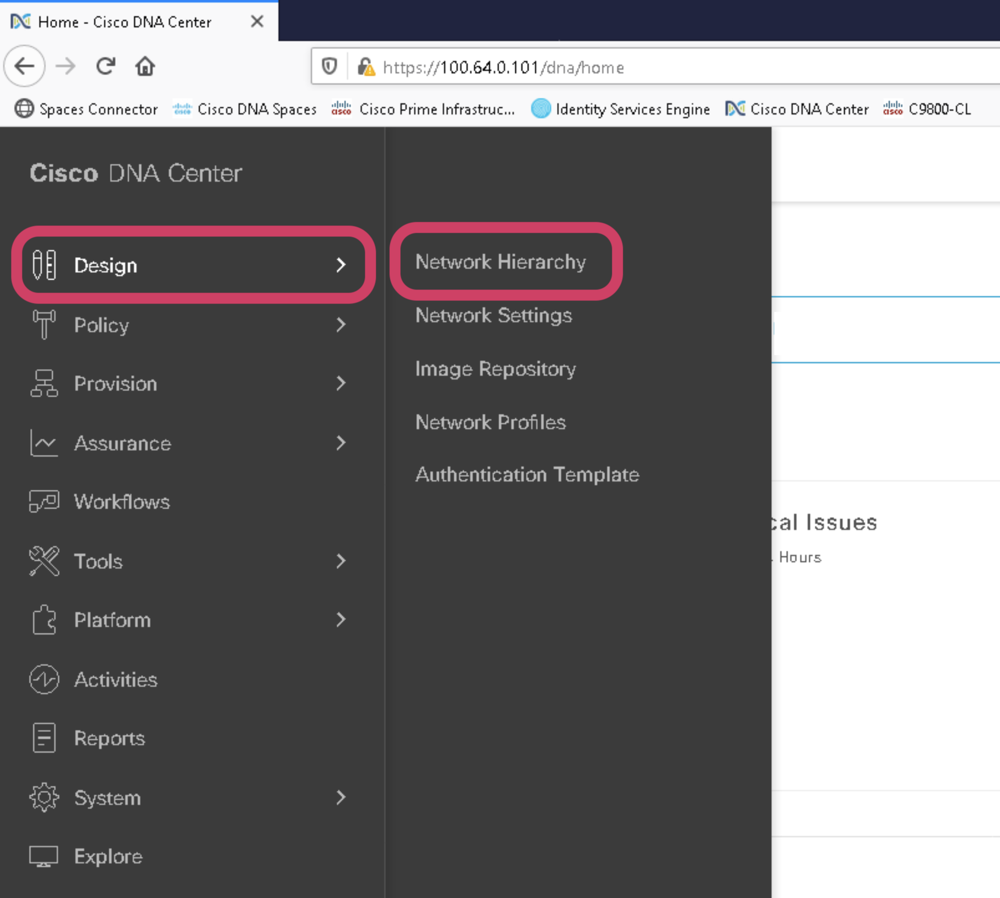
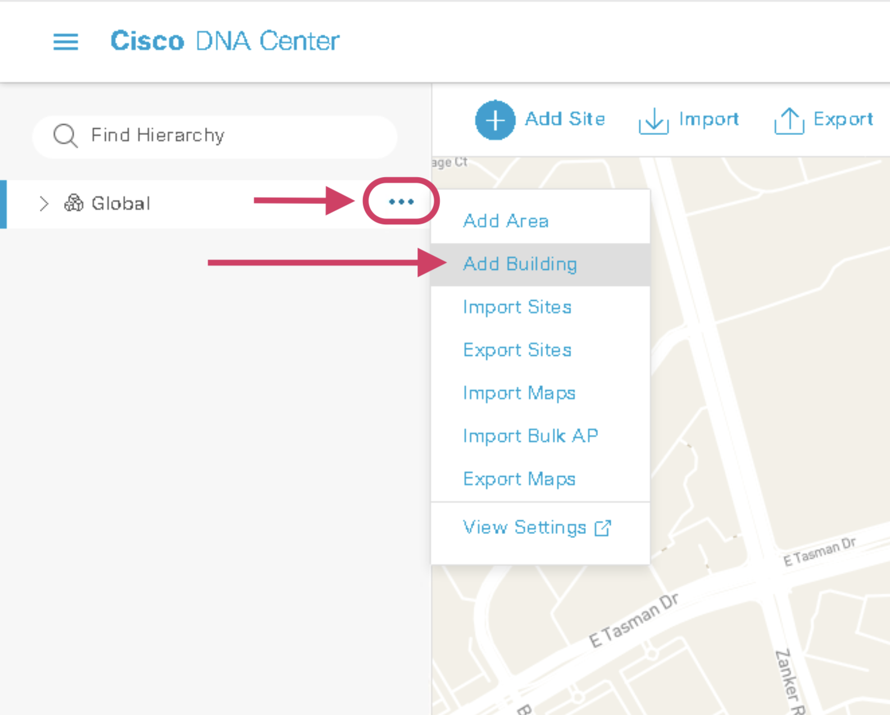
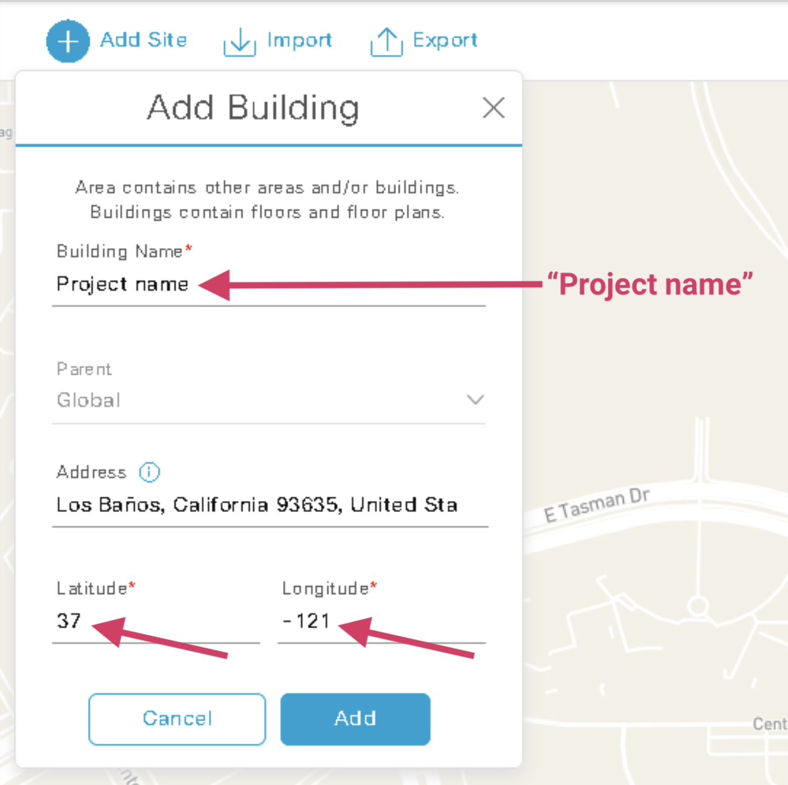
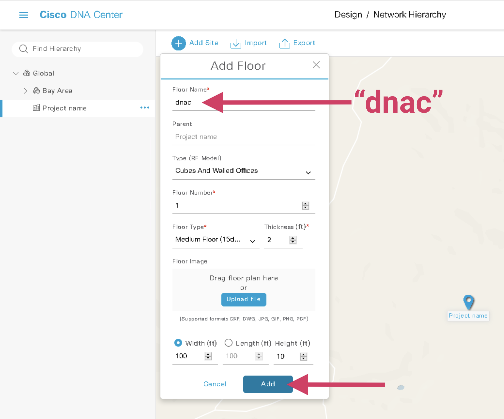
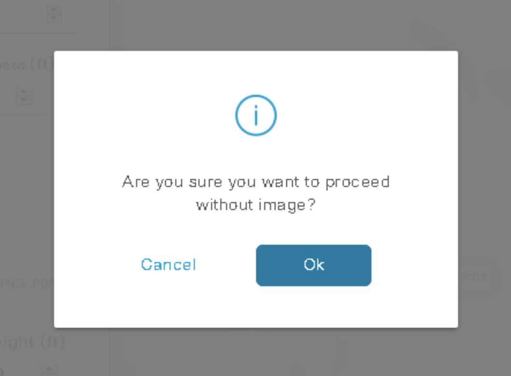
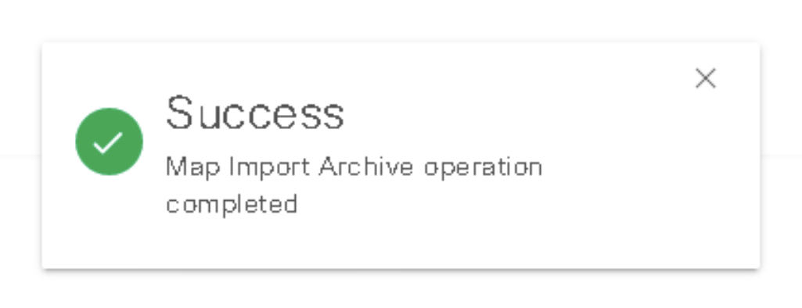
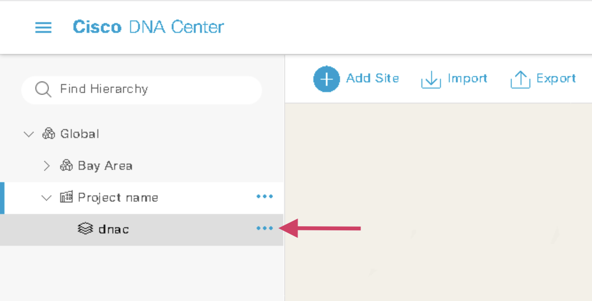

# 🧬 Cisco Catalyst Center

Hamina Network Planner can export the network design as a file that can be imported to Cisco DNA Center (formerly known as Cisco DNA Center or "DNAC").


This feature is currently in development, and is only available in Hamina Network Planner as a <mark style="color:red;">**Feature Preview**</mark>. It probably won't work at all, but feel free to give it a try if you're interested.


## Enabling the Cisco Catalyst Center Feature Preview

Since Cisco Catalyst Center Export is only available as a <mark style="color:red;">**Feature Preview**</mark>, it must be manually enabled before it will appear in the Export menu.

1.  Click on the **Account** menu in the upper right corner, and select **Edit Account** from the list.\

    

    <figure><figcaption></figcaption></figure>

    

2.  Click the **Feature preview** tab, and enable **Cisco DNA center integration**.\

    

    <figure><figcaption></figcaption></figure>

    

## Exporting From Hamina Network Planner

1.  Click the **Export Project** button.\

    

    <figure><figcaption></figcaption></figure>

    

2.  Select **Cisco DNA Center** from the list, and click the **Continue** button.\

    

    <figure><figcaption></figcaption></figure>

    

3.  Choose the desired floors and click **Export**. A progress indicator will appear at the top of the screen.\

    

    <figure><figcaption></figcaption></figure>

    

## Importing to Cisco Catalyst Center

1.  Log into Cisco Catalyst Center/Cisco DNA Center, open the hamburger 🍔 in the upper left.\

    

    <figure><figcaption></figcaption></figure>

    

2.  Click **Design**, and then **Network Hierarchy**.\

    

    <figure><figcaption></figcaption></figure>

    

3.  Next to the root of the hierarchy, click the **ellipsis menu**, and then **Add Building**.\

    

    <figure><figcaption></figcaption></figure>

    

4.  In the **Add Building** window, enter `Project name` in the **Building Name** field.  Set the latitude and longitude of the site, and click the **Add** button.\
    \
    _Note: For now, this specific name is required, but should be fixed before the Feature Preview concludes._\

    

    <figure><figcaption></figcaption></figure>

    

5.  Next to the new building in the hierarchy, click the **ellipsis menu**, and then **Add Floor**.\

    

    <figure><figcaption></figcaption></figure>

    

6.  In the **Add Floor** window, and enter the name of the floor you want to import in the **Floor Name** field. In our example, the floor name is "dnac".\

    

    <figure><figcaption></figcaption></figure>

    

7.  Proceed without an image.\

    

    <figure><figcaption></figcaption></figure>

    

8. In the toolbar along the top of the map, click **Import**, then click **Import Maps**.\
   \

9.  Choose the `tar.gz` file that was generated in Hamina Network Planner, and click the **Import** button.\

    

    <figure><figcaption></figcaption></figure>

    

10. Success! 🎉\

    

    <figure><figcaption></figcaption></figure>

    

11. Choose the map in the hierarchy.\

    

    <figure><figcaption></figcaption></figure>

    

12. The floor plan and access points should now be visible. _Note: For now, you will need to manually match AP models._\

    

    <figure><figcaption></figcaption></figure>

    

