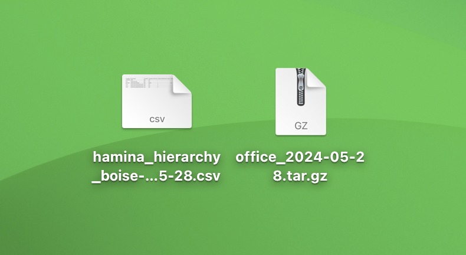
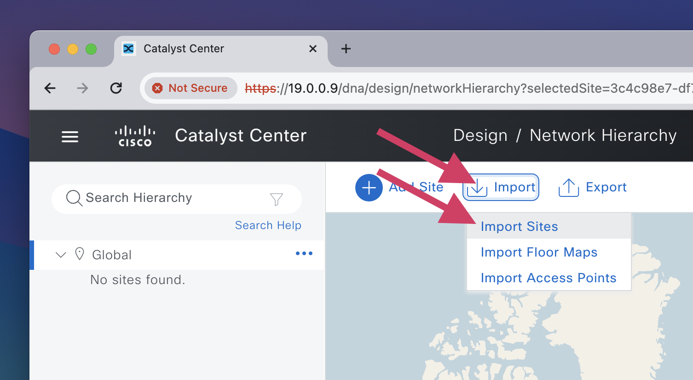

# 🧬 Cisco Catalyst Center

Hamina Network Planner can export the network design as a file that can be imported to Cisco Catalyst Center (formerly known as Cisco DNA Center or "DNAC").

In Cisco Catalyst Center, there are two ways to import data:

* With a hierarchy file generated in Hamina Network Planner. This generates a `.csv` file, which contains the entire hierarchy including buildings and floors. The following instructions use this method, which is recommended.
* Manually, without a hierarchy file. With this method, you will need to define an exact hierarchy, or Cisco Catalyst Center will fail to import the Floor Maps. Instructions for this method can be found in a [later section of this article](cisco-catalyst-center.md#manual-hierarchy).

## Exporting from Hamina Network Planner

1.  In the Project menu, select **Export Project**.\

    

    <figure><figcaption></figcaption></figure>

    

2.  Select **Cisco Catalyst (DNA) Center** from the list, and click the **Continue** button.\

    

    <figure><figcaption></figcaption></figure>

    

3.  Define the **Areas**, **Building** name, and choose which floor plans to export. **Sub-areas** can be defined with a `/` symbol.\

    

    <figure><figcaption></figcaption></figure>

    

    Since we will be downloading a hierarchy and uploading it to Cisco Catalyst Center, you can define areas, sub-areas, and the building as you see fit (but you may want to consider your existing hierarchy).\

    

    <figure><figcaption></figcaption></figure>

    

4.  Click **Download hierarchy** and **Download project.**\
    \
    **Download hierarchy** will download a **Sites** / **Hierarchy** / `.csv` file, which defines Areas, Sub-areas, Buildings, and Floors.\
    \
    Download project will generate a **Project** / **Floor Maps** / `tar.gz` file, which contains the maps and APs.\

    

    <figure><figcaption></figcaption></figure>

    

## Importing to Cisco Catalyst Center

1.  In Cisco Catalyst Center, click the menu icon.\

    

    <figure><figcaption></figcaption></figure>

    

2.  In the menu, click **Design** and then **Network Hierarchy**.\

    

    <figure><figcaption></figcaption></figure>

    

3.  In the toolbar along the top, click **Import**, then **Import Sites**.\

    

    <figure><figcaption></figcaption></figure>

    

4.  Upload the **Sites** / **Hierarchy** / `.csv` file that was generated in Hamina, and contains definitions for Areas, Sub-areas, Buildings, and Floors.\

    <figure><figcaption></figcaption></figure>
5.  Once the import is complete, you'll see the hierarchy in Cisco Catalyst Center. _Optionally, you can define an address for your new building._\

    

    <figure><figcaption></figcaption></figure>

    

6.  Now that the hierarchy exists, select **Import** > **Import Floor Maps** to upload the **Project** / **Floor Maps** / `tar.gz` file, which contains the maps and APs.\

    

    <figure><figcaption></figcaption></figure>

    

    

    <figure><figcaption></figcaption></figure>

    

7.  Follow the prompts in Cisco Catalyst Center to import the file, preview the import, and view the hierarchy.\

    

    <figure><figcaption></figcaption></figure>

    

8.  Click on one of the maps to view it.\

    

    <figure><figcaption></figcaption></figure>

    

## Manually Defining a Hierarchy 

It is possible to manually define a hierarchy in Cisco Catalyst Center, and create a Hamina project file that conforms to the Catalyst Center hierarchy. In Cisco Catalyst Center:

1. Create the desired area and sub-area hierarchy.
2.  Next to the desired area, select **...** > **Add Building**, and create the building.\

    <figure><figcaption></figcaption></figure>
3.  Next to the newly-created building, click **...** > **Add Floor**.\

    <figure><figcaption></figcaption></figure>
4.  In the building, create each floor that you intend to export from Hamina. _Note: Ignore any warnings amount missing images, as those will be added when the `tar.gz` file is imported._\

    

    <figure><figcaption></figcaption></figure>

    

5.  In Hamina Network Planner, download the **Project** / **Floor Maps** /`tar.gz` file, making sure that the areas, sub-areas, building name, and floor plan names all match Cisco Catalyst Center. _Note: Everything must match, or the import will fail._\

    

    <figure><figcaption></figcaption></figure>

    

6.  In Cisco Catalyst Center, in the toolbar along the top, click **Import**, then **Import Floor Maps**.\

    

    <figure><figcaption></figcaption></figure>

    

7.  Import the **Project** / **Floor Maps** /`tar.gz` file. Follow the prompts in Cisco Catalyst Center to import the file, preview the import, and view the hierarchy.\

    <figure><figcaption></figcaption></figure>
8.  Click on one of the maps to view it.\

    

    <figure><figcaption></figcaption></figure>

    

## Updating Access Points

It is possible to update access point models and placements on a floorplan.

1. Make adjustments to the project in Hamina as needed.
2.  Export the **Project** / **Floor Maps** /`tar.gz` file from Hamina. _Note: You can either export all floors, or you can choose to only export the floors that need to be updated (recommended)._\

    <figure><figcaption></figcaption></figure>
3. Using **Import** > **Import Floor Maps**, import the **Project** / **Floor Maps** /`tar.gz` file.
4.  Access point locations and models will be updated.\

    <figure><figcaption></figcaption></figure>

    <figure><figcaption></figcaption></figure>
