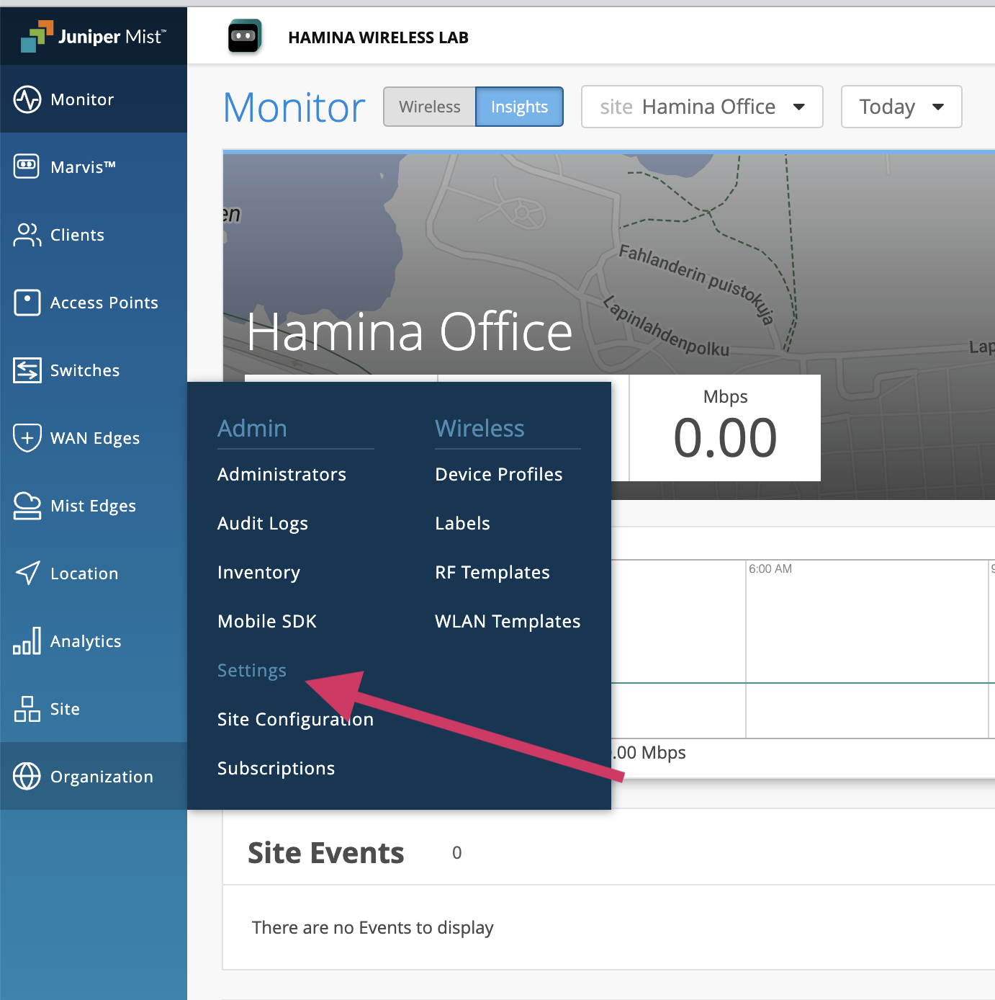
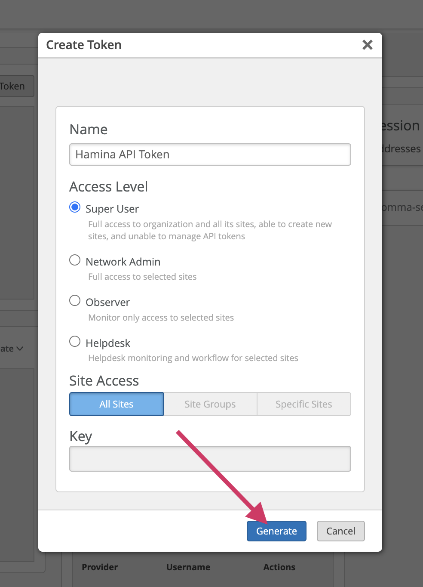
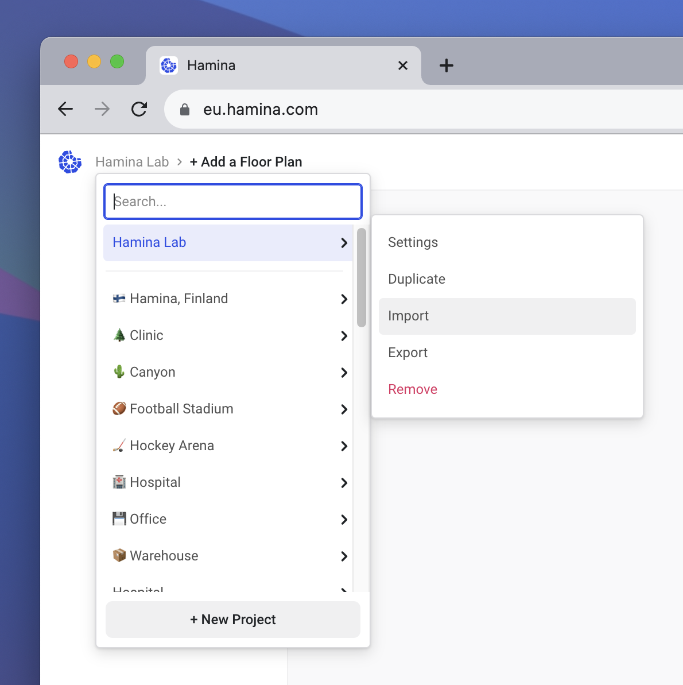
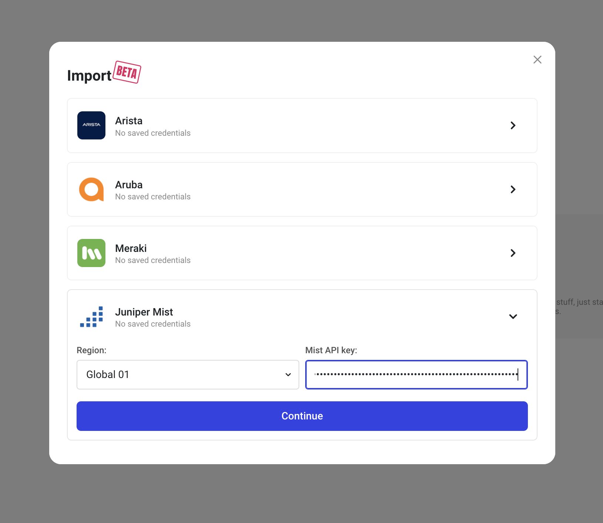
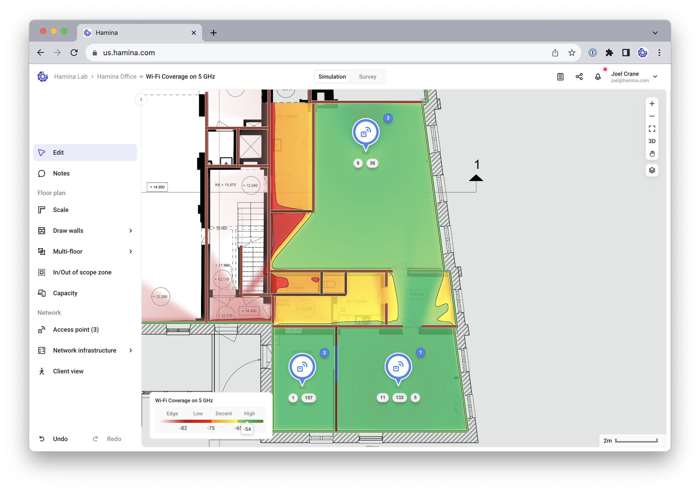
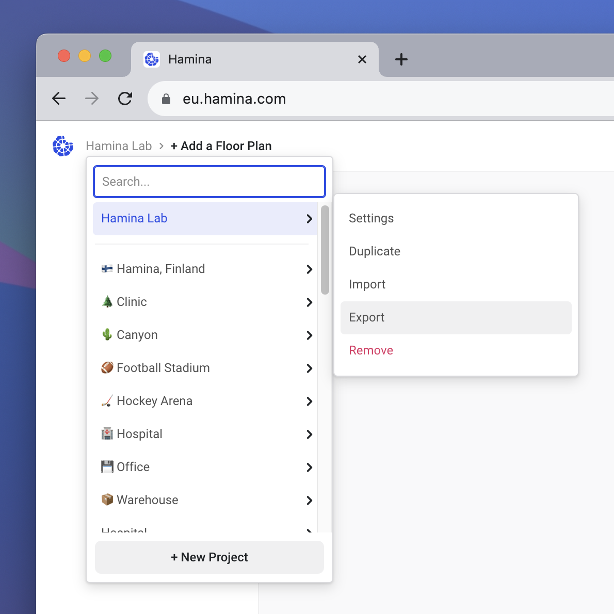

# 🌲 Juniper Mist

Hamina Network Planner includes integration with Juniper Mist, which can be used for both Import and Export purposes.&#x20;

The **Import** function will bring the map, scale, and access points (including model, name, MAC, serial, transmit power, channel, and channel width settings) into Hamina Network Planner. Then, you can add walls, attenuating objects, and scope zones to simulate the current Juniper Mist network configuration in a predictive model.

The **Export** function rapidly deploys a new site, or updates an existing site directly from Hamina Network Planner. This removes the need for any repeat map-based deployment work - all of the mapping work is automatically copied directly from Hamina Network Planner.

## Generating an API Token

1. Log into [manage.mist.com](https://manage.mist.com).
2. Select your Organization.
3.  In the toolbar on the left, select **Organization** > **Settings**.\

    

    <figure><figcaption></figcaption></figure>

    

4.  Scroll down to the **API Token** section, and click **Create Token**.\

    

    <figure><figcaption></figcaption></figure>

    

5.  Name the token, then click **Generate Token** and then copy the token that appears in the **Key** field.\

    

    <figure><figcaption></figcaption></figure>

    

## Import From Juniper Mist to Hamina

1.  In Hamina Network Planner, navigate to the **Import** page.\

    

    <figure><figcaption></figcaption></figure>

    

2.  Select your Region, paste in the key, and click the **Continue** button.\

    

    <figure><figcaption></figcaption></figure>

    

3.  Select the **Organization** and **Site** that you wish to import, and place a check mark next to any **floor plans** you wish to include in the import. Click the **Import** button.\

    

    <figure><figcaption></figcaption></figure>

    

4.  Add relevant walls, attenuating objects, and scope zones. You can now see what your current Juniper Mist configuration looks like, inside a predictive model.

    <figure><figcaption></figcaption></figure>

## Exporting from Hamina to Juniper Mist

Using the Export function in Hamina, you can deploy a network to Juniper Mist including the backgroud map and AP locations.

<figure><figcaption></figcaption></figure>

