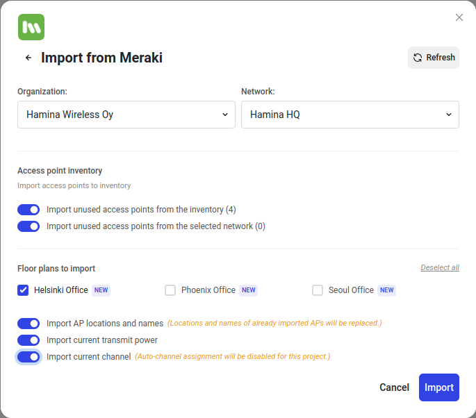

# 💬 Meraki

With the integration between Hamina and Meraki, you can import floor plans, access points, and radio details from your Meraki network into Hamina. You can also export access points and floor plans from Hamina back to the Meraki cloud.

To get started, you'll need to enable API access in your Meraki organization, and create API keys. Once API access is enabled, our step-by-step instructions will guide you through the process of importing and exporting data between Hamina and Meraki.

## Enabling API Access

In order to use Hamina integration with your Meraki organization, you have to make sure that API access is enabled in the organization. You can enable API access in Meraki Dashboard portal by navigating to **Organization > Settings > Dashboard API access**:

<figure><figcaption></figcaption></figure>

## Creating API Key

Hamina integration uses Meraki Dashboard user's API key for communicating with the Meraki API. The API key will inherit the same permissions as that account that created the API key.

You can create a new API key from **My Profile** page in Meraki dashboard.

<figure><figcaption></figcaption></figure>


**Note**: Your API key provides access to all organizations with the API enabled. Keep it secret, and keep it safe to prevent unauthorized access.


For more information, see [Meraki documentation about API access](https://documentation.meraki.com/General\_Administration/Other\_Topics/Cisco\_Meraki\_Dashboard\_API).

## Importing Floor Plans

To initiate the import process, start by clicking on the import button located under your project name in the left menu. This will open the import modal. From the vendor list, select **Meraki** and enter your API key. You can also specify the region you want to connect to. Once you have entered the connection credentials, click the **Continue** button.

<figure><figcaption></figcaption></figure>

If the connection is successful, you will be presented with a list of organizations and networks that you have access to. Choose the organization and network from which you wish to import floor plans. You can also import access points from Meraki inventory or from the selected network.

Next, select the floor plans you want to import. Any floor plans that you have not yet imported will have `NEW` label next to their name. If a floor plan has already been imported, it will be updated. In addition to the floor plan image, you can choose to import access points along with their locations, current transmit power, and current channel and channel width.

<figure><figcaption></figcaption></figure>

Once you have made your selections, click on the **Import** button to start the import operation.
