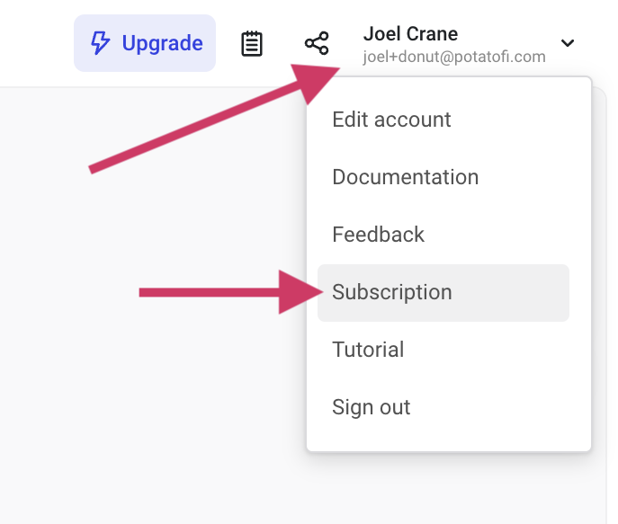
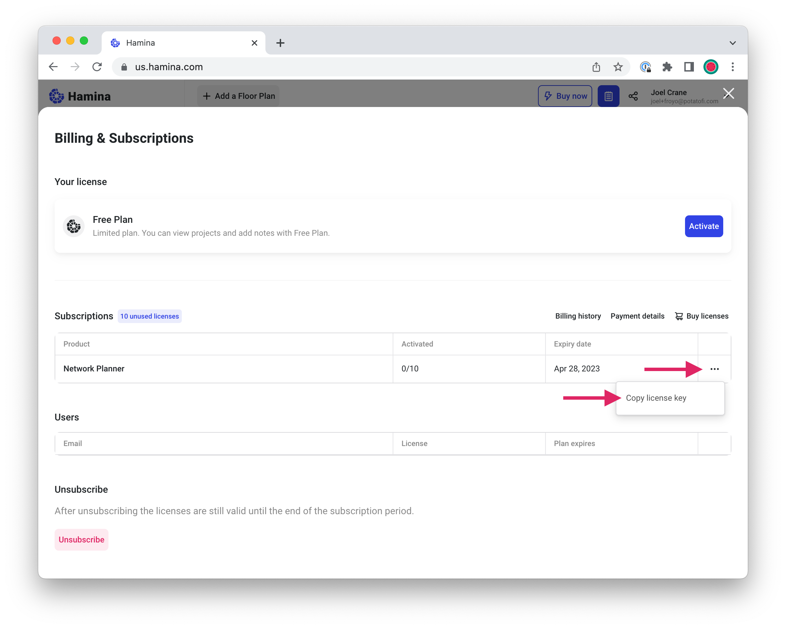

# 🔑 Accounts and Licenses

## Users

In Hamina Wireless products, a user is defined as an individual person. Each user needs to have their own subscription. Subscriptions for teams can be provided through a volume license key.


Shared accounts, group accounts, and login sharing are not permitted per our Terms of Service. Each user must create a unique, named account.

For details, check out our [Terms of Service](https://www.hamina.com/terms).


## Activating a License Key

Whether you are trying out Hamina, or activating a new subscription, here's how to activate your license. This applies to both Hamina Network Planner, and Hamina Onsite.

1.  Click on the **Account** menu in the upper right, then click **Subscription**.\

    

    <figure><figcaption></figcaption></figure>

    

2.  Click the **... menu** next to the license, and click **Activate**.\

    

    <figure><figcaption></figcaption></figure>

    

3. If you have a subscription with multiple seats, and have any colleagues who need to activate it, use the **Copy license key** option in the **... menu** to retrieve it to share with them.

## Volume License Keys

If you have a team of two or more users, you can purchase multiple licenses from a single account. This is often useful for simplifying billing.

### Retrieving the License Key

If you purchase multiple licenses, you'll need to retrieve the license key from Hamina, and share it with anyone that you'd like to add to your Hamina organization.

1. Click on the **Account Menu** in the upper right.

<figure><figcaption></figcaption></figure>

2. In the drop-down menu, click **Subscription**.
3. In the Subscriptions table, click on the **... menu** (**elipsis menu**) on the right, and click **Copy License Key.**

<figure><figcaption></figcaption></figure>


By default, your individual Hamina account is not activated. You can either activate it with your key, or you can leave it unactivated.


### Activating the License Key

1. Create an account at [https://app.hamina.com](https://app.hamina.com). _Note: Be very careful to select the instance that your team uses!_
2. Sign into your Hamina account.
3. Name and create your first project.
4. Click on the Account Menu in the upper right.

<figure><figcaption></figcaption></figure>

5. In the drop-down menu, click **Subscription**.
6. Click the blue **Use License Key** button in the upper right.

## Cancelling a Subscription

Done with wireless projects, and ready to take a break from Hamina? No problem! It's super easy to unsubscribe.

* Click on the **Account Menu** in the upper right.
* In the drop-down menu, click **Subscription**.
* At the bottom of the page, click on the red **Unsubscribe** button.


Note: After unsubscribing, your license(s) will be valid until the end of the subscription period.

