# 🗒️ Release Notes

### 2024/04/29

**Improvements 💫**

*   Once a license has been activated by a user for at least 90 days, the subscriber (who has a list of users who have activated their keys) can release their license! This is useful if someone leaves the company, moves to a different role, or if the team just plain needs to move the license to someone else.

    

    <figure><figcaption></figcaption></figure>

    

*   If an access point wasn't loud enough for us to automatically place it, you can now right-click on the map with the **Edit** tool and click **Place access point**. The list respects any filters that you have an place, and will show a heatmap for the access point as you mouse over it.\

    

    <figure><figcaption></figcaption></figure>

    

**Bugfixes 🪲**

* We found a corner case where survey measurements might not synchronize properly, and got it fixed.
* If there were multiple photos in a note, the full-screen image viewer would switch back to the first image if you nudged your mouse. We fixed that.
* One of the selectable map note icons was broken, so we fixed that too.
* The Meraki MR86 was erroneously marked as an indoor AP, which caused the description in the bill of materials to be incorrect. It is now marked as an outdoor AP.
* In the external antennas list, we corrected "NetGear" to "Netgear".

**APs and Antennas 🛰️**

* Cradlepoint A2415
* Fortinet 421E
* Ubiquiti U6 Enterprise In-Wall
* Intelbras AP5626
* HFCL ion12xi
* HFCL ion4xi\_WP
* We also updated the antenna pattern for the Acceltex ATS-OHDP-245-1312-6

### 2024/04/11

**Improvements ✨**

* Surveyed AP selections persist when you switch floors, so now you can see what other floors an access point (or multiple access points) was audible on. When an AP on another floor is selected, you'll see an **Adjacent floor measured access points** filter applied at the top.
* When importing an Arista network, we now include import the transmit power and current channel for each AP radio.
* In the **Project Settings** menu, we renamed **Remove** to **Delete project**.
* We made some minor improvements to the styling in the Teams dialogue.

**Bugfixes 🪲**

* There was a bug that caused the Legend to always say 5 GHz, even if 2.4 or 6 GHz is selected. Oops. No more!
* When viewing site surveys, there was a bug that would sometimes cause the access point details pane to be mostly empty. We fixed it!
* In Hamina Network Planner Lite, we now show an **🔒 Upgrade** tag next to the **Duplicate floor** option, to show that you can't do it without a Planner or Planner Plus subscription.
* The drop shadow was missing from the Layers menu button, so we added it back in.
* There was a strange bug where if you placed a big **Out of Scope zone**, and drew a small **In Scope zone** inside of it, everything would turn green (even if there were no access points). Weird, but fixed!

**APs and Antennas 📻**

* Gamma Nu IOAOXY2FLAT\_MIMO
* Extreme ML-2452-HPA5-036
* AccelTex:
  * ATS-ID90RD-245-23-1
  * ATS-ID90RD-245-46-1
* L-com HG3513DP4-NF
* JMA Wireless IV02OMI136-M4
* KP Performance:
  * KP-3DP120S-45
  * KP-3DP33S-45
  * KP-3DP65S-45
  * KPP-3SX4-65
  * KPPA-3GHZDP90S-45
  * KPPA-3GHZ-DPOMA
* Aruba (omnidirectional antennas):
  * AP-ANT-311
  * AP-ANT-312
  * AP-ANT-313
  * AP-ANT-340
  * AP-ANT-320
* Aruba (directional antennas):
  * AP-ANT-345
  * AP-ANT-348
  * AP-ANT-325
  * AP-ANT-328
* Netgear WBE750
* Netgear WBE758
* We also updated the antenna pattern for the Meter MW08

### 2024/04/03

**Improvements 🥳**

*   This release adds the option to generate stairs in sloped floors! The stair sizes are based on the scale of the map, and are purely cosmetic (they don't affect the predictive model at all). To enable them, just click the **Draw stairs** option in the **Edit Sloped Floor** pane.\

    

    <figure>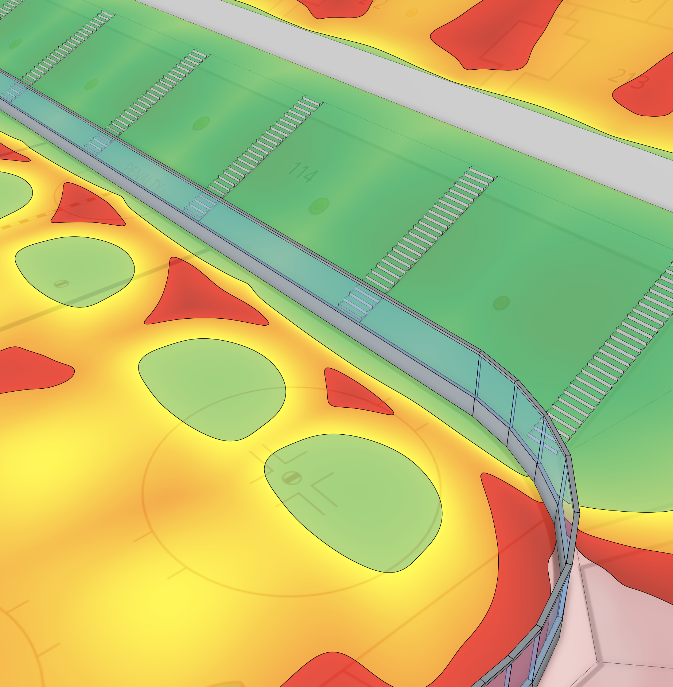<figcaption></figcaption></figure>

    

*   In the last release, we stacked the **Top height from floor** and **Bottom height from floor** boxes for the wall type editor. In this release, we gave the Attenuating object type editor the same treatment.\

    

    <figure>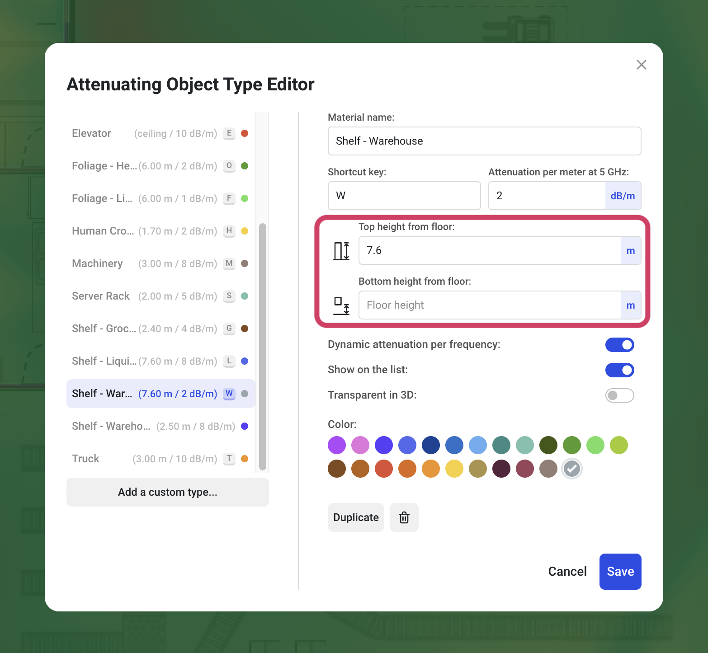<figcaption></figcaption></figure>

    

* We added map notes images to reports!
* If you duplicate a project, the note images will now be duplicated along with it.
*   In the Survey tab, when selecting multiple radios, we don't try to show all of the radio details anymore. Instead, we'll just show you the stuff that you might want to bulk edit, like the AP height and model.\

    

    <figure>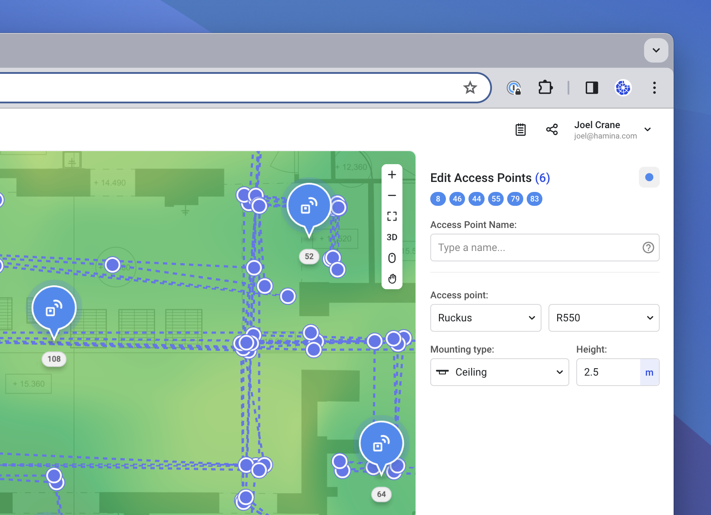<figcaption></figcaption></figure>

    

* Hamina Network Planner Lite (aka "free tier") users can now adjust heatmap settings.
* The cyan, orange, and purple colors that we were using didn't have very much contrast (and didn't match our designs), so we fixed those up. We also fixed and improved some other styling around the app.
* We used to show a separate toast notification for each PDF page that was uploading. Now, we just show one toast for the entire file. 🍞

**Bugfixes** 🪲

* There was an issue where some users could get stuck in an endless loop while logging in if they have multiple accounts, which could cause them to get stuck in an endless loop while logging in, if they have multiple accounts, which could cause them to get stuck in and endless loop while logging in...
* There was another loopy login bug, where if you clicked **Cancel** on the MFA page, you'd get stuck in one infinite loop.
* There was a bug where if you have only an Onsite license (a common scenario, especially for people who only do surveys and don't need to create designs), you'd still see the **Upgrade** button towards the upper right. That was confusing to people who only subscribe to Onsite, so we fixed it.
* In the AP Radio Details page in the Report Editor and Viewer, radios now correctly say "Off".
* On the **Subscriptions** page, under **Your licenses**, users with Hamina Network Planner Lite (basically, anyone without a paid Network Planner or Network Planner Plus subscription) would see **Free evaluation**. We're calling it **Hamina Network Planner Lite** these days, so we fixed it.
* There was a bug where sloped floors didn't take out-of-scope zones into account. That's been taken care of.
* Routers were missing from the BoM. They aren't missing from the BoM anymore.
* There was a weird bug where if you placed an IDF or MDF without any switches or power, it would show a warning icon on the map.
* Previously, if you started the project notes with an image, the Save button would be disabled. That's fixed now - feel free to begin your notes with a logo, or whatever you like!
* If there wasn't enough room, or if the browser size was too small, some of the submenus would get really weird. They behave normally now.

**APs and Antennas** 📡

* Eero PoE 6
* Eero Max 7
* Ventev M6060060P23602NBC
* Ventev M6040040P23602
* Ventev M6060060P1D43602M
* Ventev M6130130MP1D3607D
* Ventev M6060060D3D43699
* Ventev M6060060P1D43699D
* Nomadix AP-6NA
* Calix u6t
* Calix u6txg
* Aruba AP-305
* Aruba Instant On AP-12
* Fortinet AP-432G
* Meraki MR42E
* Meraki MR45
* Meraki MR84
* EnGenius EWS377AP
* Juniper AP45 in 5/5/6 mode
* Cisco IW-ANT-PNL25610-R antenna
* Extreme 7532-67040 (which is the external antenna version of the 7532)
* Edgecore OAP101
* Celona AP-11 2-sector mode
* Added Zigbee patterns to the Ruckus H510, R550, R650, R850, and T750

<figure>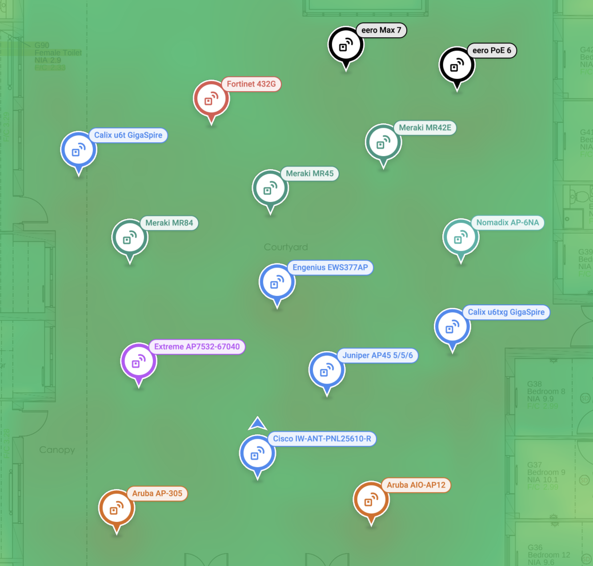<figcaption></figcaption></figure>

**Known Issues** 🫢

* If you place the Celona AP-11 in 2-sector mode without defining an antenna, it will be stuck with a default antenna that you can't change. If you pick the antenna before placing it, it works fine. We didn't catch this one until it was out the door, so we'll fix it in the next release.
* The Meraki MR86 is marked as an "Indoor" AP, when it is in fact an outdoor AP.

### 2024/03/13

**Improvements ✨**

*   Floor duplication is now a thing that exists in Hamina Network Planner!\

    

    <figure>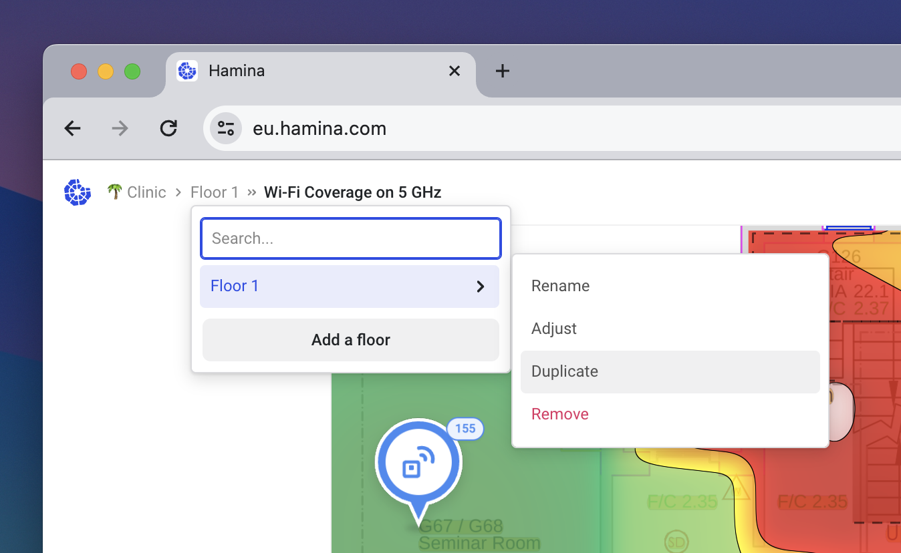<figcaption></figcaption></figure>

    

*   AP labels on the map! Now, in the **Layer Visibility** menu, you can turn Labels on and off, and switch them between **Numbers** and **Names**. We don't have this on the reporting side yet, but we will soon.\

    

    <figure><figcaption></figcaption></figure>

    

*   The **Mouseover inspector** in the **Heatmap legend** now works in the **Survey tab**! Inspect all of the things!\

    

    <figure>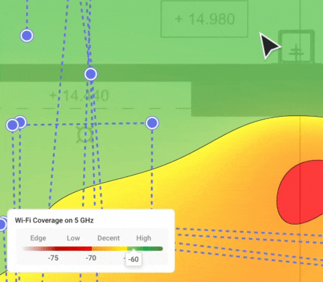<figcaption></figcaption></figure>

    

*   BLE radios (like the Mist BT11) have a Bluetooth logo now, and it looks pretty slick! Wi-Fi and RTLS wired clients have shiny new icons, too!\

    

    <figure>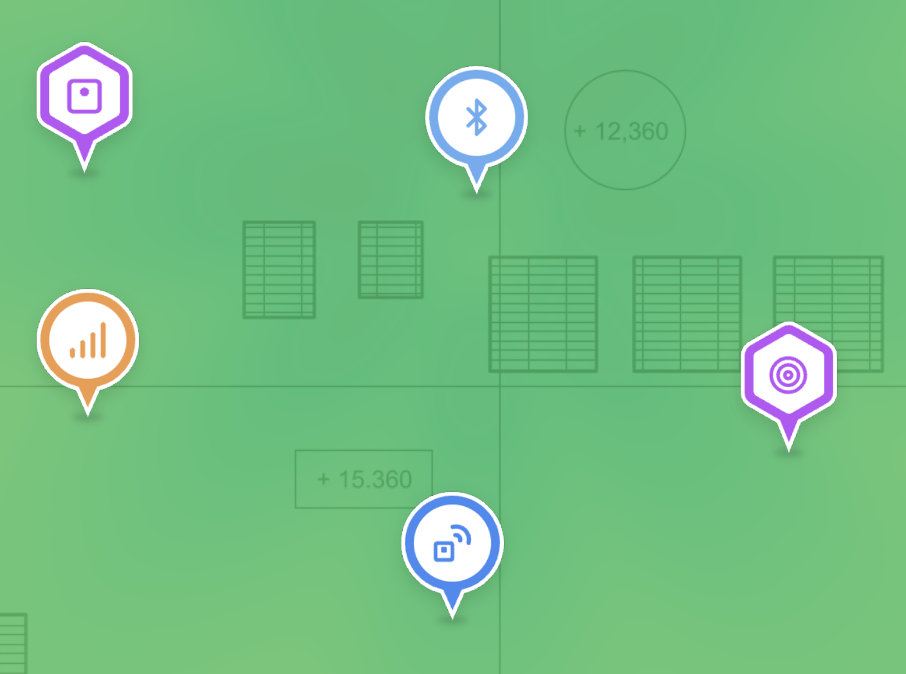<figcaption></figcaption></figure>

    

*   Previous, in the wall profile editor, the **Top height** and **Bottom height** text boxes were next to each other, and we confused them almost every single time we edited a wall profile. We couldn't stand it anymore, and raised the issue with our UX guy, and he totally, totally fixed it. The **Top height from floor** and **Bottom height from floor** input boxes have now been stacked, and have handy diagrams that show exactly what they do! 👏\

    

    <figure>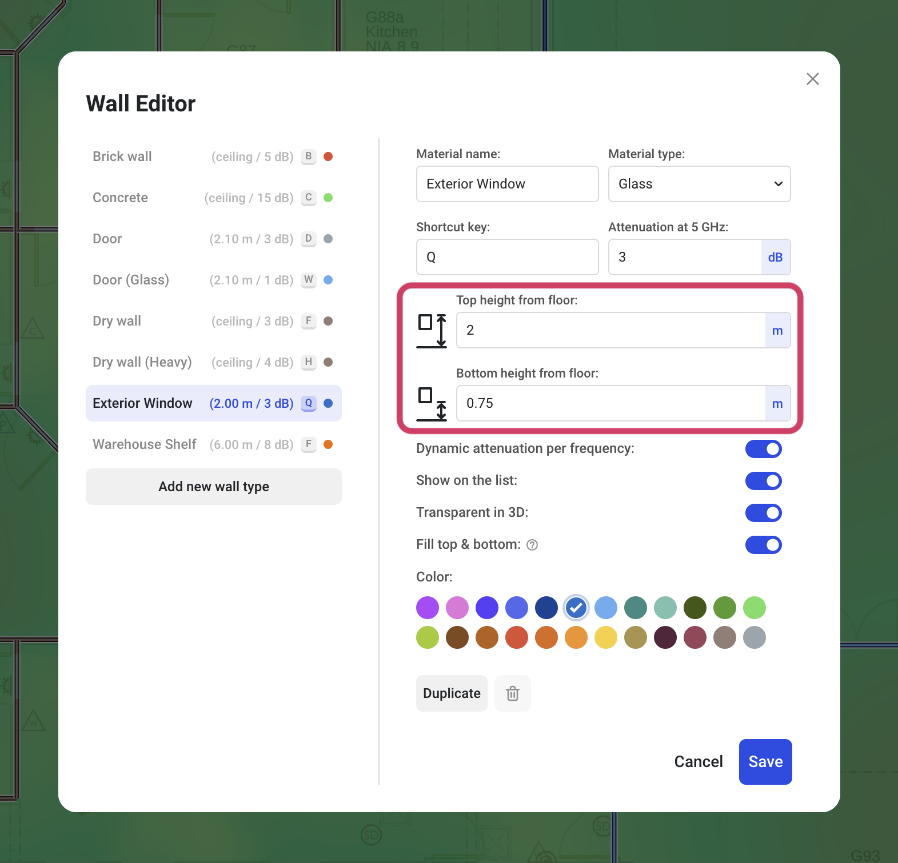<figcaption></figcaption></figure>

    

*   **High quality graphics** and **Transparency effects** are now available in the **Report Editor**. The settings will mirror whatever you're using the main web app.\

    

    <figure>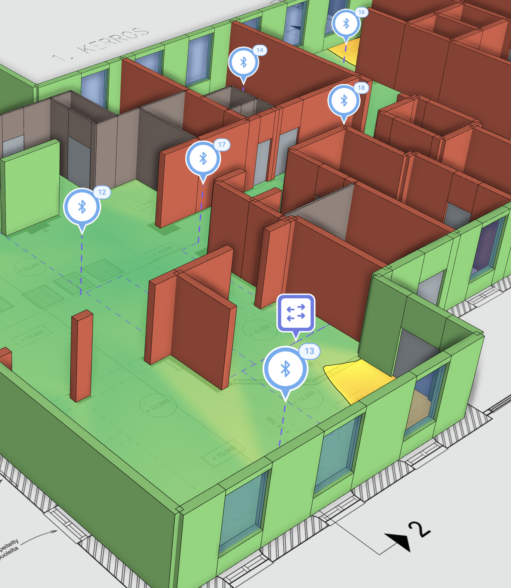<figcaption></figcaption></figure>

    

* We made some improvements to the **Shared Report Viewer** (the one that your customers see when you send them a link), too! It hasn't received the transparency and shadow effects yet, but we did add outlines to make things look nicer. We're planning to revisit this soon.
* The maximum zoom level is now based on the map scale, instead of being tied to the background map resolution. If you're trying to do precise things like select co-located access points and precisely draw walls, this should make things much easier.
* Project invitation and team invitation links now take 30 days to expire, instead of two days like before.&#x20;
* For surveys, we improved our AP location estimation a bit.
* If you open a photo note, full-screen a photo, and press **`Esc`**, we now close just the full-screen photo, instead of closing the entire note.

**Bugs** 🐛

* If you had a Hamina Network Planner subscription, and activated a Hamina Onsite subscription, there was a weird bug that would deactivate Network Planner. Not anymore!
* We improved automatic BSSID grouping for Juniper Mist and Cisco access points.
* Email addresses for team invitations are now case-insensitivie (just in case uppercase letters sneak into your email addresses).

**APs**

* The CW9163E was available in Cisco before, but it shows up under Meraki now as well.

**Known Issues** 😅

* Routers don't appear in the BOM. Fix coming soon!
* The weird issue with sloped floors being backwards is still there, but we haven't been able to reliably reproduce it. We might put it in the back burner for now.

### 2024/03/06

**Improvements 🍻**

*   We've added a new "Teams" feature to Hamina Network Planner! In the **Account** menu (in the upper right), visit the Teams view to create teams, manage who is part of your team, and manage their permissions. Critically, when you share a project, you can share it with an entire team!\

    

    <figure>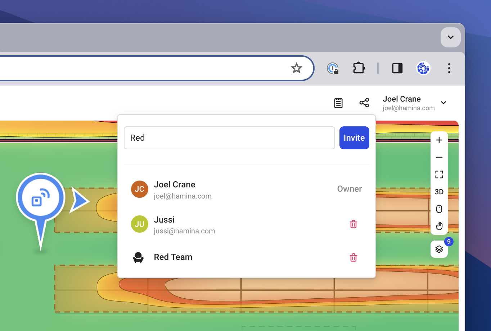<figcaption></figcaption></figure>

    

*   When viewing the results of a survey, Hamina won't show an access point on the map, unless we hear it above -60 dBm. In Hamina Network Planner, you can now manually show and place an access point by selecting the **Edit** tool, right-clicking on the map, and selecting **Place Access Point**. Then, you can select the SSID and BSSID of the AP you'd like to place. A manually placed access point won't automatically update if you add more survey data.\

    

    <figure>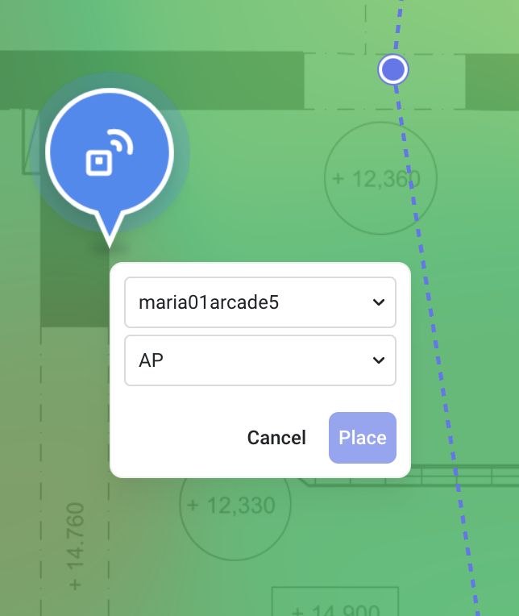<figcaption></figcaption></figure>

    

* Previously, the raised and sloped floors feature tried to be smart about what default heights to use;  when drawing a new area, the heights would be inherited from other areas. We think it was a pretty good idea, but in practice, it ended up just being confusing. Now, just like with access points and switches, when you draw a new sloped or raised floor, we just copy the values of whatever you last selected.
* Previously, if you placed a Wall/Pole mounted AP within 0.7 meters (2.3 feet) of a wall, it would automatically point away from the wall at a 90° angle. We've increased the threshold to 1 meter, so you don't have to click quite as precisely when you place the access point.
* Attenuating objects were visible in the Survey tab when viewing in 3D. Since Attenuating objects don't affect the survey data, we removed them from the survey 3D view.

**Bug Fixes 🐛**

* In the Survey tab, if you selected some SSIDs and switched to a different floor, the heatmap breadcrumbs would show the wrong amount of selected SSIDs. It's a small bug, but we fixed it.
* We found and fixed a bug where some APs in survey reports were missing some data, such as channels and names.
* Mesh links wouldn't survive project duplication. Now, when you duplicate a project, mesh links are preserved!
* If a survey path point was deleted in Planner, and then the delete was undone, the survey path wouldn't appear back in the Onsite app. Fixed!

**Known Issues 🔍**

* When drawing sloped areas, Hamina Network Planner is supposed to draw the low side first. For some reason, sometimes the first side drawn ends up being the high side of the slope. We'll investigate that and get it fixed.

### 2024/03/01

**Improvements ✨**

* You can now create online reports for surveys! This initial release includes Survey Paths, AP Placement, Coverage, Secondary Coverage, and SNR heatmaps. PDF reporting will follow soon, along with more heatmaps.
* We made how we read survey measurements a bit more efficient. It's pretty technical stuff, so don't worry about it too much. Just know that things should be a bit faster now.
* In Hamina, whatever access point you selected last will be duplicated when you place more APs. Previously, this was partially true for switches as well, but it would break when you switched maps/floors. Now, the previous switch settings will persist when you switch to another floor.
* Before this production push, we always calculated propagation across the entire map, regardless of what was in or out of scope. Now, we ignore areas that are outside of the scope zones, so things compute more faster-er.

**Bugs 🪲**

* Previously, Onsite users couldn't adjust heatmap thresholds due to a licensing bug. Not anymore.
* In the **AP Radio Details** list in reports, the **Tx Power (EIRP)** field was incorrect, due to a calculation bug. That's fixed now!

### 2024/02/20

**Improvements** 🔧

* If you place a Wall/Pole mounted AP within 0.7 meters (2.3 feet) of a wall, it will automatically point away from the wall at a 90° angle! We hope that saves you a lot of time manually pointing antennas around.
* You can now use **`Option`** + **`C`** (macOS) or **`Alt`** + **`C`** (Windows) to open the Channel and Network Settings!
* We inverted the direction that the map moves with the arrow keys, which feels a lot more natural.
* Opening the heatmap settings (Requirements pane) doesn't de-select APs anymore, which is nice if you want to make small adjustments while looking at a set of specific APs.

**Bug Fixes** 🔨

* There was a bug that would break photos in notes if you didn't have a Hamina Onsite subscription. Oops! It's fixed now.
* We squished some more bugs, but they were all related to upcoming features that aren't available yet. 🤫

**New APs and Antennas** ✨

* Celona AP-13 and AP-13E
* Meraki MR53 and MR74

### 2024/02/13

**Improvements 🎉**

*   It has been possible to view antenna patterns for internal antennas on access points for a long time, but only after pressing a cryptic keyboard shortcut. Now, you can enable the antenna pattern viewer for access points in **Edit account**.\

    

    <figure>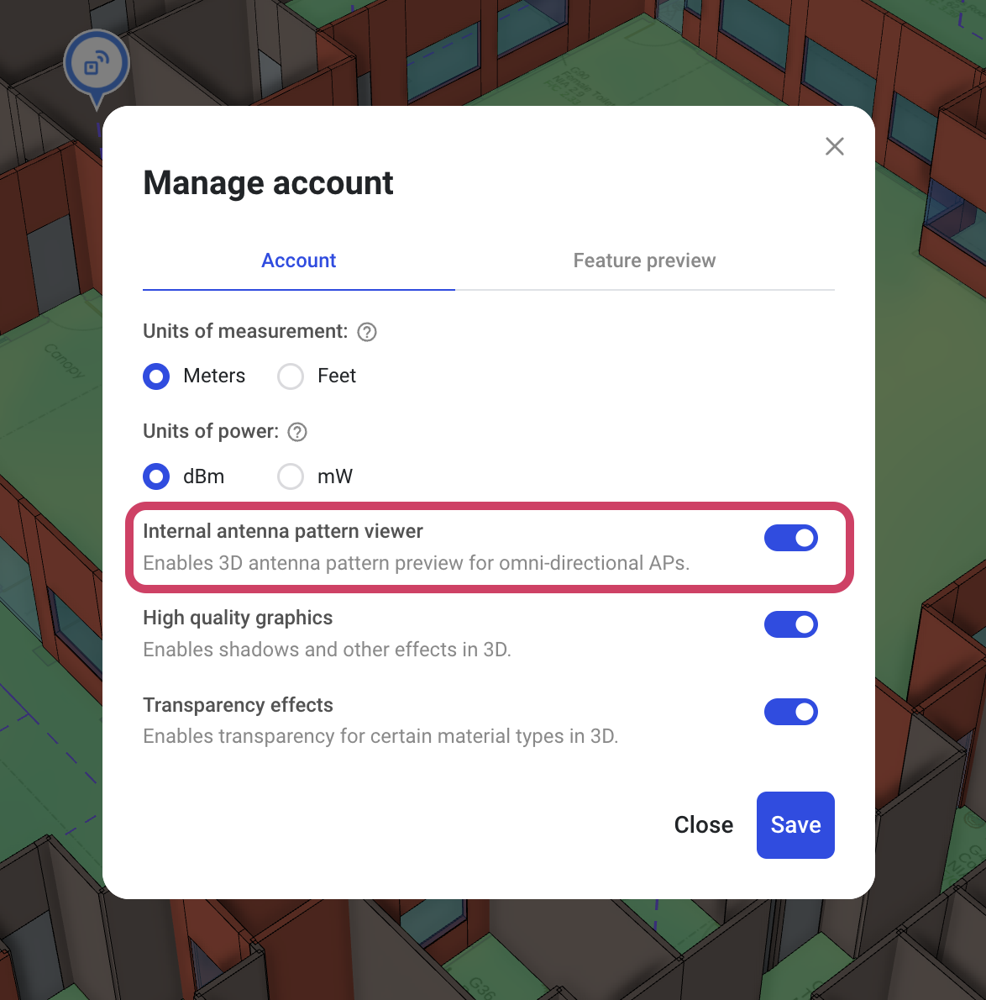<figcaption></figcaption></figure>

    

*   Once that is enabled, you can mouse over access points to see their antennas.\

    

    <figure>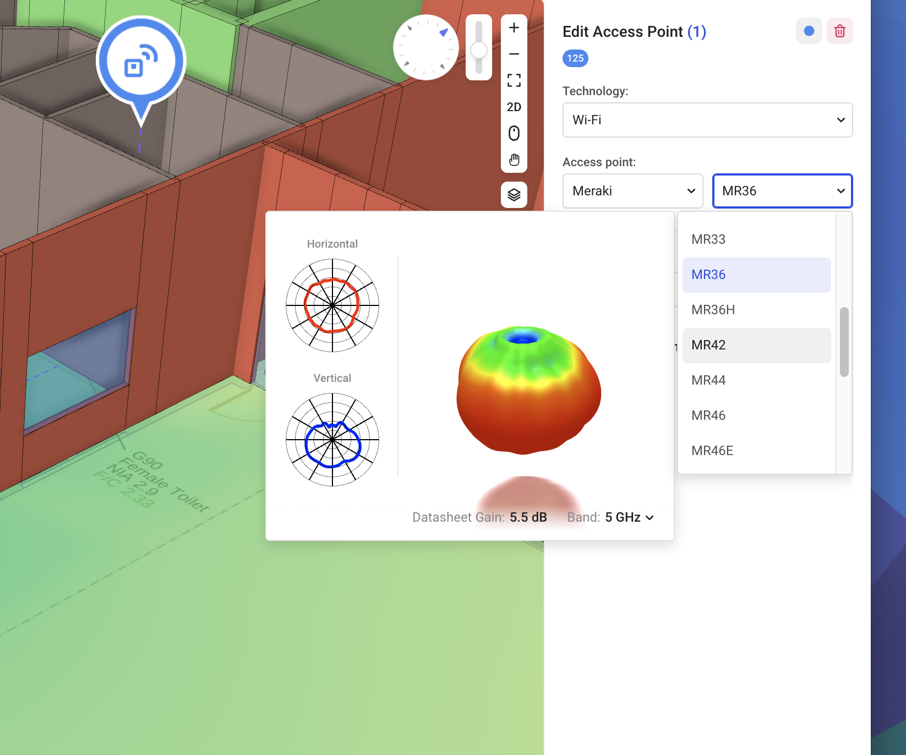<figcaption></figcaption></figure>

    

* We applied some more performance improvements to Survey mode. There are still some more things to do, but we're moving things in the right direction. 👍

**Bug Fixes 🤦‍♂️**

* If the heatmap was turned off (set to **None**) in Simulation mode, then the heatmap legend would not re-appear in Survey mode (even when you turned the heatmaps back on). That's fixed!
* We got the orientation of the MP Antenna 1039 and 1041 wrong, but it should be fixed now! Thanks Jeremy for the heads-up about this, and be sure to check out his recent appearance on [The Industrial Wi-Fi Shop podcast](https://industrialwifishop.com/2024/01/15/the-industrial-wi-fi-shop-podcast-ep-2-industrial-wireless-safety-mobility/).

**New APs and Antennas**

* Alta AP6 and AP6 Pro
* MosoLabs Canopy 4GID1 (4G Indoor), 4GOD1 (4G Outdoor), 5GID1 (5G Indoor), and 5GOD1 (5G Outdoor)
* Fortinet 441K and 443K

### 2024/02/05

**New Features** 📷

*   Photo notes are here! Now you can now view photos that were added from Hamina Onsite, as well as upload, download, and remove photos. _Note: We don't have project duplication or copy/paste for photos in notes supported quite yet, but we'll get them taken care of soon._\

    

    <figure><figcaption></figcaption></figure>

    

**Improvements** 🔧

* We removed the scale marker from the 3D view, which was only correct for 2D and doesn't apply to 3D very well. Just what you want to see, _less_ features for your money!
* We worked on ther performance of the Survey tab and Survey Paths pane, especially when viewing larger surveys. We think there's more we can do to improve this, but we made good progress.

### 2024/01/30

**New Features 🎉**

*   In this update, we've introduced transparent walls, transparent attenuating objects, and a high-quality graphics mode! Check it out!\

    

    <figure>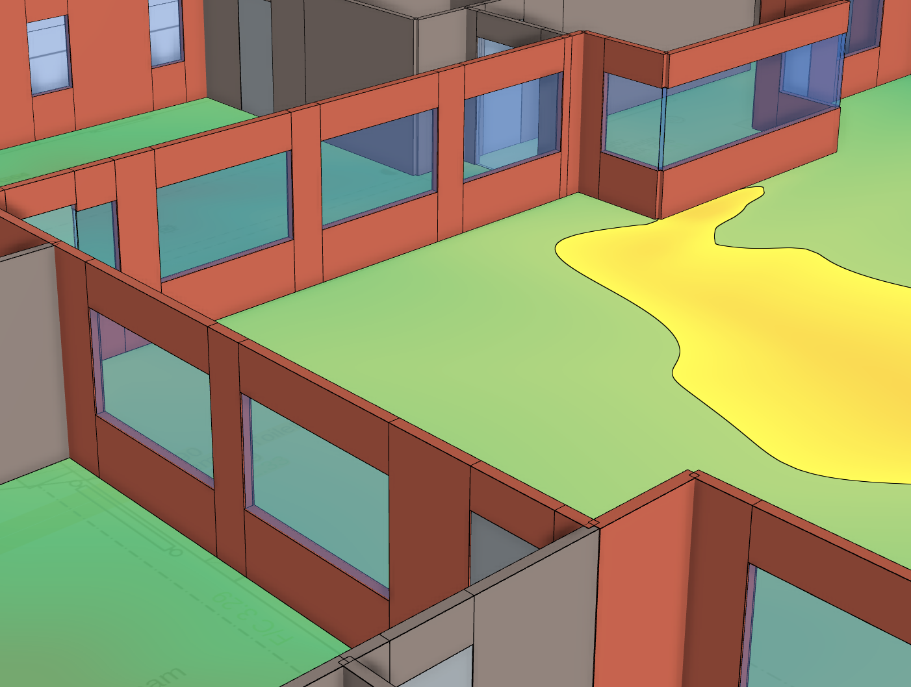<figcaption></figcaption></figure>

    

*   **High quality graphics** and **Transparency effects** can be enabled in the **Edit account** menu. There is a performance impact from these, so experiment with your machine to see how it does. We'd also recommend not having a bunch of Hamina tabs open at once, as it does consume more RAM. That said, it works pretty well for us, even on modest machines.\

    

    <figure>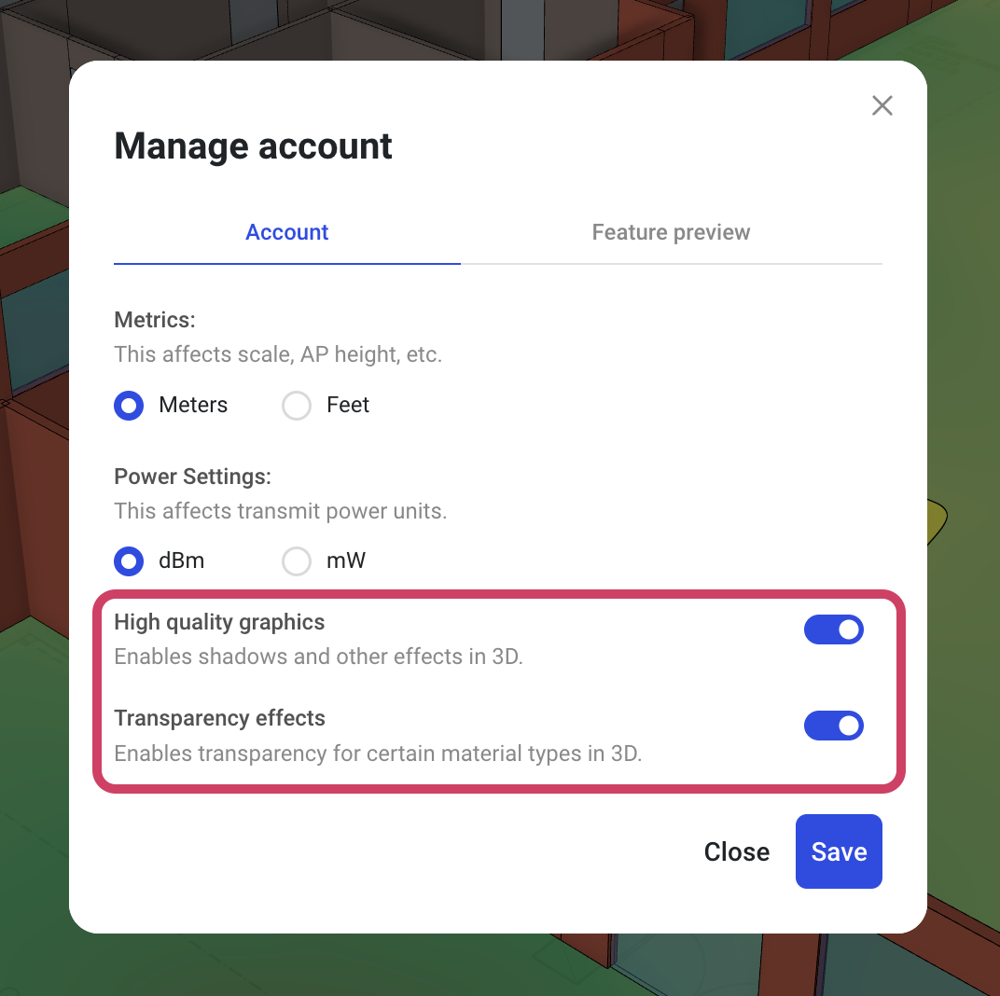<figcaption></figcaption></figure>

    

*   For both Walls and Attenuating objects, you can enable or disable transparency for each material type.\

    

    <figure>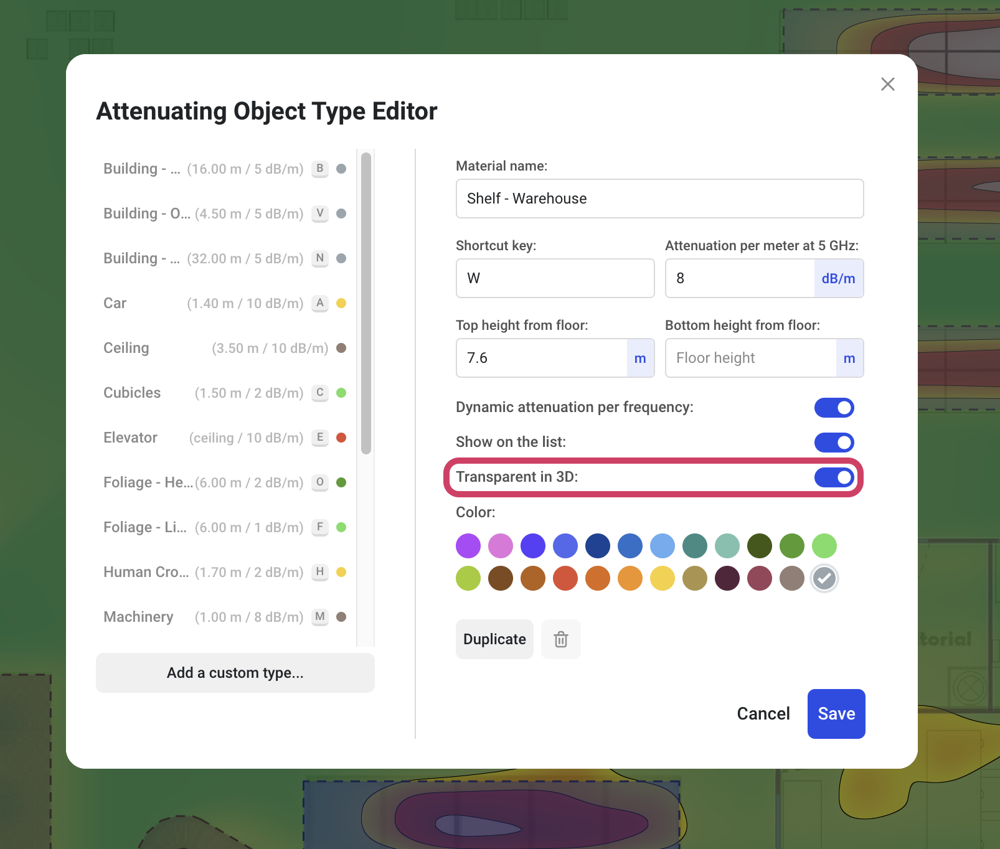<figcaption></figcaption></figure>

    

*   In addition to just looking cool, we think transparency will be helpful for tall warehouse shelves, and also for situations where you need to see a heatmap under the material, like this custom ceiling Attenuating Object that we made for this warehouse.\

    

    <figure>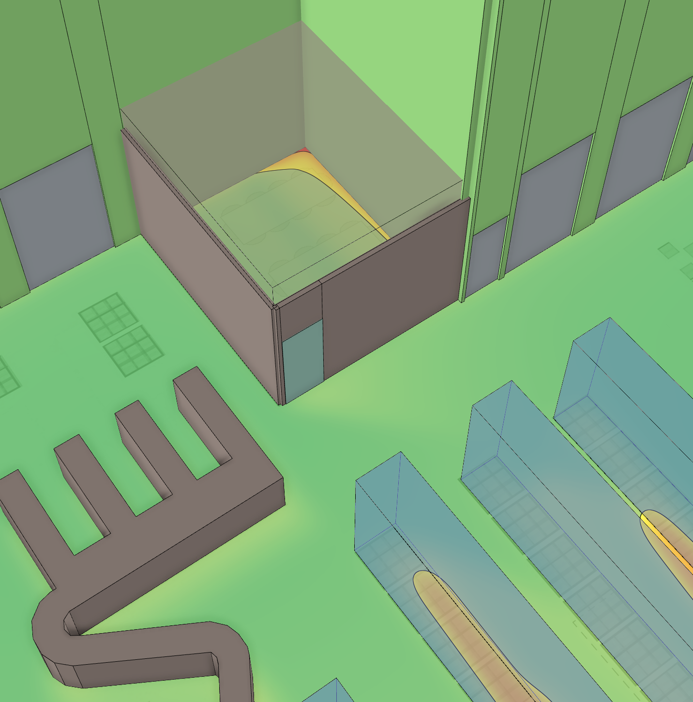<figcaption></figcaption></figure>

    

* We applied some more smoothing to the survey heatmaps. They're 0.42% smoother. Or was is 4.2%, or 42%?&#x20;
* The Survey tab now supports 3D mode, which is nice for visualizing heatmaps in buildings with raised floors, sloped floors, and holes in the floor.
* The selected heatmap, band, and SSID are now saved to the project, and synchronized between Hamina Planner and Hamina Onsite.
* In 2D mode, a **Floor holes** area no longer masks the heatmap, if the **Floor holes layer** is hidden.

**Improvements** 🔧

* Previously, if you disabled Note visibility in Simulation mode, and then switched to the Survey tab, you couldn't see the notes anymore without switching back to the Simulation mode to re-enable them. Now, they're always visible in the Survey tab. We'll add fine-grained layer visibility to Survey mode soon.
* In Hamina Onsite and Hamina Network Planner, we don't try to place an AP on the map, unless we're pretty confident that we know which map it should be placed on (such as in a multi-story building).
* Previously, if you used the Edit tool to select an area, it would select invisible APs. Now, the Edit tool only selects visible APs.
* We improved the appearance of heatmap contours on low-resolution displays.
* When exporting to ExtremeCloud and creating a building, you can now input the building's country, which is required by the ExtremeCloud API.
* In the Survey tab, Coverage is now the default heatmap.
* Cisco Catalyst (DNA) Center is now available directly in Export! It's marked as "Beta", since we're still fine-tuning it.

**Bugfixes 🪲**

* There was an issue where switching AP models could cause the direction arrow to disappear. We fixed it!
* We fixed an issue where switching the mouse mode (mouse/trackpad) in shared reports would cause the page to reload.
* There was a minor bug in our authentication code that was causing us to ask you to log back in way too often. We fixed it, so now you don't have to log in nearly as often. Sorry about the hassle!
* We fixed the Netgear 630, which wasn't implemented correctly in our AP database. Now in Hamina Planner, it supports dual 5 GHz with the correct channel selection limitations.

**New APs and Antennas**

* We added dual 5 GHz mode for the Fortinet 231G, which appears as Fortinet 231G (2.4/5/5).
* We added dual 5 GHz mode for the Fortinet 431G, which appears as Fortinet 431G (2.4/5/5).
* Fortinet 233G Custom, 234G, and 432FR.
* Fortinet FANT-02ACAX-0606-P-R.
* Ruckus T300, T301n, and T301s.
* Ruckus T710o and T710s.
* Mist AP64.
* CyberTAN EWW631-B1.
* Extreme AP650.
* Acceltex ATS-OO-2456-466-4.
* AccelTex ATS-OP-2456-81010-4.
* Ventev Nano Patch M6060060D3D36.

### 2024/01/15

#### Features and Changes

*   We added an all-new feature for constructing doors and windows: **Top and Bottom Fill**. For walls with a custom lower or upper height, the empty space will be filled with whatever wall type is on either side of it. For example, if you draw a door on a brick wall, the empty space above the door will now be filled with Brick.\

    

    <figure>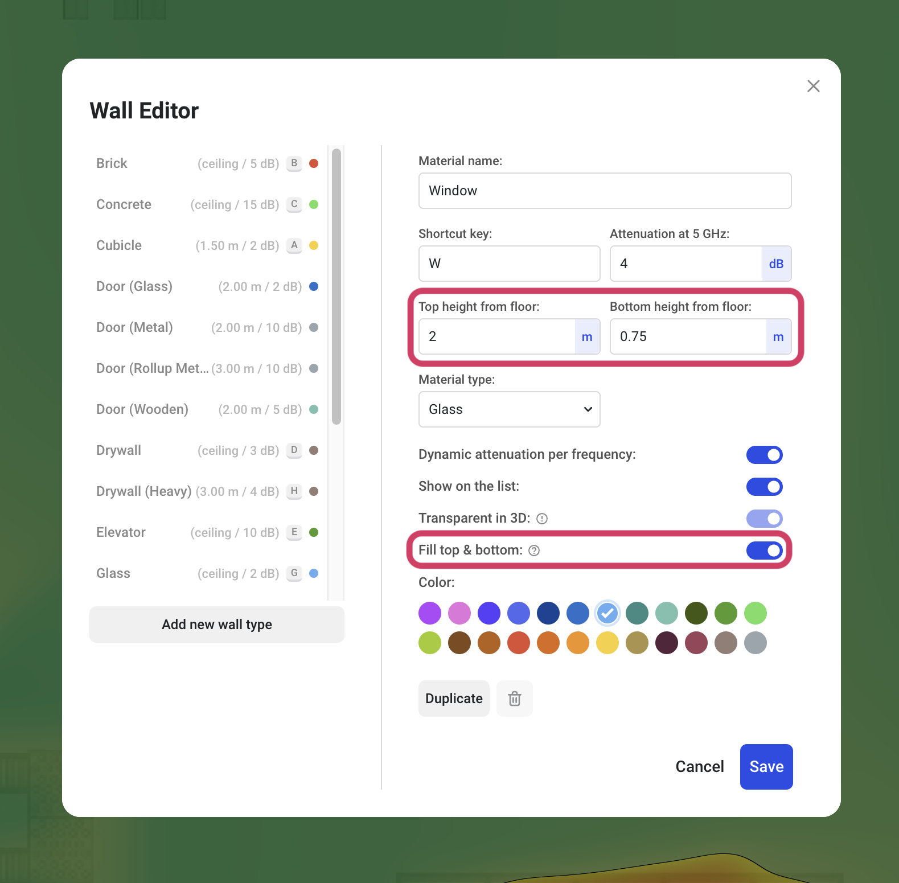<figcaption></figcaption></figure>

    

*   Here's an example in a pretty standard building, in this case a small medical clinic. The doors and windows are drawn in like standard walls, and the **Fill top & bottom** setting takes care of the rest. We've added all of the correct profiles for new projects, so this will work out-of-the box. There's still a floor-to-ceiling **Glass** profile for fancy conference rooms.\

    

    <figure><figcaption></figcaption></figure>

    

*   Here's the window and door effect in a warehouse. Notice that even though the Concrete walls are pretty tall, the Windows are still at the correct height, because of the static **Top height** and **Bottom height** settings. Note that everything you see is included in the predictive model, so your models will be a tiny bit more accurate now, too.\

    

    <figure><figcaption></figcaption></figure>

    

* When Importing access points, they are now "Not Connected" by default.
* We no longer fetch survey data until you switch to the "Survey" tab.

#### Bugs

* There was a bug where you couldn't select notes in the Survey tab. That's fixed now.
* If two measurements were in the exact same location, some strange visual artifacts could occur. Fixed!

#### New APs and Antennas

* MP Antenna 08-ANT-1072.
* Aruba AP-584, AP-634, AP-635, AP-654, and AP-655.
* Alcatel OAW-AP1321, OAW-AP1322, OAW-AP1331, OAW-AP1361, OAW-AP1361D, and OAW-AP1362.
* Extreme ML-2452-APA2-02.
* Siemens ANT793-8DJ and ANT793-8DL.

### 2024/01/10

#### Features and Changes

* When using the Export feature, with the "Match by name" selected, Hamina Planner will now attempt matching unassigned APs by name, instead of randomly assigning them.
* We made some other model matching improvements.

### 2024/01/09

#### Features and Changes

* Previously for measured data, the heatmaps would fade to red near the edges, suggesting that signal strength wasn't as good there. This has now been corrected; the heatmaps now have a clean cut at the edges without a color change.
* We adjusted the default heatmap thresholds. For Primary Coverage:
  * Green: -65 dBm
  * Yellow: -70 dBm
  * Red: -75 dBm
* For Secondary Coverage:
  * Green: -67 dBm
  * Yellow: -70 dBm
  * Red: -75 dBm
* For SNR:
  * Green: 25 dB
  * Yellow: 20 dB
  * Red: 15 dB
* The Secondary Coverage and SNR heatmaps are now available for measured data.
* For the various integration/import/export features in Hamina Network Planner, we renamed "Meraki" to "Cisco Meraki".

#### Bugs

* Fixed a bug where the channel optimizer wouldn't re-run when switching AP models.
* The Cisco 3802 was labeled as "Wi-Fi 6", which is not correct. Now, it says "Wi-Fi 5" in the BOM, like it should.

### 2024/01/04

Happy New Year! 🎉

#### Features and Changes

* Aruba, Hewlett-Packard Enterprise, and Hewlett Packard OUIs have been combined and grouped as "Aruba" (which, looking at this a few weeks later, is pretty funny).
* Cisco and Cisco Systems are now grouped as "Cisco".
* When switching between the Simulation and Survey tabs, the viewport location and zoom does not change, and the map doesn't reload, which makes it easy to flip and back and forth between Simulation and Survey for comparison purposes.
* Previously, moving or deleting survey points wouldn't update AP locations without refreshing the browser. Now, the AP locations update without a refresh.

#### Bugs

* Previously, you couldn't activate an Onsite license without a Planner license. That is fixed now.
* Pressing Ctrl+C to copy something would change all of the selected walls to whatever button "C" was bound to (which was usually Concrete). This is fixed - you can now safely copy a bunch of walls without turning them into stone. Well, concrete.
* There was a weird bug where the channel planning could try to set an 80 MHz channel in 2.4 GHz, which would cause a small crash. Ha, whoops. Fixed now.

### 2023/12/21

One last production push of the year, and right before Christmas! 🎅🌲🎁 This one contains a bunch of stuff, so we'll break it up into categories a little bit. ❄️⛄🎄

#### Features and Changes

* **Vendor Integrations**
  * Cisco Catalyst (DNA) Center users can now define an existing hierarchy with building and areas (with multiple nested areas) when exporting a Cisco Catalyst XML file.
    * If there isn't a hierarchy defined in Cisco Catalyst Center, it can be exported as as separate CSV file.
    * The building name defaults to the Hamina project name, but this can be overridden.
  * Added APAC01 region to Juniper Mist.
* **Client View**
  * Added a scroll bar to the Client experience pane.
  * When the Client View is activated, the heatmaps are now automatically hidden, but you can show them again by unchecking **Show association area** in the **Client experience** pane.
  * In the **Survey paths** pane, the newest surveys are now at the top, making them the easiest to find.
  * In 3D, if the client height is changed, the "Roaming Man" in the Client View now has a vertical line to show it's precise location on the ground.
  * The maximum client height is now tied to the height of the current floor.
* **Folder Behavior**
  * To prepare for our upcoming team project sharing features, we converted the concept of "Folders" to "Tags". With this change, we are able to drastically simplify the development and usage of the team project sharing feature.
    * As part of the conversion from "Folders" to "Tags", when you tag a project and share it, the person you are sharing with will see the same tag structure as you.
    * Conversely, if someone shares a tagged project with you, you'll see the tag structure as well.
* **Surveys**
  * We show the location of measured APs if they exceed -60 dBm.
  * For users with Hamina Network Planner subscriptions, the Survey tab only appears if the project contains survey data.
* **Miscellaneous**
  * When mousing over areas with Interference in the Interference heatmap, the APs causing that interference have a red highlight. Nice.
  * Previously, we gave new Hamina accounts the opportunity to view one of several example projects, which would then copy that example project to their account. Now, we copy all of the example projects to the new user's account, so they can explore all of them.

#### APs and Antennas

* Added the Calix GigaPro p6dx

#### Bugs

* We fixed an issue where a measured AP could appear on two maps. This was mostly true before (but is extra-true now): if you have a project with multiple maps/floors, a surveyed AP will only appear on one at a time.
* We decided to make the "Roaming Man" in the Client View is more grounded. Seriously. At the default client height, in 3D, his feet appear to be on the ground.
* There was an issue where you couldn't place notes on survey paths. That's fixed, now you can put map notes wherever you want!
* There were some memory usage issues in Safari, which we mitigated with... uh... memory-usage-mitigating techniques.

### 2023/12/11

*   Added support for an innovative new input method for computer mice: **scroll wheels**! The camera controls toolbar on the right now has a **Switch to mouse/trackpad mode** button, which changes the behavior of the "scroll wheel". Trackpad mode optimizes for two-finger scrolling and pinch-to-zoom, and mouse mode optimizes for zooming in and out with the scroll wheel. We put the button right there in the toolbar, so if you switch back and forth instantly. 🐭\

    

    <figure>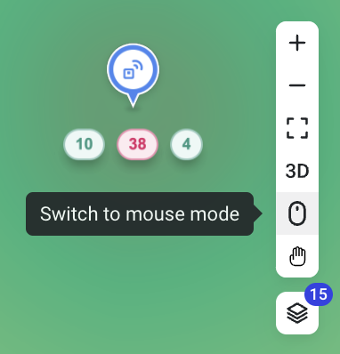<figcaption></figcaption></figure>

    

*   While we typically don't want it to happen, clients do occasionally roam to APs on different floors! The problem is that the Client View only paid attention to the current floor, but we fixed that. Now, the client can roam to APs on the floors above and below. Enable **Full Building propagation** and the client can potentially roam to any AP on any floor! The association area turns red, too.\

    

    <figure><figcaption></figcaption></figure>

    

*   Speaking of the Client View, it's all-new to make room for **Client capacity**! Now, when a Capacity zone is drawn, and clients are associated to the current associated AP, the Client view will now show the capacity of the current radio from a client association perspective.\

    

    <figure>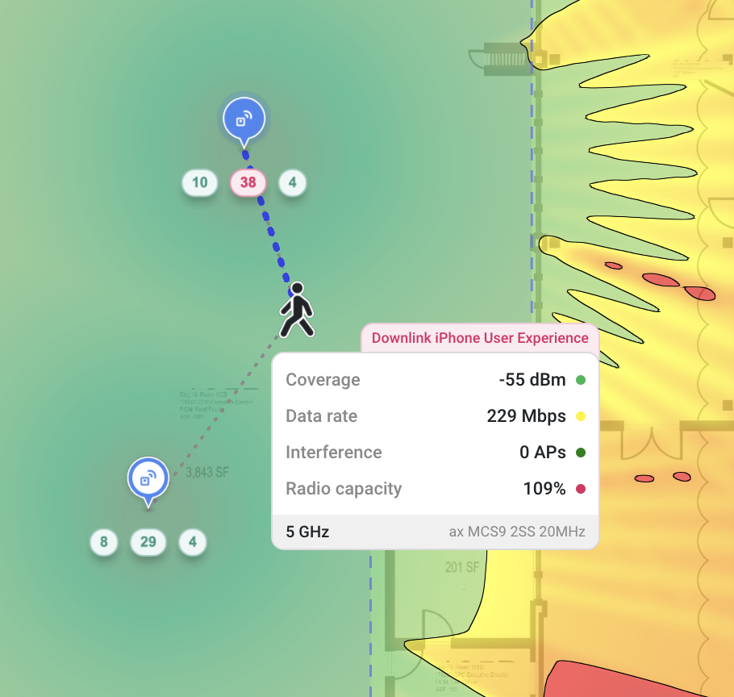<figcaption></figcaption></figure>

    

* With Hamina Network Planner Plus, the Client View can now show **Downlink**, **Uplink**, and... you're gunna love this one, we made it all up on our own: **Worstlink**®! It shows you, uh... the worst of the two.
* In the Client View, enabling **Show association area** now automagically disables the current heatmap.
* Cisco Catalyst (DNA) Center Export now includes the building, floor, and radio details! The **Building** is populated from the **Hamina project name**, and the **Floor** is derived from the multi-floor feature. The radios now include azimuth, elevation (from the AP height), and radio type. It's all still in beta though, so be careful!
*   The **x** button in the Share menu is now a trash can. Am I getting paid per bullet point? No...? Why do you ask?

    

    <figure><figcaption></figcaption></figure>

    

* Previously, entering 3D mode would cause the map to slowly rotate, which looked pretty cool. Unfortunately, changing the zoom or rotation would stop it. Now, you can right-click the Switch to 2D button in the camera controls toolbar to restart rotation. Ok, this is mostly for us to demo things and sell more Hamina subscriptions, but maybe you'll find some use for it too.

#### Bugs

* The Channel Width column in the AP Radio Details table had a decimal place for no reason. It will now, for example, say "20 MHz" instead of "20.0 MHz".
* In PDF reports, the Legend in the lower left was all red, but only in Preview on macOS. In other PDF viewers, it was fine, but we changed how we draw the legend in the PDF so it would look right in Preview.
* The title for the "table mount" was wrong in the BOM, so we fixed it.

### 2023/11/23

* Behind-the-scenes work for Hamina Onsite. 😮

#### Bugs

* In some cases, the tops of overlapping walls might flicker, so we applied a temporary fix. We'll do a permanent fix soon, along with some big 3D improvements that are on the horizon. 🤩

### 2023/11/21

* Added the MikroTik cAP ax
* Added the MikroTik hAP-ac3 and hAP-ax3 that uses an HGO-52 antenna.
* Added the Huawei 8760-X1E.
* Added the Juniper Mist AP41E.
* Added the Alcatel Lucent AP1301 and AP1311.
* Added the an AirSpeed 1900/2900 external antenna variant. You're all variants!
* Behind-the-scenes work for Hamina Onsite. 🤫

#### Bugs

* There was an issue where users without a subscription (the "free tier" users) couldn't create reports. That wasn't intentional, and it's fixed now!
* PDF report generation was sometimes failing. We figured it why, and fixed. it.
* We accidentally added the Extreme AP3000 as a tri-radio AP. In reality, it is a dual-band AP with a band-selectable radio, so we fixed it. There is now a 2.4/5 GHz version, and a 5/6 GHz version.
* The EnGenius ECW215 and ECW230 had the wrong Wi-Fi generation assigned. Now, they're Wi-Fi 6, as they should be.

### 2023/11/01

* We added multi-radio support for cellular APs (or "eNodeBs" as the cool kids say), which means support for different antennas per radio and selecting radios individually (both for heatmaps and azimuth controls).
* We added an Upcoming AP models flag to the APs/antennas database, and a **Preview upcoming AP models** checkbox, so vendors can see their APs and antennas in Hamina ahead of their official release.
* Added the Zyxel WBE660S.
* You guessed it, more behind-the-scenes work for Hamina Onsite! 🤫

#### Bugs

* Just one bugfix this time: switching between cellular and Wi-Fi APs could have broken the external antenna switcher. It doesn't break anymore!

### 2023/10/25

* Implemented the new Planner layout to prepare for Hamina Onsite.
* We added the resolved AP number to the Copy function, which some of our users needed for doing automation and stuff.
* Added channel width indicators to the Access point pane, so you could quickly see what channel width the Automatic channel width feature is using.
* Added the Ruckus R770.
* Behind-the-scenes work for Hamina Onsite. 🤫

#### Bugs

* Fixed a bug where the channel settings wouldn't save if you opened them through the access point pane. 🐛
* Fixed a bug where a project wouldn't save to the folder you specified, if you assigned it to  a folder during creation. 🪲
* Here's a weird one: if you uploaded some maps, and quickly switched to a different project, you'd get map upload notifications for the previous project.
* Fixed an issue where the Extreme AP3000 didn't default to a ceiling mount. Whoops. 🤪
* Fixed an issue where the Automatic channel width would get stuck. I tell you what, we hit it with some WD-40. It doesn't get stuck no more.

### 2023/10/19

*   Added Co-channel interference tooltips! Now, with the **Interference** heatmap enabled, mousing over any interference will show which APs are causing the interference down in the Legend.\

    

    <figure>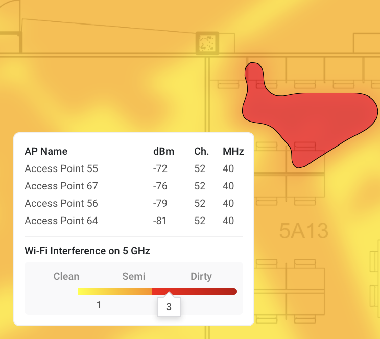<figcaption></figcaption></figure>

    

* Added **Automatic channel width**! Now, Hamina Network Planner can automagically optimize the channel width, based on how much co-channel interference you have. For now, you'll need to visit the **Channel settings** to enable it for each band, but someday, we'll probably make it on by default. Once it's enabled, as you add APs, you'll see &#x20;
* Behind-the-scenes work for Hamina Onsite. 😮

### 2023/10/13

There's so much stuff in this one that we're going to split out the release notes into **Features and Changes**, **Bugs**, and **New APs and Antennas**. Let's gooooooo!

**Features and Changes**

* Map/floor ordering in PDF reports didn't have a specific order, so we added sorting to it.
* We renamed "Cisco DNAC" to "Cisco Catalyst (DNA) Center", which we think is both correct and universally recognizable. _Note: this feature is still in a Feature Preview state, and isn't considered production-ready yet._
* In sample projects, we now automatically select a heatmap for the user when they open it for the first time.
* In the Client View, there is now an option to make the iPhone 6E capable of Wi-Fi 6E, so you can simulate the iPhone 15 Pro in 6 GHz.
* In a previous release, we introduced the new mesh feature, which automatically meshed any access points that were configured to **Not connected** via Ethernet. This broke a few corner cases (such as our current lack of connecting to a switch/IDF on another floor), so we brought back the normal "Not connected" option, and gave mesh it's own option, simply called "Mesh".

**Bugs**

* In our last production push, we accidentally introduced some slowdown in the heatmap rendering. Basically, we were constantly recalculating a bunch of stuff that we didn't need to. That's fixed now, so the heatmaps should feel smooth again.
* Note images were broken, due to some data isolation issues. The images have been... uh... un-isolated.

**New APs and Antennas**

* Renamed "Home Wi-Fi" to "Acme Technology", which fits the list better.&#x20;
* Alcatel Lucent
  * OAW-AP1411 2.4/5
  * OAW-AP1411 2.4/6
  * OAW-AP1411 5/6
  * OAW-AP1431
* Ubiquiti U6 Plus
* Arista C-330
* Huawei
  * AirEngine5760-51
  * AirEngine 5760-51 2.4/5/5
  * AirEngine 5761-11
  * AirEngine 5761-11W
  * AirEngine 5761-12W
  * AirEngine 5762-10
  * AirEngine 5762-12SW
  * AirEngine 5762-15HW
  * AirEngine 5762-17W
  * AirEngine 6760-X1
  * AirEngine 6760-X1E
  * AirEngine 6761-21 (Omni)
  * AirEngine 6761-21 (HD)
  * AirEngine 6761-21E
  * AirEngine 6761-21T
  * AirEngine 8760-x1-PRO
  * AirEngine 8760-x1-PRO 2.4/5/5
  * AirEngine 8761-X1
  * AP7060
* Celona
  * AP 20 4G
  * AP 20 5G
* Meraki
  * 9166D1-MR 2.4/5/6
  * 9166D1-MR 2.4/5/5
  * _Note: these were already available in the Cisco group, but have just been copied here for completeness._
* Alpha Wireless
  * AW3161
  * AW3711
  * AW3939
* Ventev
  * Terrawave M6060060D4D3602FP
  * Terrawave 58070MP13620P2

### 2023/10/03

* This release adds the AP Radio Details page to the PDF output. Now, the PDF report should include everything that the online report does, except for the Client View, which requires interactivity that only a browser can provide. 😉
* **Beta feature**: We've also added an option to enable Full Building Propagation. By default, Hamina shows propagation from the floor above and below the currently selected floor. This helps keep performance pretty fast without sacrificing any accuracy in most environments, as signal usually doesn't propagate through more than two floors. The[ Full Building Propagation (Beta)](https://docs.hamina.com/kb/basics/heatmaps#full-building-propagation-beta) option enables signal propagation calculations across all floors in the building for special buildings like theaters and arenas.
* **Special feature preview**: Export to Cisco DNA Center! This feature isn't done yet, but we wanted to show you our progress. It probably won't work at all, but [feel free to give it a try](https://docs.hamina.com/kb/import-export/cisco-catalyst-center).
* There was a bug that would cause the automatic channel planner to use 40, 80, and 160 MHz channels that don't exist. For example, the channel planner would create a 160 MHz channel in UNII-3, with channel 149 as the primary 20 MHz channel. Now, in addition to checking the regulatory domain and what channels the user has allowed, it now understands which 40, 80, and 160 MHz channels are valid.
* The signaling rate in the Client View was incorrectly labeled MBps (megabytes per second), instead of the correct Mbps (megabits per second). The label now correctly says Mbps. Sometimes, it's the small things. 🎸

### 2023/09/25

* We used to have an option to “Dowload” a PDF. We decided to depreciate that feature, and offer a new “Download” PDF option instead. 🤪
* There was a bug where you couldn’t add Interference thresholds after you removed them. We’ve removed the Interference removal bug, which removed the ability to safely remove Interference thresholds.
* In online reports, it wasn't possible to select a cellular client in the Client View. That's been fixed!
* We fixed a minor bug that would cause the mouseover inspector in the legendy to stop updating.
* We added some access points and antennas:
  * Fortinet 221-C
  * Cambium XV3-8
  * Airspan 1900/2900
  * Celona AP 21
  * Celona AP 22
  * Ventev M6060060MO1D3607O
  * Fortinet FANT-06ABGN-0606-O-N
* We also changed some access points and antennas:
  * The Calix u10xe now defaults to a table mount.
  * We updated the Celona external antennas to use the same part numbers that appear on the Celona data sheets.
  * Since the Meter MW05 and MW09 use external antenna connectors, we split them out into two variants: Default, which includes the stock antennas, and custom, so you can select whatever antenna you’d like to use.
  * The gain on all of the generic home Wi-Fi access points seem a bit high, so we decreased it a little bit.
  * BLE Gateways now connect back to switches by default.

### 2023/09/12

* In Safari, heatmaps weren't updating. We fixed it, and they're updating now!
* We fixed a little bug that was causing duplicate users to show up in our payment processing service.

### 2023/09/08

* Wait. _Another_ production push? There was a sneaky surprise in yesterday's push: single-hop mesh support! We did a mini-production push today to enable it. Now, **Connected via Ethernet** is set to `Not Connected (Mesh)`, mesh options appear. Check out our [Mesh Planning knowledgebase article](../design/mesh-planning.md) to learn more.
* In addition to the new mesh feature, we also added generic `Home Wi-Fi` gear. Now, new users can create an account and design their home Wi-Fi network for free. If you're a consumer router/access point/home mesh system vendor, and want us to include your gear, let us know and we can get it added for you. We'll just need your [specs and antenna patterns](requesting-aps.md#what-data-do-you-need-to-add-aps-and-antennas-to-hamina). 😃

### 2023/09/07

* If the heatmap is set to None, placing the first AP on the map automatically turns on the primary coverage heatmap for that type of AP (Wi-Fi, Private Cellular, BLE, or Zigbee)! 🔥
* Previously, the pin icon for private cellular base stations used a “5G” icon, which didn’t make sense for base stations that were 4G. We switched it to a generic  “cellular bars” icon to make it more universal. 📶
* Consumer routers and customer premises equipment is now “on the table” in Network Planner, with the all-new “Table Mount” option. 🍽️
* Fixed a bug where all APs in PDF would be blue, no matter what. Now, alternate AP colors appear in PDF reports. 🗒️
* Previously in 3D, the lines from the client view tracked back to the floor underneath the AP. Now, the lines terminate at the height of the AP, which is nice for seeing if the client has line-of-sight through sloped floors and attenuating objects.
* Added the Airspan Velocity 1901
* Added the Arista O-235E
* Added the CIG WF-660A
* Added the Meter MW05 and MW09

<figure><figcaption>
Check out the latest amazing Hamina innovation: new cellular radio unit icons! Whoa!
</figcaption></figure>

### 2023/09/01

* The Auto-draw walls tool has been hugely improved! It now draws less segments, and straighter walls.
* New accounts now include five sample projects, so new users can immediately see what the tool is capable of, and start moving APs around. 🎉
* In addition to the new sample accounts, there is now a 15-minute tutorial video. 📺
* In the Auto-draw walls tool, you can now click on a wall layer, and assign a material to it with a hotkey. ⌨️
* When sharing a project with another Hamina Network Planner user, you can now type in their address and hit Enter (without having to click on the Share button).
* The scale marker in the lower left wasn’t working correctly with feet, although it was fine in meters. We beat feet and got it fixed. 🏃

<figure><figcaption>
Comparison of the old automatic wall drawing and the new automatic wall drawing on the same CAD-sourced PDF file.
</figcaption></figure>
