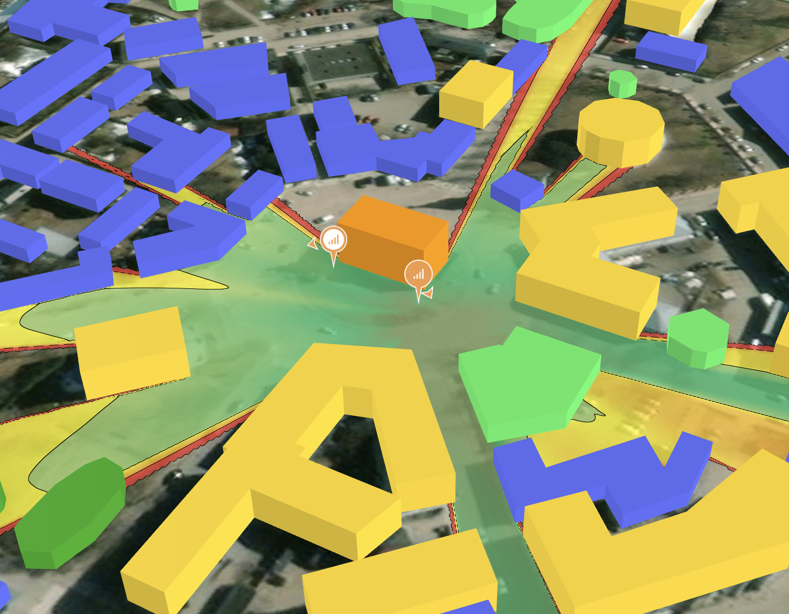

# 🗒 Release Notes

### 2023/10/13

There's so much stuff in this one that we're going to split out the release notes into **Features and Changes**, **Bugs**, and **New APs and Antennas**. Let's gooooooo!

**Features and Changes**

* The automatic channel planner will now automatically set the channel width, network wide. As you add access points, and co-channel interference gets worse, the channel planner will notify you that the channel width has been changed via notification at the top. This is on by default to help novice users, but of course can be disabled in **Channel settings**.&#x20;
* Map/floor ordering in PDF reports didn't have a specific order, so we added sorting to it.
* We renamed "Cisco DNAC" to "Cisco Catalyst (DNA) Center", which we think is both correct and universally recognizable. _Note: this feature is still in a Feature Preview state, and isn't considered production-ready yet._
* In sample projects, we now automatically select a heatmap for the user when they open it for the first time.
* In the Client View, there is now an option to make the iPhone 6E capable of Wi-Fi 6E, so you can simulate the iPhone 15 Pro in 6 GHz.
* In a previous release, we introduced the new mesh feature, which automatically meshed any access points that were configured to **Not connected** via Ethernet. This broke a few corner cases (such as our current lack of connecting to a switch/IDF on another floor), so we brought back the normal "Not connected" option, and gave mesh it's own option, simply called "Mesh".

**Bugs**

* In our last production push, we accidentally introduced some slowdown in the heatmap rendering. Basically, we were constantly recalculating a bunch of stuff that we didn't need to. That's fixed now, so the heatmaps should feel smooth again.
* Note images were broken, due to some data isolation issues. The images have been... uh... un-isolated.

**New APs and Antennas**

* Renamed "Home Wi-Fi" to "Acme Technology", which fits the list better.&#x20;
* Alcatel Lucent
  * OAW-AP1411 2.4/5
  * OAW-AP1411 2.4/6
  * OAW-AP1411 5/6
  * OAW-AP1431
* Ubiquiti U6 Plus
* Arista C-330
* Huawei
  * AirEngine5760-51
  * AirEngine 5760-51 2.4/5/5
  * AirEngine 5761-11
  * AirEngine 5761-11W
  * AirEngine 5761-12W
  * AirEngine 5762-10
  * AirEngine 5762-12SW
  * AirEngine 5762-15HW
  * AirEngine 5762-17W
  * AirEngine 6760-X1
  * AirEngine 6760-X1E
  * AirEngine 6761-21 (Omni)
  * AirEngine 6761-21 (HD)
  * AirEngine 6761-21E
  * AirEngine 6761-21T
  * AirEngine 8760-x1-PRO
  * AirEngine 8760-x1-PRO 2.4/5/5
  * AirEngine 8761-X1
  * AP7060
* Celona
  * AP 20 4G
  * AP 20 5G
* Meraki
  * 9166D1-MR 2.4/5/6
  * 9166D1-MR 2.4/5/5
  * _Note: these were already available in the Cisco group, but have just been copied here for completeness._
* Alpha Wireless
  * AW3161
  * AW3711
  * AW3939
* Ventev
  * Terrawave M6060060D4D3602FP
  * Terrawave 58070MP13620P2

### 2023/10/03

* This release adds the AP Radio Details page to the PDF output. Now, the PDF report should include everything that the online report does, except for the Client View, which requires interactivity that only a browser can provide. 😉
* **Beta feature**: We've also added an option to enable Full Building Propagation. By default, Hamina shows propagation from the floor above and below the currently selected floor. This helps keep performance pretty fast without sacrificing any accuracy in most environments, as signal usually doesn't propagate through more than two floors. The[ Full Building Propagation (Beta)](https://docs.hamina.com/kb/basics/heatmaps#full-building-propagation-beta) option enables signal propagation calculations across all floors in the building for special buildings like theaters and arenas.
* **Special feature preview**: Export to Cisco DNA Center! This feature isn't done yet, but we wanted to show you our progress. It probably won't work at all, but [feel free to give it a try](https://docs.hamina.com/kb/import-export/cisco-catalyst-center).
* There was a bug that would cause the automatic channel planner to use 40, 80, and 160 MHz channels that don't exist. For example, the channel planner would create a 160 MHz channel in UNII-3, with channel 149 as the primary 20 MHz channel. Now, in addition to checking the regulatory domain and what channels the user has allowed, it now understands which 40, 80, and 160 MHz channels are valid.
* The signaling rate in the Client View was incorrectly labeled MBps (megabytes per second), instead of the correct Mbps (megabits per second). The label now correctly says Mbps. Sometimes, it's the small things. 🎸

### 2023/09/25

* We used to have an option to “Dowload” a PDF. We decided to depreciate that feature, and offer a new “Download” PDF option instead. 🤪
* There was a bug where you couldn’t add Interference thresholds after you removed them. We’ve removed the Interference removal bug, which removed the ability to safely remove Interference thresholds.
* In online reports, it wasn't possible to select a cellular client in the Client View. That's been fixed!
* We fixed a minor bug that would cause the mouseover inspector in the legendy to stop updating.
* We added some access points and antennas:
  * Fortinet 221-C
  * Cambium XV3-8
  * Airspan 1900/2900
  * Celona AP 21
  * Celona AP 22
  * Ventev M6060060MO1D3607O
  * Fortinet FANT-06ABGN-0606-O-N
* We also changed some access points and antennas:
  * The Calix u10xe now defaults to a table mount.
  * We updated the Celona external antennas to use the same part numbers that appear on the Celona data sheets.
  * Since the Meter MW05 and MW09 use external antenna connectors, we split them out into two variants: Default, which includes the stock antennas, and custom, so you can select whatever antenna you’d like to use.
  * The gain on all of the generic home Wi-Fi access points seem a bit high, so we decreased it a little bit.
  * BLE Gateways now connect back to switches by default.

### 2023/09/12

* In Safari, heatmaps weren't updating. We fixed it, and they're updating now!
* We fixed a little bug that was causing duplicate users to show up in our payment processing service.

### 2023/09/08

* Wait. _Another_ production push? There was a sneaky surprise in yesterday's push: single-hop mesh support! We did a mini-production push today to enable it. Now, **Connected via Ethernet** is set to `Not Connected (Mesh)`, mesh options appear. Check out our [Mesh Planning knowledgebase article](design/mesh-planning.md) to learn more.
* In addition to the new mesh feature, we also added generic `Home Wi-Fi` gear. Now, new users can create an account and design their home Wi-Fi network for free. If you're a consumer router/access point/home mesh system vendor, and want us to include your gear, let us know and we can get it added for you. We'll just need your [specs and antenna patterns](requesting-aps.md#what-data-do-you-need-to-add-aps-and-antennas-to-hamina). 😃

### 2023/09/07

* If the heatmap is set to None, placing the first AP on the map automatically turns on the primary coverage heatmap for that type of AP (Wi-Fi, Private Cellular, BLE, or Zigbee)! 🔥
* Previously, the pin icon for private cellular base stations used a “5G” icon, which didn’t make sense for base stations that were 4G. We switched it to a generic  “cellular bars” icon to make it more universal. 📶
* Consumer routers and customer premises equipment is now “on the table” in Network Planner, with the all-new “Table Mount” option. 🍽️
* Fixed a bug where all APs in PDF would be blue, no matter what. Now, alternate AP colors appear in PDF reports. 🗒️
* Previously in 3D, the lines from the client view tracked back to the floor underneath the AP. Now, the lines terminate at the height of the AP, which is nice for seeing if the client has line-of-sight through sloped floors and attenuating objects.
* Added the Airspan Velocity 1901
* Added the Arista O-235E
* Added the CIG WF-660A
* Added the Meter MW05 and MW09

<figure><figcaption>
Check out the latest amazing Hamina innovation: new cellular radio unit icons! Whoa!
</figcaption></figure>

### 2023/09/01

* The Auto-draw walls tool has been hugely improved! It now draws less segments, and straighter walls.
* New accounts now include five sample projects, so new users can immediately see what the tool is capable of, and start moving APs around. 🎉
* In addition to the new sample accounts, there is now a 15-minute tutorial video. 📺
* In the Auto-draw walls tool, you can now click on a wall layer, and assign a material to it with a hotkey. ⌨️
* When sharing a project with another Hamina Network Planner user, you can now type in their address and hit Enter (without having to click on the Share button).
* The scale marker in the lower left wasn’t working correctly with feet, although it was fine in meters. We beat feet and got it fixed. 🏃

<figure><figcaption>
Comparison of the old automatic wall drawing and the new automatic wall drawing on the same CAD-sourced PDF file.
</figcaption></figure>
