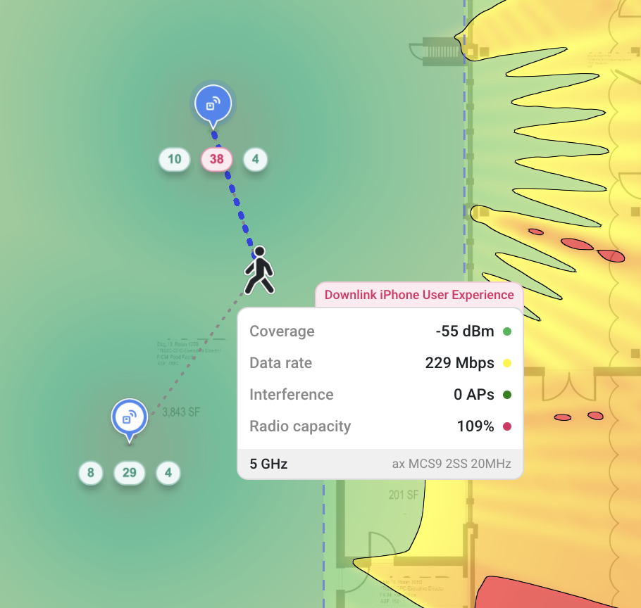
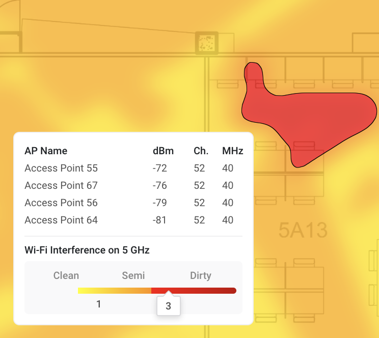

# 🗒 Release Notes

### 2024/01/15

#### Features and Changes

* When Importing access points, they are now "Not Connected" by default.
* We no longer fetch survey data until you switch to the "Survey" tab.

#### Bugs

* There was a bug where you couldn't select notes in the Survey tab. That's fixed now.
* If two measurements were in the exact same location, some strange visual artifacts could occur. Fixed!

#### New APs and Antennas

* Added the MP Antenna 08-ANT-1072.
* Added the Aruba AP-584.
* Added the Alcatel OAW-AP1321, OAW-AP1322, OAW-AP1331, OAW-AP1361, OAW-AP1361D, and OAW-AP1362.
* Added the Extreme ML-2452-APA2-02.
* Added the Siemens ANT793-8DJ and ANT793-8DL.

### 2024/01/10

#### Features and Changes

* When using the Export feature, with the "Match by name" selected, Hamina Planner will now attempt matching unassigned APs by name, instead of randomly assigning them.
* We made some other model matching improvements.

### 2024/01/09

#### Features and Changes

* Previously for measured data, the heatmaps would fade to red near the edges, suggesting that signal strength wasn't as good there. This has now been corrected; the heatmaps now have a clean cut at the edges without a color change.
* We adjusted the default heatmap thresholds. For Primary Coverage:
  * Green: -65 dBm
  * Yellow: -70 dBm
  * Red: -75 dBm
* For Secondary Coverage:
  * Green: -67 dBm
  * Yellow: -70 dBm
  * Red: -75 dBm
* For SNR:
  * Green: 25 dB
  * Yellow: 20 dB
  * Red: 15 dB
* The Secondary Coverage and SNR heatmaps are now available for measured data.
* For the various integration/import/export features in Hamina Network Planner, we renamed "Meraki" to "Cisco Meraki".

#### Bugs

* Fixed a bug where the channel optimizer wouldn't re-run when switching AP models.
* The Cisco 3802 was labeled as "Wi-Fi 6", which is not correct. Now, it says "Wi-Fi 5" in the BOM, like it should.

### 2024/01/04

Happy New Year! 🎉

#### Features and Changes

* Aruba, Hewlett-Packard Enterprise, and Hewlett Packard OUIs have been combined and grouped as "Aruba" (which, looking at this a few weeks later, is pretty funny).
* Cisco and Cisco Systems are now grouped as "Cisco".
* When switching between the Simulation and Survey tabs, the viewport location and zoom does not change, and the map doesn't reload, which makes it easy to flip and back and forth between Simulation and Survey for comparison purposes.
* Previously, moving or deleting survey points wouldn't update AP locations without refreshing the browser. Now, the AP locations update without a refresh.

#### Bugs

* Previously, you couldn't activate an Onsite license without a Planner license. That is fixed now.
* Pressing Ctrl+C to copy something would change all of the selected walls to whatever button "C" was bound to (which was usually Concrete). This is fixed - you can now safely copy a bunch of walls without turning them into stone. Well, concrete.
* There was a weird bug where the channel planning could try to set an 80 MHz channel in 2.4 GHz, which would cause a small crash. Ha, whoops. Fixed now.

### 2023/12/21

One last production push of the year, and right before Christmas! 🎅🌲🎁 This one contains a bunch of stuff, so we'll break it up into categories a little bit. ❄️⛄🎄

#### Features and Changes

* **Vendor Integrations**
  * Cisco Catalyst (DNA) Center users can now define an existing hierarchy with building and areas (with multiple nested areas) when exporting a Cisco Catalyst XML file.
    * If there isn't a hierarchy defined in Cisco Catalyst Center, it can be exported as as separate CSV file.
    * The building name defaults to the Hamina project name, but this can be overridden.
  * Added APAC01 region to Juniper Mist.
* **Client View**
  * Added a scroll bar to the Client experience pane.
  * When the Client View is activated, the heatmaps are now automatically hidden, but you can show them again by unchecking **Show association area** in the **Client experience** pane.
  * In the **Survey paths** pane, the newest surveys are now at the top, making them the easiest to find.
  * In 3D, if the client height is changed, the "Roaming Man" in the Client View now has a vertical line to show it's precise location on the ground.
  * The maximum client height is now tied to the height of the current floor.
* **Folder Behavior**
  * To prepare for our upcoming team project sharing features, we converted the concept of "Folders" to "Tags". With this change, we are able to drastically simplify the development and usage of the team project sharing feature.
    * As part of the conversion from "Folders" to "Tags", when you tag a project and share it, the person you are sharing with will see the same tag structure as you.
    * Conversely, if someone shares a tagged project with you, you'll see the tag structure as well.
* **Surveys**
  * We show the location of measured APs if they exceed -60 dBm.
  * For users with Hamina Network Planner subscriptions, the Survey tab only appears if the project contains survey data.
* **Miscellaneous**
  * When mousing over areas with Interference in the Interference heatmap, the APs causing that interference have a red highlight. Nice.
  * Previously, we gave new Hamina accounts the opportunity to view one of several example projects, which would then copy that example project to their account. Now, we copy all of the example projects to the new user's account, so they can explore all of them.

#### APs and Antennas

* Added the Calix GigaPro p6dx

#### Bugs

* We fixed an issue where a measured AP could appear on two maps. This was mostly true before (but is extra-true now): if you have a project with multiple maps/floors, a surveyed AP will only appear on one at a time.
* We decided to make the "Roaming Man" in the Client View is more grounded. Seriously. At the default client height, in 3D, his feet appear to be on the ground.
* There was an issue where you couldn't place notes on survey paths. That's fixed, now you can put map notes wherever you want!
* There were some memory usage issues in Safari, which we mitigated with... uh... memory-usage-mitigating techniques.

### 2023/12/11

*   Added support for an innovative new input method for computer mice: **scroll wheels**! The camera controls toolbar on the right now has a **Switch to mouse/trackpad mode** button, which changes the behavior of the "scroll wheel". Trackpad mode optimizes for two-finger scrolling and pinch-to-zoom, and mouse mode optimizes for zooming in and out with the scroll wheel. We put the button right there in the toolbar, so if you switch back and forth instantly. 🐭\

    

    <figure><figcaption></figcaption></figure>

    

*   While we typically don't want it to happen, clients do occasionally roam to APs on different floors! The problem is that the Client View only paid attention to the current floor, but we fixed that. Now, the client can roam to APs on the floors above and below. Enable **Full Building propagation** and the client can potentially roam to any AP on any floor! The association area turns red, too.\

    

    <figure><figcaption></figcaption></figure>

    

*   Speaking of the Client View, it's all-new to make room for **Client capacity**! Now, when a Capacity zone is drawn, and clients are associated to the current associated AP, the Client view will now show the capacity of the current radio from a client association perspective.\

    

    <figure><figcaption></figcaption></figure>

    

* With Hamina Network Planner Plus, the Client View can now show **Downlink**, **Uplink**, and... you're gunna love this one, we made it all up on our own: **Worstlink**®! It shows you, uh... the worst of the two.
* In the Client View, enabling **Show association area** now automagically disables the current heatmap.
* Cisco Catalyst (DNA) Center Export now includes the building, floor, and radio details! The **Building** is populated from the **Hamina project name**, and the **Floor** is derived from the multi-floor feature. The radios now include azimuth, elevation (from the AP height), and radio type. It's all still in beta though, so be careful!
*   The **x** button in the Share menu is now a trash can. Am I getting paid per bullet point? No...? Why do you ask?

    

    <figure><figcaption></figcaption></figure>

    

* Previously, entering 3D mode would cause the map to slowly rotate, which looked pretty cool. Unfortunately, changing the zoom or rotation would stop it. Now, you can right-click the Switch to 2D button in the camera controls toolbar to restart rotation. Ok, this is mostly for us to demo things and sell more Hamina subscriptions, but maybe you'll find some use for it too.

#### Bugs

* The Channel Width column in the AP Radio Details table had a decimal place for no reason. It will now, for example, say "20 MHz" instead of "20.0 MHz".
* In PDF reports, the Legend in the lower left was all red, but only in Preview on macOS. In other PDF viewers, it was fine, but we changed how we draw the legend in the PDF so it would look right in Preview.
* The title for the "table mount" was wrong in the BOM, so we fixed it.

### 2023/11/23

* Behind-the-scenes work for Hamina Onsite. 😮

#### Bugs

* In some cases, the tops of overlapping walls might flicker, so we applied a temporary fix. We'll do a permanent fix soon, along with some big 3D improvements that are on the horizon. 🤩

### 2023/11/21

* Added the MikroTik cAP ax
* Added the MikroTik hAP-ac3 and hAP-ax3 that uses an HGO-52 antenna.
* Added the Huawei 8760-X1E.
* Added the Juniper Mist AP41E.
* Added the Alcatel Lucent AP1301 and AP1311.
* Added the an AirSpeed 1900/2900 external antenna variant. You're all variants!
* Behind-the-scenes work for Hamina Onsite. 🤫

#### Bugs

* There was an issue where users without a subscription (the "free tier" users) couldn't create reports. That wasn't intentional, and it's fixed now!
* PDF report generation was sometimes failing. We figured it why, and fixed. it.
* We accidentally added the Extreme AP3000 as a tri-radio AP. In reality, it is a dual-band AP with a band-selectable radio, so we fixed it. There is now a 2.4/5 GHz version, and a 5/6 GHz version.
* The EnGenius ECW215 and ECW230 had the wrong Wi-Fi generation assigned. Now, they're Wi-Fi 6, as they should be.

### 2023/11/01

* We added multi-radio support for cellular APs (or "eNodeBs" as the cool kids say), which means support for different antennas per radio and selecting radios individually (both for heatmaps and azimuth controls).
* We added an Upcoming AP models flag to the APs/antennas database, and a **Preview upcoming AP models** checkbox, so vendors can see their APs and antennas in Hamina ahead of their official release.
* Added the Zyxel WBE660S.
* You guessed it, more behind-the-scenes work for Hamina Onsite! 🤫

#### Bugs

* Just one bugfix this time: switching between cellular and Wi-Fi APs could have broken the external antenna switcher. It doesn't break anymore!

### 2023/10/25

* Implemented the new Planner layout to prepare for Hamina Onsite.
* We added the resolved AP number to the Copy function, which some of our users needed for doing automation and stuff.
* Added channel width indicators to the Access point pane, so you could quickly see what channel width the Automatic channel width feature is using.
* Added the Ruckus R770.
* Behind-the-scenes work for Hamina Onsite. 🤫

#### Bugs

* Fixed a bug where the channel settings wouldn't save if you opened them through the access point pane. 🐛
* Fixed a bug where a project wouldn't save to the folder you specified, if you assigned it to  a folder during creation. 🪲
* Here's a weird one: if you uploaded some maps, and quickly switched to a different project, you'd get map upload notifications for the previous project.
* Fixed an issue where the Extreme AP3000 didn't default to a ceiling mount. Whoops. 🤪
* Fixed an issue where the Automatic channel width would get stuck. I tell you what, we hit it with some WD-40. It doesn't get stuck no more.

### 2023/10/19

*   Added Co-channel interference tooltips! Now, with the **Interference** heatmap enabled, mousing over any interference will show which APs are causing the interference down in the Legend.\

    

    <figure><figcaption></figcaption></figure>

    

* Added **Automatic channel width**! Now, Hamina Network Planner can automagically optimize the channel width, based on how much co-channel interference you have. For now, you'll need to visit the **Channel settings** to enable it for each band, but someday, we'll probably make it on by default. Once it's enabled, as you add APs, you'll see &#x20;
* Behind-the-scenes work for Hamina Onsite. 😮

### 2023/10/13

There's so much stuff in this one that we're going to split out the release notes into **Features and Changes**, **Bugs**, and **New APs and Antennas**. Let's gooooooo!

**Features and Changes**

* Map/floor ordering in PDF reports didn't have a specific order, so we added sorting to it.
* We renamed "Cisco DNAC" to "Cisco Catalyst (DNA) Center", which we think is both correct and universally recognizable. _Note: this feature is still in a Feature Preview state, and isn't considered production-ready yet._
* In sample projects, we now automatically select a heatmap for the user when they open it for the first time.
* In the Client View, there is now an option to make the iPhone 6E capable of Wi-Fi 6E, so you can simulate the iPhone 15 Pro in 6 GHz.
* In a previous release, we introduced the new mesh feature, which automatically meshed any access points that were configured to **Not connected** via Ethernet. This broke a few corner cases (such as our current lack of connecting to a switch/IDF on another floor), so we brought back the normal "Not connected" option, and gave mesh it's own option, simply called "Mesh".

**Bugs**

* In our last production push, we accidentally introduced some slowdown in the heatmap rendering. Basically, we were constantly recalculating a bunch of stuff that we didn't need to. That's fixed now, so the heatmaps should feel smooth again.
* Note images were broken, due to some data isolation issues. The images have been... uh... un-isolated.

**New APs and Antennas**

* Renamed "Home Wi-Fi" to "Acme Technology", which fits the list better.&#x20;
* Alcatel Lucent
  * OAW-AP1411 2.4/5
  * OAW-AP1411 2.4/6
  * OAW-AP1411 5/6
  * OAW-AP1431
* Ubiquiti U6 Plus
* Arista C-330
* Huawei
  * AirEngine5760-51
  * AirEngine 5760-51 2.4/5/5
  * AirEngine 5761-11
  * AirEngine 5761-11W
  * AirEngine 5761-12W
  * AirEngine 5762-10
  * AirEngine 5762-12SW
  * AirEngine 5762-15HW
  * AirEngine 5762-17W
  * AirEngine 6760-X1
  * AirEngine 6760-X1E
  * AirEngine 6761-21 (Omni)
  * AirEngine 6761-21 (HD)
  * AirEngine 6761-21E
  * AirEngine 6761-21T
  * AirEngine 8760-x1-PRO
  * AirEngine 8760-x1-PRO 2.4/5/5
  * AirEngine 8761-X1
  * AP7060
* Celona
  * AP 20 4G
  * AP 20 5G
* Meraki
  * 9166D1-MR 2.4/5/6
  * 9166D1-MR 2.4/5/5
  * _Note: these were already available in the Cisco group, but have just been copied here for completeness._
* Alpha Wireless
  * AW3161
  * AW3711
  * AW3939
* Ventev
  * Terrawave M6060060D4D3602FP
  * Terrawave 58070MP13620P2

### 2023/10/03

* This release adds the AP Radio Details page to the PDF output. Now, the PDF report should include everything that the online report does, except for the Client View, which requires interactivity that only a browser can provide. 😉
* **Beta feature**: We've also added an option to enable Full Building Propagation. By default, Hamina shows propagation from the floor above and below the currently selected floor. This helps keep performance pretty fast without sacrificing any accuracy in most environments, as signal usually doesn't propagate through more than two floors. The[ Full Building Propagation (Beta)](https://docs.hamina.com/kb/basics/heatmaps#full-building-propagation-beta) option enables signal propagation calculations across all floors in the building for special buildings like theaters and arenas.
* **Special feature preview**: Export to Cisco DNA Center! This feature isn't done yet, but we wanted to show you our progress. It probably won't work at all, but [feel free to give it a try](https://docs.hamina.com/kb/import-export/cisco-catalyst-center).
* There was a bug that would cause the automatic channel planner to use 40, 80, and 160 MHz channels that don't exist. For example, the channel planner would create a 160 MHz channel in UNII-3, with channel 149 as the primary 20 MHz channel. Now, in addition to checking the regulatory domain and what channels the user has allowed, it now understands which 40, 80, and 160 MHz channels are valid.
* The signaling rate in the Client View was incorrectly labeled MBps (megabytes per second), instead of the correct Mbps (megabits per second). The label now correctly says Mbps. Sometimes, it's the small things. 🎸

### 2023/09/25

* We used to have an option to “Dowload” a PDF. We decided to depreciate that feature, and offer a new “Download” PDF option instead. 🤪
* There was a bug where you couldn’t add Interference thresholds after you removed them. We’ve removed the Interference removal bug, which removed the ability to safely remove Interference thresholds.
* In online reports, it wasn't possible to select a cellular client in the Client View. That's been fixed!
* We fixed a minor bug that would cause the mouseover inspector in the legendy to stop updating.
* We added some access points and antennas:
  * Fortinet 221-C
  * Cambium XV3-8
  * Airspan 1900/2900
  * Celona AP 21
  * Celona AP 22
  * Ventev M6060060MO1D3607O
  * Fortinet FANT-06ABGN-0606-O-N
* We also changed some access points and antennas:
  * The Calix u10xe now defaults to a table mount.
  * We updated the Celona external antennas to use the same part numbers that appear on the Celona data sheets.
  * Since the Meter MW05 and MW09 use external antenna connectors, we split them out into two variants: Default, which includes the stock antennas, and custom, so you can select whatever antenna you’d like to use.
  * The gain on all of the generic home Wi-Fi access points seem a bit high, so we decreased it a little bit.
  * BLE Gateways now connect back to switches by default.

### 2023/09/12

* In Safari, heatmaps weren't updating. We fixed it, and they're updating now!
* We fixed a little bug that was causing duplicate users to show up in our payment processing service.

### 2023/09/08

* Wait. _Another_ production push? There was a sneaky surprise in yesterday's push: single-hop mesh support! We did a mini-production push today to enable it. Now, **Connected via Ethernet** is set to `Not Connected (Mesh)`, mesh options appear. Check out our [Mesh Planning knowledgebase article](design/mesh-planning.md) to learn more.
* In addition to the new mesh feature, we also added generic `Home Wi-Fi` gear. Now, new users can create an account and design their home Wi-Fi network for free. If you're a consumer router/access point/home mesh system vendor, and want us to include your gear, let us know and we can get it added for you. We'll just need your [specs and antenna patterns](requesting-aps.md#what-data-do-you-need-to-add-aps-and-antennas-to-hamina). 😃

### 2023/09/07

* If the heatmap is set to None, placing the first AP on the map automatically turns on the primary coverage heatmap for that type of AP (Wi-Fi, Private Cellular, BLE, or Zigbee)! 🔥
* Previously, the pin icon for private cellular base stations used a “5G” icon, which didn’t make sense for base stations that were 4G. We switched it to a generic  “cellular bars” icon to make it more universal. 📶
* Consumer routers and customer premises equipment is now “on the table” in Network Planner, with the all-new “Table Mount” option. 🍽️
* Fixed a bug where all APs in PDF would be blue, no matter what. Now, alternate AP colors appear in PDF reports. 🗒️
* Previously in 3D, the lines from the client view tracked back to the floor underneath the AP. Now, the lines terminate at the height of the AP, which is nice for seeing if the client has line-of-sight through sloped floors and attenuating objects.
* Added the Airspan Velocity 1901
* Added the Arista O-235E
* Added the CIG WF-660A
* Added the Meter MW05 and MW09

<figure><figcaption>
Check out the latest amazing Hamina innovation: new cellular radio unit icons! Whoa!
</figcaption></figure>

### 2023/09/01

* The Auto-draw walls tool has been hugely improved! It now draws less segments, and straighter walls.
* New accounts now include five sample projects, so new users can immediately see what the tool is capable of, and start moving APs around. 🎉
* In addition to the new sample accounts, there is now a 15-minute tutorial video. 📺
* In the Auto-draw walls tool, you can now click on a wall layer, and assign a material to it with a hotkey. ⌨️
* When sharing a project with another Hamina Network Planner user, you can now type in their address and hit Enter (without having to click on the Share button).
* The scale marker in the lower left wasn’t working correctly with feet, although it was fine in meters. We beat feet and got it fixed. 🏃

<figure><figcaption>
Comparison of the old automatic wall drawing and the new automatic wall drawing on the same CAD-sourced PDF file.
</figcaption></figure>
