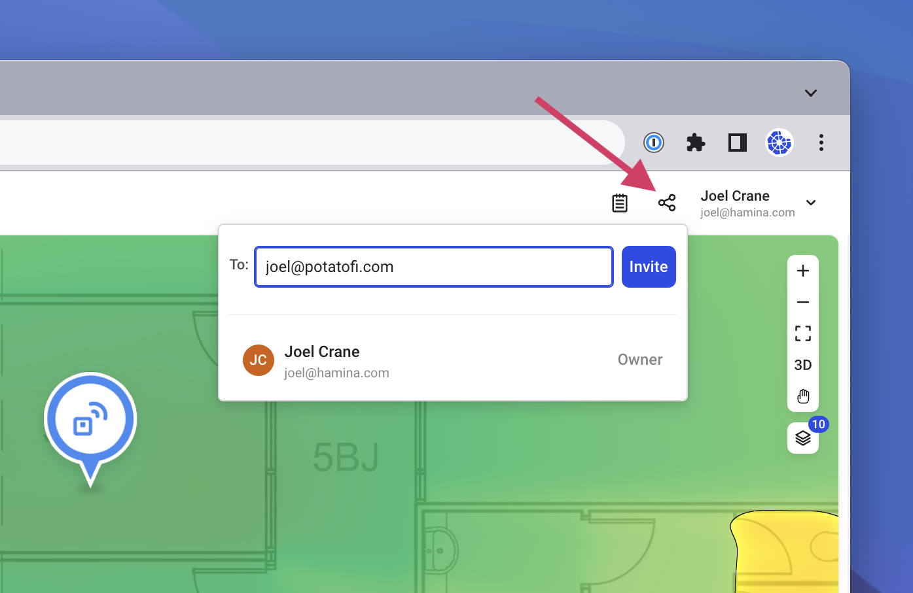
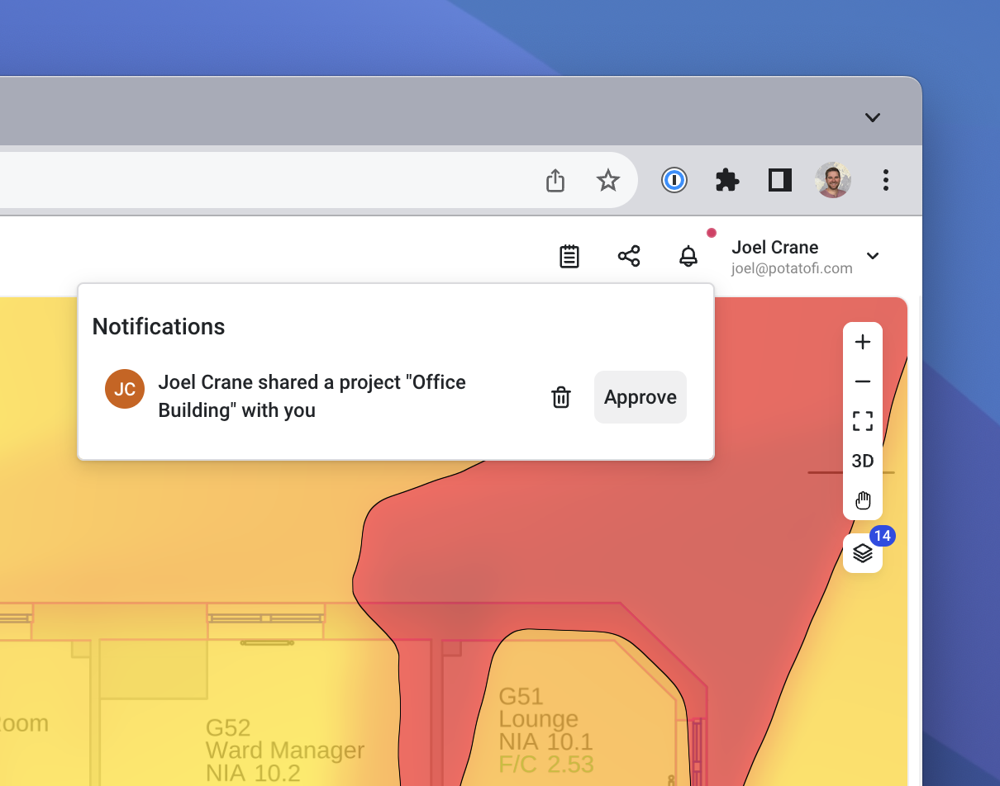
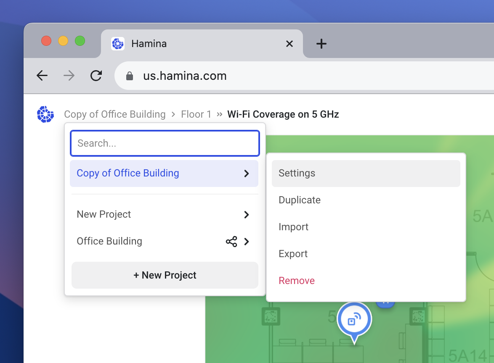

# 🤝 Project Sharing

## Share a Project

To invite other Hamina users to a project, click on the Share button in the upper right.

<figure><figcaption></figcaption></figure>

Enter the email address(es) of the Hamina users that you wish to share the project. For multiple recipients, separate each email address with a comma.&#x20;


The EU and US instances of Hamina are completely separate. Hamina user accounts, and project data only exists on one instance.&#x20;


Invited users will receive an email notification asking them to approve invite. Once approved, they will have access to the project. They will be able to modify the project based on their individual Hamina Network Planner subscription status.&#x20;

## Teams

In Hamina Network Planner, you can use teams to share projects with multiple users at the same time. Hamina users can be part of and own multiple teams.

### Creating a Team

To create, view, and manage teams, visit the **Team view** in the **Account menu**.

<figure><figcaption></figcaption></figure>

### Inviting Users to the Team

To create a team, click the **Add a team** button. You'll be prompted to name the team and choose an icon, both of which can be changed later at any time.

In the **To** field, enter in the email address of the person you would like to invite, and click **Send invite**. The user will receive an email inviting them to join the team. In the Hamina Network Planner web app, they will also receive a notification inviting them to join the team.

<figure><figcaption></figcaption></figure>


The user does not need to have a pre-existing Hamina account to be invited to the team.



Email addresses are not case sensitive, so you don't need to worry about case.


### Managing Team Roles

There are three roles that users can have on a team:

* **User** - View and edit all projects in the team, see who is in the team.
* **Admin** - Add and remove users, change membership roles (excluding Owner), rename the team and change the icon.
* **Owner** - Add and remove users, change membership roles (including Owner), rename the team and change the icon, delete the team. Multiple owners can exist in one team. The last owner on a team can't be removed, so there is always at least one owner.

To change the user's role, click on the role next to the user in the list.

<figure><figcaption></figcaption></figure>

### Sharing Projects with Teams

Sharing projects with teams is identical to sharing projects with individual users. In the **Share project** menu in the upper right, you can click on the search box to see a list of available teams, or you can use the search field to look for a specific team.


Sharing a project with a team gives full write access to all members of the team.


<figure><figcaption></figcaption></figure>

## Moving Projects to Other Accounts

Using the Project Sharing and Project Duplication tools, you can move projects to another account.


While these instructions show how to move one project at a time, you can perform each step for all of your projects to batch the tasks, and speed up the process.


1.  In the source account, invite the target account to share the project with the **Share** button in the upper right.\

    

    <figure><figcaption></figcaption></figure>

    

2.  The target account will receive both an email and a notification in Hamina Network Planner where the project can be accepted. In Hamina Network Planner, accept the project in the target account with the **Notification** button in the upper right, and the **Approve** button.\

    

    <figure><figcaption></figcaption></figure>

    

3.  The project is still owned by the source account, so make a duplicate of it in the **Project** list with the **Duplicate** option.\

    

    <figure><figcaption></figcaption></figure>

    

4.  Optionally rename the duplicated project in the target account in the **Project** list in the **Settings** option.\

    

    <figure><figcaption></figcaption></figure>

    

5. Optionally, remove the old project from the source account.

