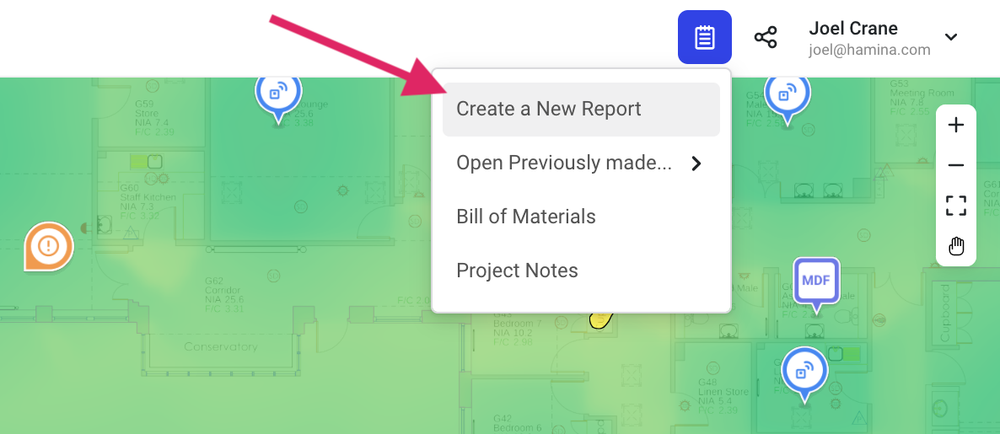

# 📒 Reporting

## Creating Reports

To create a report in Hamina Network Planner, click the blue **Reporting** button in the upper right. Then, select **Create a new Report**.

A new browser tab will appear, where you can name and create a report.


If you've created a previous report that you'd like to reuse, you can use the **Template** dropdown menu to browse previous projects and reports that you've created.


### Adding a Custom Logo

In the upper right, you can upload a custom logo, such as your company logo to add branding to your report.

### Hiding and Showing Pages

On the left is a list of pages that will be included in the report. You can hide pages by hovering your mouse over a page, and clicking the **Hide** button. Click the **Show** button to re-enable the page.

### Online Reports

Online Reports in Hamina Network Planner provide your managers, customers, and project stakeholders with a fully interactive, read-only Hamina Network Planner interface. The user interface is very similar to Hamina Network Planner, except there are no tools, and the report viewer can navigate between heatmaps and views with a simple menu.&#x20;

The heatmaps and views that the user sees are determined by which pages you show and hide.


Whenever the Online Report is loaded or refreshed, it shows the most recent version of the project, so the documentation is never out of date.


#### Sharing an Online Report

To share an Online Report, click the blue **Share** button in the upper right. Next, you'll have the option to create a password for the report. Click the **Create links** button to create a link.

The report will be available as long as the report exists. You can click the red **Revoke links** button to make the report no longer accessible.

### PDF Reports

If the customer requires a physical deliverable, you can generate a PDF report with the **Download** button in the upper right. Select **Generate PDF** to begin the report generation progress, at which point you will see a progress indicator. When the report has finished generating on the Hamina Cloud, the **Download PDF** button will become available.


Per Hamina account, only one PDF Report can be generated at a time. You won't be able to start generating a new PDF report until the previous report is finished generating.


