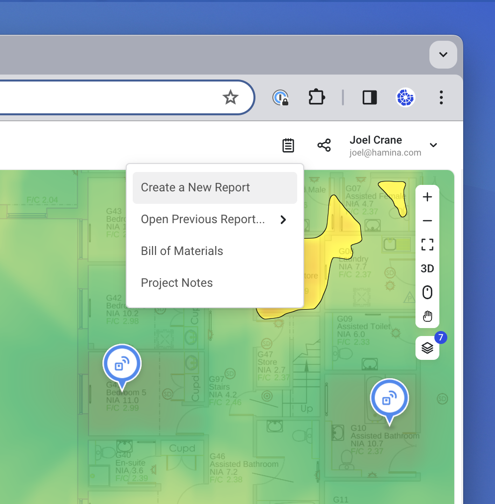
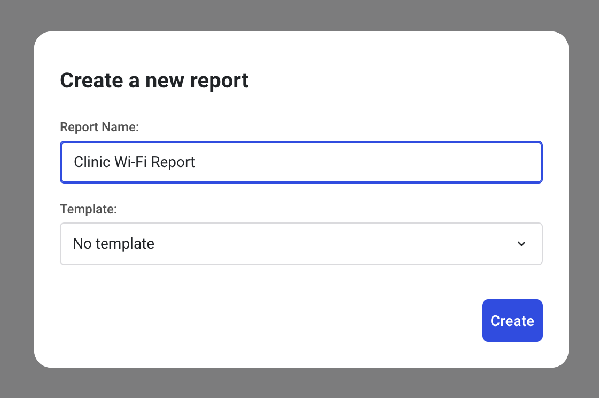
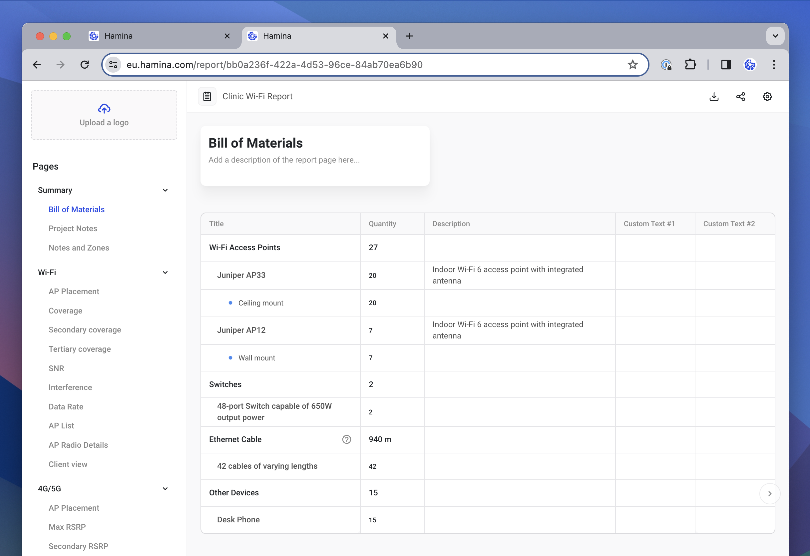
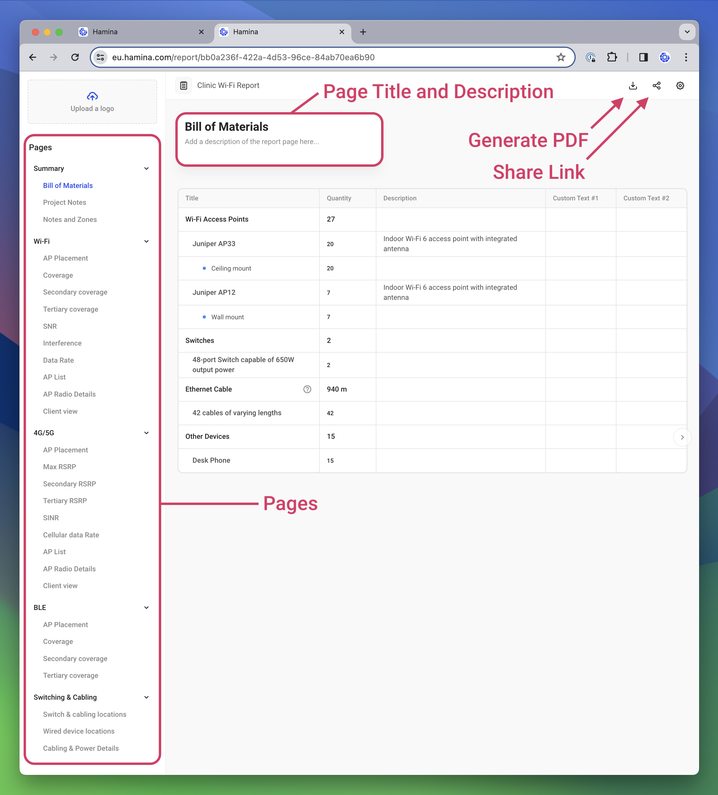
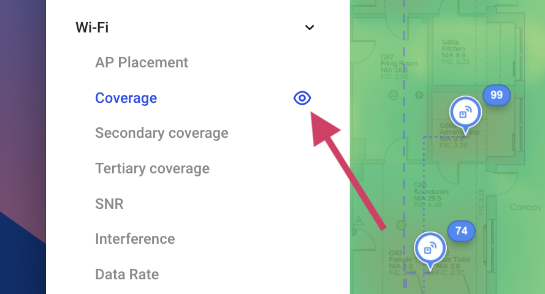
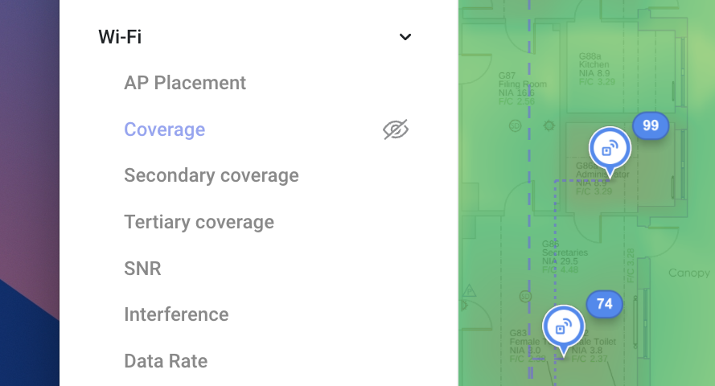
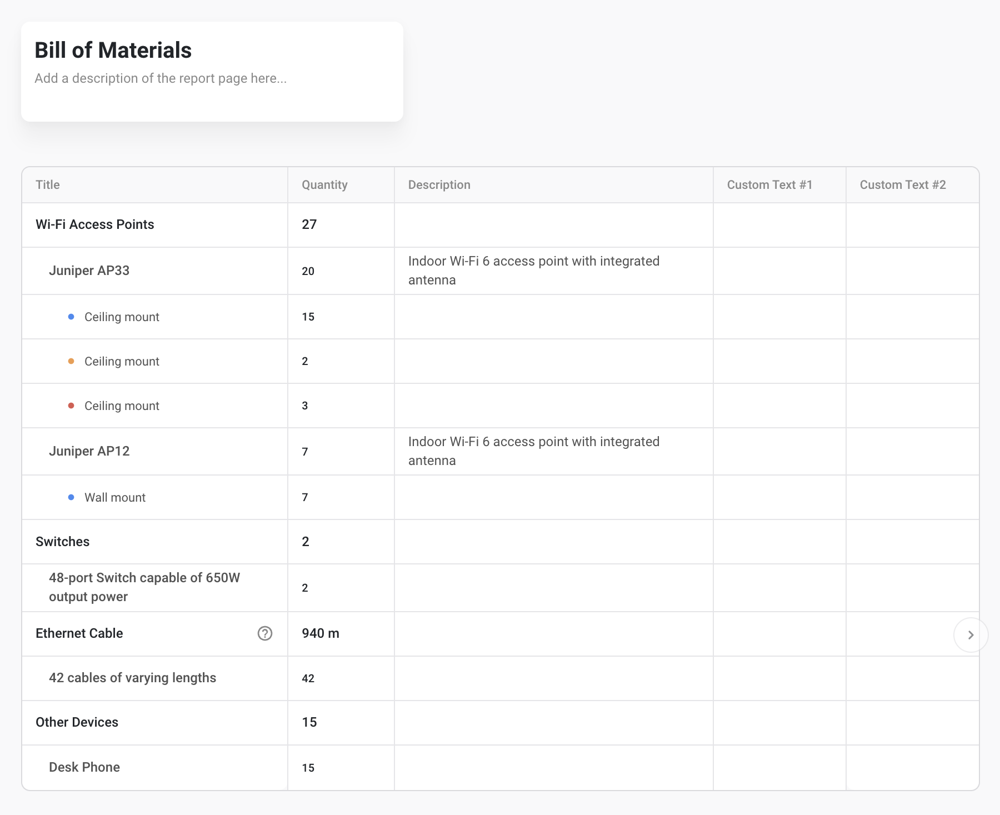
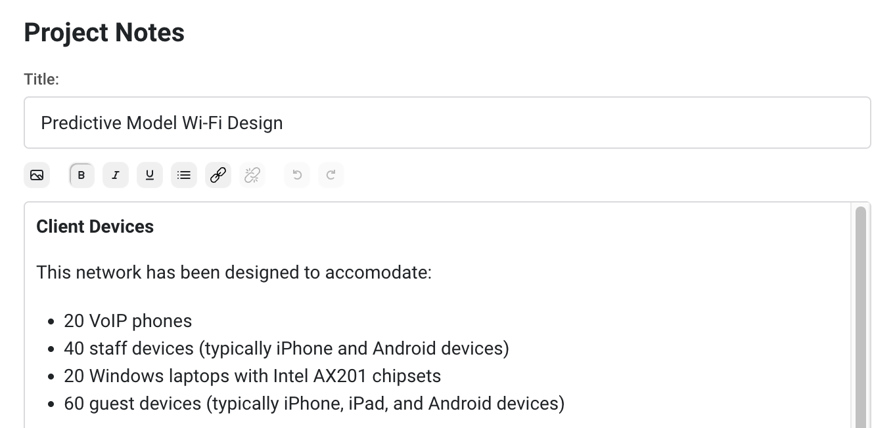
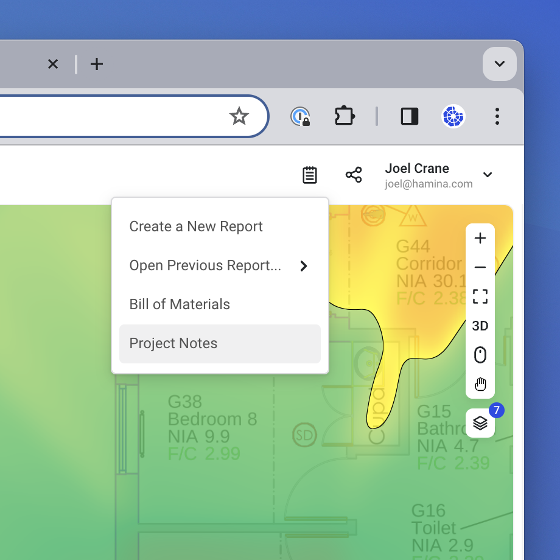

# 📒 Reporting

Hamina Network Planner offers a built-in, customizable reporting systems. It can generate a static, traditional PDF report, or a web link to an online, interactive report.

The online, interactive report is essentially a read-only version of Hamina, with full panning, zooming, and interactivity. The report viewer doesn't need a Hamina account or license - they only need a link to the report (and a password, if you choose to password-protect it).

## Creating a Report

To create a report in Hamina Network Planner:

1.  Click the **Reporting** button in the upper right. Then, select **Create a new Report**.\

    

    <figure><figcaption></figcaption></figure>

    

2.  A new browser tab will appear. Name the report, and click **Create**. _Note: You can choose a previous report to use as a template._\

    

    <figure><figcaption></figcaption></figure>

    

3.  The **Reporting Tab** will now be visible, where the report can be customized, exported to a PDF, or shared.\

    

    <figure><figcaption></figcaption></figure>

    


If you've created a previous report that you'd like to reuse, you can use the **Template** dropdown menu to browse previous projects and reports that you've created.


### Reporting Tab Overview

The Reporting Tab has several sections:

1. **Generate PDF** - Generate and download a static PDF version of the report.
2. **Share Link** - Customize and create a link to a live, interactive, web-based version of the report.
3. **Pages** - Switch between different pages of the report, and hide/show pages to deliver the relevant content to whoever will view the report.
4. **Page Title and Description** - Customize the title and description of each page in the report. Changing the title here will also change it in the Pages column.

<figure><figcaption></figcaption></figure>

### Adding a Custom Logo

In the upper right, you can upload a custom logo, such as your company logo to add branding to your report. You can upload it either by clicking on the field, or dragging a logo to the field.

### Hiding and Showing Pages

To switch to a different page, click on the page in the list.

You can hide pages from the final report by hovering your mouse over a page, and clicking the **Hide** button.

<figure><figcaption></figcaption></figure>

Once a page is hidden, click the **Show** button to re-enable the page for the final report.

<figure><figcaption></figcaption></figure>

## Pages

### Summary

#### Bill of Materials

Lists all of the materials required to complete the project.&#x20;

<figure><figcaption></figcaption></figure>


If the same AP and mounting type exists in the project with multiple colors, then the mount will be split out into a line item for each color. Use this if you need to define multiple types of ceiling mounts, for example.



Nearly all text fields are modifiable; hover your mouse over the field, and a **Edit** button (a pencil icon) will appear that you can use to change or add test.


#### Project Notes

The Project Notes page contains a rich text editor that you can use for any documentation purposes within the project.&#x20;

<figure><figcaption></figcaption></figure>


The Project Notes are also editable in Hamina Planner in **Report** menu > **Project Notes**.


<figure><figcaption></figcaption></figure>

### Online Reports

Online Reports in Hamina Network Planner provide your managers, customers, and project stakeholders with a fully interactive, read-only Hamina Network Planner interface. The user interface is very similar to Hamina Network Planner, except there are no tools, and the report viewer can navigate between heatmaps and views with a simple menu.&#x20;

The heatmaps and views that the user sees are determined by which pages you show and hide.


Whenever the Online Report is loaded or refreshed, it shows the most recent version of the project, so the documentation is never out of date.


#### Sharing an Online Report

To share an Online Report, click the blue **Share** button in the upper right. Next, you'll have the option to create a password for the report. Click the **Create links** button to create a link.

The report will be available as long as the report exists. You can click the red **Revoke links** button to make the report no longer accessible.

### PDF Reports

If the customer requires a physical deliverable, you can generate a PDF report with the **Download** button in the upper right. Select **Generate PDF** to begin the report generation progress, at which point you will see a progress indicator. When the report has finished generating on the Hamina Cloud, the **Download PDF** button will become available.


Per Hamina account, only one PDF Report can be generated at a time. You won't be able to start generating a new PDF report until the previous report is finished generating.


